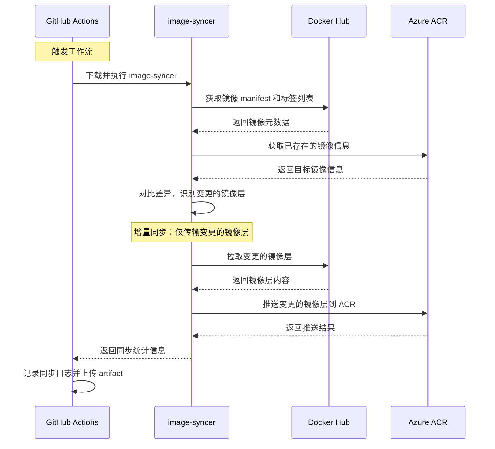

# 实现 Docker Hub 到 Azure ACR 的自动化镜像同步

> 本文介绍了如何使用 GitHub Actions 和 image-syncer 工具，实现 Docker Hub 镜像到 Azure Container Registry 的自动化同步，解决了国内及部分 Azure 区域访问 Docker Hub 速度慢的问题，提升了镜像的可用性和 Azure 环境的部署效率。

## 背景/引言

HagiCode 项目使用 Docker 镜像作为核心运行时组件，主要镜像托管在 Docker Hub。随着项目发展和 Azure 环境部署需求的增加，我们遇到了以下痛点：
- 镜像拉取速度慢，Docker Hub 在国内及部分 Azure 区域访问受限
- 依赖单一镜像源存在单点故障风险
- Azure 环境下使用 Azure Container Registry 能获得更好的网络性能和集成体验

为解决这些问题，我们需要建立一个自动化的镜像同步机制，将 Docker Hub 的镜像定期同步到 Azure ACR，确保用户能够在 Azure 环境中获得更快的镜像拉取速度和更高的可用性。

## 关于 HagiCode

我们正在开发 HagiCode——一款 AI 驱动的代码智能助手，让开发体验变得更智能、更便捷、更有趣。

智能——AI 全程辅助，从想法到代码，让编码效率提升数倍。便捷——多线程并发操作，充分利用资源，开发流程顺畅无阻。有趣——游戏化机制和成就系统，让编码不再枯燥，充满成就感。

项目正在快速迭代中，如果你对技术写作、知识管理或者 AI 辅助开发感兴趣，欢迎来 GitHub 看看。

## 技术方案对比

在制定解决方案时，我们对比了多种技术方案：

### 1. image-syncer（最终选择）
- 增量同步：仅同步变更的镜像层，显著减少网络传输
- 断点续传：网络中断后可恢复同步
- 并发控制：支持配置并发线程数，提升大镜像同步效率
- 完善的错误处理：内置失败重试机制（默认 3 次）
- 轻量级部署：单二进制文件，无依赖
- 多仓库支持：兼容 Docker Hub、Azure ACR、Harbor 等

### 2. Docker CLI
- 不支持增量同步：每次都需要拉取完整的镜像内容
- 效率较低：网络传输量大，时间长
- 简单易用：使用熟悉的 docker pull/push 命令

### 3. Azure CLI
- 复杂度高：需要配置 Azure CLI 认证
- 功能限制：az acr import 功能相对单一
- 原生集成：与 Azure 服务集成良好

## 架构设计决策

### 决策 1：同步频率设置为每日 UTC 00:00
- 平衡镜像新鲜度和资源消耗
- 避开业务高峰期，减少对其他操作的影响
- Docker Hub 镜像通常在每日构建后更新

### 决策 2：同步所有镜像标签
- 保持与 Docker Hub 的完全一致性
- 为用户提供灵活的版本选择
- 简化同步逻辑，避免复杂的标签过滤规则

### 决策 3：使用 GitHub Secrets 存储认证信息
- GitHub Actions 原生支持，安全性高
- 配置简单，易于管理和维护
- 支持仓库级别的访问控制

## 风险评估与缓解

### 风险 1：Azure ACR 认证信息泄露
- 使用 GitHub Secrets 加密存储
- 定期轮换 ACR 密码
- 限制 ACR 用户权限为仅推送
- 监控 ACR 访问日志

### 风险 2：同步失败导致镜像不一致
- image-syncer 内置增量同步机制
- 自动失败重试（默认 3 次）
- 详细的错误日志和失败通知
- 断点续传功能

### 风险 3：资源消耗过大
- 增量同步减少网络传输
- 可配置并发线程数（当前设置为 10）
- 监控同步的镜像数量和大小
- 在非高峰时段运行同步

## 核心解决方案

我们采用 GitHub Actions + image-syncer 的自动化方案，实现从 Docker Hub 到 Azure ACR 的镜像同步。

## 实施步骤

### 1. 准备阶段
- 在 Azure Portal 中创建或确认 Azure Container Registry
- 创建 ACR 访问密钥（用户名和密码）
- 确认 Docker Hub 镜像仓库访问权限

### 2. 配置 GitHub Secrets
在 GitHub 仓库设置中添加以下 Secrets：
- AZURE_ACR_USERNAME: Azure ACR 用户名
- AZURE_ACR_PASSWORD: Azure ACR 密码

### 3. 创建 GitHub Actions 工作流
在 .github/workflows/sync-docker-acr.yml 中配置工作流：
- 定时触发：每天 UTC 00:00
- 手动触发：支持 workflow_dispatch
- 额外触发：publish 分支推送时触发（用于快速同步）

### 4. 工作流执行流程


## GitHub Actions 工作流实现

以下是实际运行的工作流配置（.github/workflows/sync-docker-acr.yml）：

```yaml
name: Sync Docker Image to Azure ACR

on:
  schedule:
    - cron: "0 0 * * *" # 每天 UTC 00:00
  workflow_dispatch: # 手动触发
  push:
    branches: [publish]

permissions:
  contents: read

jobs:
  sync:
    runs-on: ubuntu-latest

    steps:
      - name: Checkout code
        uses: actions/checkout@v4

      - name: Download image-syncer
        run: |
          # 下载 image-syncer 二进制文件
          wget https://github.com/AliyunContainerService/image-syncer/releases/download/v1.5.5/image-syncer-v1.5.5-linux-amd64.tar.gz
          tar -zxvf image-syncer-v1.5.5-linux-amd64.tar.gz
          chmod +x image-syncer

      - name: Create auth config
        run: |
          # 生成认证配置文件 (YAML 格式)
          cat > auth.yaml <<EOF
          hagicode.azurecr.io:
            username: "${{ secrets.AZURE_ACR_USERNAME }}"
            password: "${{ secrets.AZURE_ACR_PASSWORD }}"
          EOF

      - name: Create images config
        run: |
          # 生成镜像同步配置文件 (YAML 格式)
          cat > images.yaml <<EOF
          docker.io/newbe36524/hagicode: hagicode.azurecr.io/hagicode
          EOF

      - name: Run image-syncer
        run: |
          # 执行同步 (使用新版 --auth 和 --images 参数)
          ./image-syncer --auth=./auth.yaml --images=./images.yaml --proc=10 --retries=3

      - name: Upload logs
        if: always()
        uses: actions/upload-artifact@v4
        with:
          name: sync-logs
          path: image-syncer-*.log
          retention-days: 7
```

## 配置说明

### 1. 触发条件
- 定时触发：cron: "0 0 * * *" - 每天 UTC 00:00 执行
- 手动触发：workflow_dispatch - 允许用户在 GitHub UI 手动运行
- 推送触发：push: branches: [publish] - 发布分支推送时触发（用于快速同步）

### 2. 认证配置 (auth.yaml)
```yaml
hagicode.azurecr.io:
  username: "${{ secrets.AZURE_ACR_USERNAME }}"
  password: "${{ secrets.AZURE_ACR_PASSWORD }}"
```

### 3. 镜像同步配置
```yaml
docker.io/newbe36524/hagicode: hagicode.azurecr.io/hagicode
```
此配置表示将 docker.io/newbe36524/hagicode 的所有标签同步到 hagicode.azurecr.io/hagicode

### 4. image-syncer 参数
- --auth=./auth.yaml: 认证配置文件路径
- --images=./images.yaml: 镜像同步配置文件路径
- --proc=10: 并发线程数为 10
- --retries=3: 失败重试 3 次

## GitHub Secrets 配置清单

在 GitHub 仓库的 Settings → Secrets and variables → Actions 中配置：

| Secret 名称 | 描述 | 示例值 | 获取方式 |
|------------|------|--------|---------|
| AZURE_ACR_USERNAME | Azure ACR 用户名 | hagicode | Azure Portal → ACR → Access keys |
| AZURE_ACR_PASSWORD | Azure ACR 密码 | xxxxxxxx-xxxx-xxxx-xxxx-xxxxxxxxxxxx | Azure Portal → ACR → Access keys → Password |

## 使用说明

### 1. 手动触发同步
1. 访问 GitHub 仓库的 Actions 标签页
2. 选择 Sync Docker Image to Azure ACR 工作流
3. 点击 Run workflow 按钮
4. 选择分支并点击 Run workflow 确认

### 2. 查看同步日志
1. 在 Actions 页面点击具体的工作流运行记录
2. 查看各个步骤的执行日志
3. 在页面底部的 Artifacts 区域下载 sync-logs 文件

### 3. 验证同步结果
```bash
# 登录到 Azure ACR
az acr login --name hagicode

# 列出镜像及其标签
az acr repository show-tags --name hagicode --repository hagicode --output table
```

## 注意事项和最佳实践

### 1. 安全建议
- 定期轮换 Azure ACR 密码（建议每 90 天）
- 使用专用的 ACR 服务账户，限制权限为仅推送
- 监控 ACR 的访问日志，及时发现异常访问
- 不要在日志中输出认证信息
- 不要将认证信息提交到代码仓库

### 2. 性能优化
- 调整 --proc 参数：根据网络带宽调整并发数（建议 5-20）
- 监控同步时间：如果同步时间过长，考虑减少并发数
- 定期清理日志：设置合理的 retention-days（当前为 7 天）

### 3. 故障排查

#### 问题 1：认证失败
```
Error: failed to authenticate to hagicode.azurecr.io
```
解决方案：
1. 检查 GitHub Secrets 是否正确配置
2. 验证 Azure ACR 密码是否过期
3. 确认 ACR 服务账户权限是否正确

#### 问题 2：网络超时
```
Error: timeout waiting for response
```
解决方案：
1. 检查网络连接
2. 减少并发线程数（--proc 参数）
3. 等待网络恢复后重新触发工作流

#### 问题 3：镜像同步不完整
```
Warning: some tags failed to sync
```
解决方案：
1. 检查同步日志，识别失败的标签
2. 手动触发工作流重新同步
3. 验证 Docker Hub 源镜像是否正常

### 4. 监控和告警
- 定期检查 Actions 页面，确认工作流运行状态
- 设置 GitHub 通知，及时获取工作流失败通知
- 监控 Azure ACR 的存储使用情况
- 定期验证镜像标签一致性

## 常见问题和解决方案

### Q1: 如何同步特定标签而不是所有标签？

修改 images.yaml 配置文件：
```yaml
# 仅同步 latest 和 v1.0 标签
docker.io/newbe36524/hagicode:latest: hagicode.azurecr.io/hagicode:latest
docker.io/newbe36524/hagicode:v1.0: hagicode.azurecr.io/hagicode:v1.0
```

### Q2: 如何同步多个镜像仓库？

在 images.yaml 中添加多行配置：
```yaml
docker.io/newbe36524/hagicode: hagicode.azurecr.io/hagicode
docker.io/newbe36524/another-image: hagicode.azurecr.io/another-image
```

### Q3: 同步失败后如何重试？
- 自动重试：image-syncer 内置重试机制（默认 3 次）
- 手动重试：在 GitHub Actions 页面点击 Re-run all jobs

### Q4: 如何查看同步的详细进度？
- 在 Actions 页面查看实时日志
- 下载 sync-logs artifact 查看完整日志文件
- 日志文件包含每个标签的同步状态和传输速度

### Q5: 同步需要多长时间？
- 首次全量同步：根据镜像大小，通常需要 10-30 分钟
- 增量同步：如果镜像变更小，通常 2-5 分钟
- 时间取决于网络带宽、镜像大小和并发设置

## 扩展功能建议

### 1. 添加同步通知
在工作流中添加通知步骤：
```yaml
- name: Notify on success
  if: success()
  run: |
    echo "Docker images synced successfully to Azure ACR"
```

### 2. 实现镜像标签过滤
在工作流中添加标签过滤逻辑：
```yaml
- name: Filter tags
  run: |
    # 仅同步以 v 开头的标签
    echo "docker.io/newbe36524/hagicode:v* : hagicode.azurecr.io/hagicode:v*" > images.yaml
```

### 3. 添加同步统计报告
```yaml
- name: Generate report
  if: always()
  run: |
    echo "## Sync Report" >> $GITHUB_STEP_SUMMARY
    echo "- Total tags: $(grep -c 'synced' image-syncer-*.log)" >> $GITHUB_STEP_SUMMARY
    echo "- Sync time: ${{ steps.sync.outputs.duration }}" >> $GITHUB_STEP_SUMMARY
```

## 总结

通过本文介绍的方法，我们成功实现了从 Docker Hub 到 Azure ACR 的自动化镜像同步。这个方案利用 GitHub Actions 的定时触发和手动触发功能，结合 image-syncer 的增量同步和错误处理机制，确保了镜像的及时同步和一致性。

我们还讨论了安全最佳实践、性能优化、故障排查等方面的内容，帮助用户更好地管理和维护这个同步机制。希望本文能够为需要在 Azure 环境中部署 Docker 镜像的开发者提供有价值的参考。

## 参考资料
- [HagiCode 项目 GitHub 仓库](https://github.com/HagiCode-org/site)
- [image-syncer 官方文档](https://github.com/AliyunContainerService/image-syncer)
- [Azure Container Registry 官方文档](https://learn.microsoft.com/zh-cn/azure/container-registry/)
- [GitHub Actions 官方文档](https://docs.github.com/zh-cn/actions)

---

## 互动引导

感谢您的阅读,如果您觉得本文有用,快点击下方点赞按钮👍,让更多的人看到本文。

## AI 辅助声明

本内容采用人工智能辅助协作,经本人审核,符合本人观点与立场。

## 元信息

- **本文作者:** [newbe36524](https://www.newbe.pro)
- **本文链接:** [https://hagicode.com/blog/2026/01/25/how-to-sync-docker-hub-to-azure-acr-with-github](https://hagicode.com/blog/2026/01/25/how-to-sync-docker-hub-to-azure-acr-with-github)
- **版权声明:** 本博客所有文章除特别声明外,均采用 BY-NC-SA 许可协议。转载请注明出处!