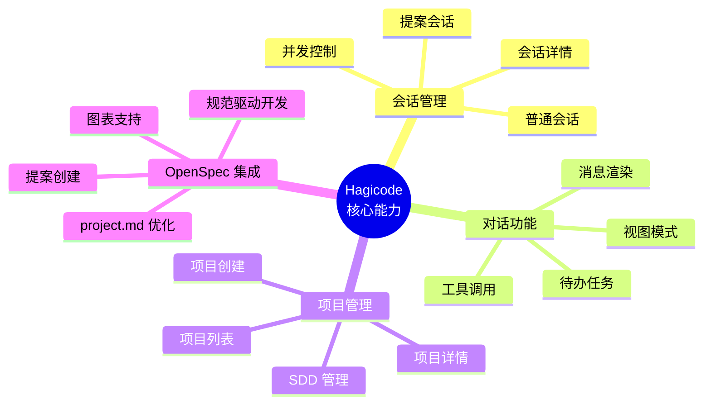

本概述文档将帮助您从产品定位、核心能力、技术架构和使用场景等多个维度,全面了解 Hagicode 这款 AI 驱动的代码开发辅助工具。

## 一个真实的场景

想象你刚加入一个新团队,面前是一个拥有几十万行代码的仓库。按照传统方式,你需要花几天时间阅读文档、调试代码、到处询问同事,才能勉强理解项目结构。

现在想象另一种方式:你打开 Hagicode,创建一个"只读会话",问 AI:"这个项目的核心架构是什么?"几分钟内,你不仅获得了清晰的架构图,还了解了关键模块的设计思路和业务逻辑。当你准备动手实现第一个功能时,你切换到"编辑模式",AI 帮你完成编码,并解释每个修改的意图。

这不再是科幻想象——这就是 Hagicode 能带给你的体验。

## Hagicode 是什么?

想象一下,如果你有一个编程搭档,它不仅能写代码,还能帮你管理想法、追踪进度、沉淀知识。这就是 **Hagicode**——一个让编码变得更高效、更有趣的 AI 助手。

Hagicode 不是简单的"聊天机器人",而是深度集成到开发工作流中的智能助手。它通过**两种会话模式**满足不同场景:

### 两种会话模式

- **普通会话** - 就像和一个经验丰富的同事聊天
  - **只读模式**: AI 只看不说,帮你分析代码、解释逻辑、找出问题,但不会修改任何文件
  - **编辑模式**: AI 可以动手实现功能、修复 bug、执行重构,像个得力助手

- **提案会话** - 把想法变成可执行的计划
  - 描述一个模糊的想法(比如"优化数据库性能")
  - AI 帮你生成结构化的实施计划,包含具体任务、验证标准和风险评估
  - 按计划逐步实施,每个变更都有迹可循

### 四个核心价值

1. **智能代码理解** - AI 深入分析你的代码库,理解项目架构、设计模式和业务逻辑,给你精准的解释和建议

2. **安全可控** - 默认只读模式,确保 AI 只分析不修改;需要时再切换到编辑模式,让 AI 执行具体变更

3. **提案驱动开发** - 把抽象想法转化为结构化提案,通过 OpenSpec 工作流实现从构思到代码的规范开发

4. **团队知识沉淀** - 通过 SDD(软件设计文档)和 OpenSpec 集成,自动记录设计思路、实现过程和决策理由

## 真实使用故事

### 故事 1: 新人上手不再焦虑

**角色**: 刚加入团队的软件工程师小王

**挑战**: 面对一个陌生的电商系统代码库,需要在下周内完成订单模块的新功能

**传统方式**: 小王花了前 3 天阅读文档、调试代码,在团队群里问了无数问题,才勉强理解现有架构。第 4 天开始编码,因为对代码库不熟悉,改出了几个 bug,又花了 2 天修复。

**使用 Hagicode 后**:
- 第 1 天:小王创建只读会话,问 AI:"订单模块的核心流程是什么?"AI 不仅解释了流程,还画出了时序图,指出关键文件和潜在风险点
- 第 2 天:小王切换到编辑模式,和 AI 讨论实现方案,AI 帮他完成了核心代码,并解释每个修改的意图
- 第 3 天:小王用 AI 审查代码,发现并修复了几个边界条件问题,提交代码并通过审查

**结果**: 原来 5 天的工作,3 天完成,而且代码质量更高

### 故事 2: 复杂变更不再混乱

**角色**: 技术负责人李经理

**挑战**: 团队提出"重构支付系统"的想法,但缺乏清晰计划,担心改出新问题

**传统方式**: 李经理自己写设计文档,列出任务清单,分派给团队成员。但实施过程中有人漏掉了边界情况,有人没理解设计意图,最终代码审查时发现问题,返工重做

**使用 Hagicode 后**:
- 李经理创建提案会话,描述:"重构支付系统,支持多种支付方式,提高可扩展性"
- AI 自动生成结构化提案(proposal.md),包含目标、范围、任务清单和验证标准
- 团队成员审查提案,调整细节后,按任务清单逐步实施
- 每个任务完成后,自动标记进度,遇到问题时 AI 提供解决方案
- 完成后验证标准全部通过,提案归档到 `changes/archive/`

**结果**: 变更过程规范有序,代码审查负担减轻,新成员可以查看归档提案快速理解设计思路

### 故事 3: 团队知识不再流失

**角色**: 项目经理张总监

**挑战**: 核心开发者离职,带走了大量隐性知识,新成员接手困难

**传统方式**: 知识散落在代码注释、个人笔记、聊天记录中,没人能完整解释为什么这么设计。新成员只能边做边猜,效率低下

**使用 Hagicode 后**:
- 每个功能通过 OpenSpec 工作流实施,自动记录设计思路、实现过程和决策理由
- 历史提案归档在 `openspec/changes/archive/`,可以按时间、功能分类查看
- 新成员加入时,张总监让新成员阅读相关提案,快速理解"为什么这么做"
- SDD 文档自动维护,始终保持最新状态

**结果**: 知识不再流失,新成员上手时间从几周缩短到几天,团队协作更顺畅

## 为什么选择 Hagicode?

你可能已经了解 VS Code Copilot、Cursor AI、Kilo 或 Claude Code,它们都很优秀。但 Hagicode 有一些独特的优势。

### 对比 VS Code Copilot Chat

| 场景 | VS Code Copilot Chat | Hagicode |
|------|---------------------|----------|
| **聊天编码** | 可以在编辑器中与 AI 聊天,获得代码建议 | 同样支持聊天,但增加"提案会话"模式,将想法转化为结构化实施计划 |
| **权限控制** | AI 可以直接修改文件 | 支持"只读模式"和"编辑模式",你可以控制 AI 是否能修改代码 |
| **知识管理** | 无内置知识管理 | OpenSpec 工作流自动沉淀设计决策,形成项目知识库 |
| **变更追溯** | 依赖 git 历史 | 提案归档完整记录设计思路、实施过程和决策理由 |

**适合你的情况**: 如果你想要更强的权限控制,希望 AI 帮你管理想法和知识沉淀,Hagicode 是更好的选择。

### 对比 Cursor AI

| 场景 | Cursor AI | Hagicode |
|------|----------|----------|
| **AI 编辑器** | AI 原生集成,界面简洁 | 支持多会话并发,可以同时处理多个任务 |
| **开发流程** | 直接编辑代码 | 提案驱动开发,先规划后实施,变更可追溯 |
| **团队协作** | 个人效率工具 | 内置项目管理和团队知识共享功能 |
| **只读模式** | 无专门只读模式 | 支持只读会话,安全分析代码不担心意外修改 |

**适合你的情况**: 如果你需要规范化管理复杂变更,或者团队需要共享知识库,Hagicode 更适合。

### 对比 Kilo

| 场景 | Kilo | Hagicode |
|------|------|----------|
| **AI 编程助手** | 轻量级 AI 助手 | 更深度的项目集成和会话管理 |
| **开发流程** | 快速编码辅助 | 提案会话驱动,结构化实施流程 |
| **知识沉淀** | 基础功能 | OpenSpec 规范驱动,完整的知识管理体系 |
| **提案工作流** | 无 | 将想法转化为结构化提案,包含目标、任务、验证标准 |

**适合你的情况**: 如果你想要更规范的开发流程,需要提案管理和知识沉淀,Hagicode 提供了完整的解决方案。

### 对比 Claude Code

| 场景 | Claude Code | Hagicode |
|------|------------|----------|
| **会话管理** | 支持会话管理 | 增强会话系统,支持只读/编辑模式切换,多会话并发更灵活 |
| **开发流程** | 直接对话和代码修改 | 提案会话模式,将想法转化为结构化实施计划 |
| **知识管理** | 基础对话历史 | OpenSpec 工作流自动沉淀设计决策,形成项目知识库 |
| **权限控制** | AI 可直接修改文件 | 细粒度权限控制,可设置只读模式防止意外修改 |

**适合你的情况**: 如果你需要更灵活的会话权限控制,希望 AI 帮你管理提案和知识,Hagicode 是增强版的选择。

## 核心功能一览

Hagicode 的功能围绕四大核心能力模块构建,每个模块都针对开发工作流的关键环节设计:

### 会话管理 - 灵活的工作模式

- **普通会话** - 与 AI 进行传统聊天式交互,支持代码分析、审查和修改
  - 只读模式: AI 可以读取、分析、描述代码,但无法进行修改——适合安全探索代码库
  - 编辑模式: AI 具备文件修改权限,可以实现功能、修复 bug、执行重构——适合快速开发
- **提案会话** - 基于想法的结构化工作流,将抽象想法转化为具体执行计划
- **会话详情** - 查看会话历史、消息记录和执行结果
- **并发控制** - 管理多个同时进行的会话,避免资源冲突

### 对话功能 - 更智能的 AI 交互

- **消息渲染** - 支持 Markdown 代码块、语法高亮、表格和列表的富文本消息展示
- **工具调用** - AI 可以调用各种工具执行文件操作、运行命令、搜索代码等
- **待办任务** - AI 可以创建和管理任务清单,追踪实现进度
- **视图模式** - 支持不同的消息视图模式,适应不同屏幕和阅读偏好

### 项目管理 - 完整的项目生命周期

- **项目列表** - 查看和管理所有项目,快速切换工作空间
- **项目详情** - 深入了解项目结构、SDD 状态和配置信息
- **项目创建** - 简单几步添加新项目,自动识别 Git 仓库
- **SDD 管理** - 初始化和管理软件设计文档,沉淀项目知识

### OpenSpec 集成 - 规范驱动开发流程

- **提案创建** - 将想法转化为结构化的提案文档,包含目标、范围、任务和验证标准
- **图表支持** - 使用 Mermaid 绘制架构图、流程图、状态图,可视化设计思路
- **规范驱动开发** - 遵循提案→实施→归档的规范流程,确保变更的可追溯性和质量
- **project.md 优化** - AI 自动分析和优化项目配置文件,添加领域上下文和提示词配置

## 谁适合使用 Hagicode?

Hagicode 为不同角色提供价值:

- **开发者** - 提升 coding 效率,获得智能代码分析和实现建议,缩短新人上手时间
- **技术负责人** - 通过提案工作流管理复杂变更,确保代码质量和架构一致性
- **项目经理** - 了解项目进度,追踪功能实现,管理团队知识资产
- **开源维护者** - 高效处理 PR,自动化代码审查,管理项目规范

## 从这里开始

根据您的角色和需求,选择最适合的阅读路径:

### 新用户推荐路径

如果您是第一次接触 Hagicode,建议按以下顺序阅读:

1. **[本文档](/product-overview)** - 建立对产品的整体认知(您在这里)
2. **[安装指南](/installation/docker-compose/)** - 安装并运行 Hagicode
3. **[创建第一个项目](/quick-start/create-first-project)** - 初始化您的项目
4. **[创建普通会话](/quick-start/conversation-session)** - 开始与 AI 交互
5. **[创建提案会话](/quick-start/proposal-session)** - 了解提案工作流

### 不同角色的快速入口

- **开发者**: 从 [创建普通会话](/quick-start/conversation-session) 开始,体验只读和编辑模式
- **技术负责人**: 从 [创建提案会话](/quick-start/proposal-session) 开始,了解规范驱动开发
- **项目经理**: 从 [项目管理](/projects/) 开始,学习如何管理项目和团队知识

---

**需要帮助?**

如果您在阅读本文档时有任何疑问,或发现需要改进的地方,欢迎:
- 在 GitHub 上提 Issue 报告问题或建议
- 查看其他快速入门文档获取更多细节
- 联系团队获取支持
