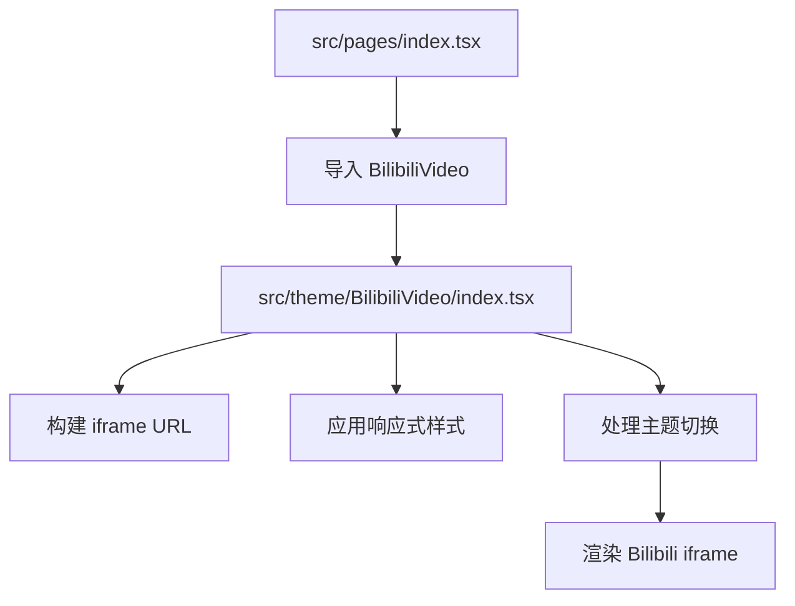
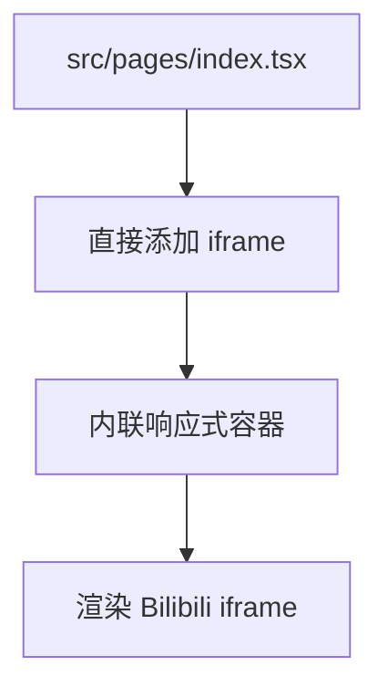
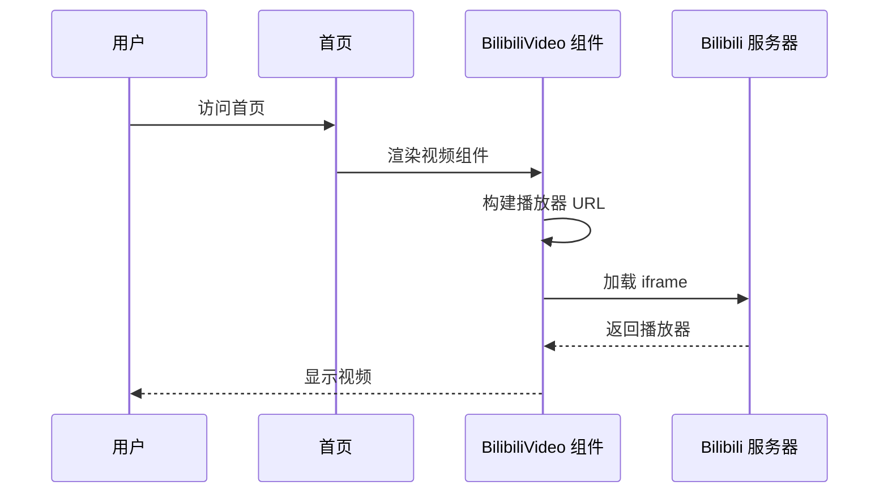

# Change: 添加B站编程实战演示视频

## Status

**ExecutionCompleted** (2026-01-15)

## Why

当前主页缺少关于 AI 多任务编程实战的演示视频内容，无法有效展示 Hagicode 在 AI 编程辅助方面的核心能力。添加《每天哈基半小时，AI多任务编程实战》的演示视频可以让访客直观了解 Hagicode 的核心功能和使用方法。

## What Changes

- 在主页添加 Bilibili 视频播放器组件
- 创建可复用的 `BilibiliVideo` 组件（推荐选项）或直接在主页嵌入 iframe
- 添加视频容器样式，与现有首页设计保持一致
- 实现响应式设计，支持桌面、平板和移动设备

## UI Design Changes

### 首页视频区域布局

```
+--------------------------------------------------------------------------+
|                     编程实战演示视频                                      |
|                观看《每天哈基半小时，AI多任务编程实战》                      |
|                                                                          |
|  +--------------------------------------------------------------------+  |
|  |                                                                    |  |
|  |            [Bilibili 嵌入式播放器]                                  |  |
|  |                                                                    |  |
|  |            (视频容器 - 16:9 宽高比)                                  |  |
|  |                                                                    |  |
|  +--------------------------------------------------------------------+  |
|                                                                          |
+--------------------------------------------------------------------------+
```

### 响应式布局规格

**桌面端 (>1024px):**
```
+-------------------------------+
|        视频容器 (900px)         |
+-------------------------------+
```

**平板端 (768px-1024px):**
```
+---------------------------+
|      视频容器 (700px)       |
+---------------------------+
```

**移动端 (<768px):**
```
+-------------------------+
|    视频容器 (全宽)        |
|    内边距 1rem           |
+-------------------------+
```

### Bilibili 播放器嵌入参数

```
iframe src: //player.bilibili.com/player.html
参数:
- isOutside: true (外部嵌入模式)
- aid: 115898165822763
- bvid: BV1pirZBuEzq
- cid: 35399205805
- p: 1 (第一分P)
- scrolling: no
- frameborder: 0
- framespacing: 0
- allowfullscreen: true
```

## Code Flow Changes

### 组件架构 (选项 1 - 推荐)



### 组件架构 (选项 2 - 直接嵌入)



### 数据流



## Impact

### 受影响的规格
- `specs/docusaurus-site/spec.md` - 添加新的视频展示需求

### 受影响的代码
- **新增文件**:
  - `src/theme/BilibiliVideo/index.tsx` (选项 1)
  - `src/components/home/BilibiliVideoPlayer.tsx` (选项 1 备选)
- **修改文件**:
  - `src/pages/index.tsx` - 添加视频组件导入和渲染

### 用户体验改进
- 访客可以在首页直接观看 AI 编程实战演示
- 更直观地了解 Hagicode 的核心功能和使用方法
- 提高用户对产品的理解和兴趣

### 技术影响
- 需要确保构建通过：`npm run build` 无错误
- 需要确保类型检查通过：`npm run typecheck` 无错误
- 需要确保视频在不同设备上正常显示
- 需要支持亮色和暗色主题切换

### 维护注意事项
- 如果 Bilibili 视频链接发生变化，需要更新嵌入代码
- 组件化实现便于未来添加更多视频内容
- 视频加载需要考虑网络延迟和错误处理
