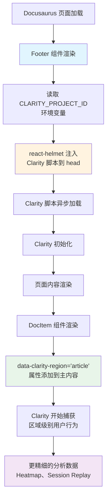

# Change: 优化 Clarity 集成配置

## Status

**ExecutionCompleted** (2026-01-15)

## Why

Hagicode 文档站点当前已配置了 Microsoft Clarity 分析工具，但集成方式相对简单，仅通过 `docusaurus.config.ts` 中的 `scripts` 配置实现。参考项目 Newbe.Pro 展示了更完善的 Clarity 集成方式，包括：

1. **内容区域标记** - 使用 `data-clarity-region` 属性为不同内容区域添加语义标记，提升分析数据的质量
2. **组件级集成** - 通过主题组件 swizzling 实现更精细的控制
3. **多脚本协同** - 与其他第三方脚本（如 poetry API、AdSense）的组织方式

当前实现的问题：
- 缺少内容区域标记，无法区分文章、导航、页脚等不同区域
- 没有利用 Clarity 的高级功能（如 heatmap 区域聚焦）
- 与参考实现相比，数据分析粒度较粗

## Configuration Comparison: pcode-docs vs Newbe.Pro

| 配置项 | pcode-docs (当前) | Newbe.Pro (参考) | 本提案目标 |
|--------|-------------------|------------------|------------|
| **Project ID 配置** | 环境变量 `CLARITY_PROJECT_ID` | 硬编码 `'j15shshi6c'` | 保持环境变量方式（更灵活安全） |
| **脚本加载位置** | `docusaurus.config.ts` 的 `scripts` 配置 | `Footer` 组件通过 `react-helmet` | **改为 Footer 组件方式** |
| **内容区域标记** | 未实现 | `DocItem` 组件添加 `data-clarity-region='article'` | 采用此方案 |

**设计决策说明**：
- **保持** pcode-docs 的环境变量配置方式（优于 Newbe.Pro 的硬编码方式）
- **采用** Newbe.Pro 的组件级脚本加载方式（通过 Footer 组件和 react-helmet）
- **采用** Newbe.Pro 的内容区域标记方案（`data-clarity-region` 属性）

## What Changes

- **Swizzle Footer 组件** - 将 Clarity 脚本从 `docusaurus.config.ts` 移至 `Footer` 组件，通过 `react-helmet` 注入
- **Swizzle DocItem 组件** - 添加 `data-clarity-region="article"` 属性标记主内容区域
- **保持环境变量配置** - Clarity Project ID 仍通过 `CLARITY_PROJECT_ID` 环境变量获取
- **移除 docusaurus.config.ts 中的 scripts 配置** - 清理旧配置避免重复加载

## Code Flow Changes



## Impact

### Affected Specs
- `specs/docusaurus-site/spec.md` - 修改 "Third-Party Analytics Integration" 需求，添加组件级脚本加载和内容区域标记

### Affected Code
- `src/theme/Footer/index.tsx` (新建) - Swizzled Footer 组件，通过 react-helmet 注入 Clarity 脚本
- `src/theme/DocItem/index.tsx` (新建) - Swizzled DocItem 组件，添加 `data-clarity-region` 属性
- `docusaurus.config.ts` - 移除 `scripts` 配置中的 Clarity 相关代码

### Technical Impact
- 新增两个 swizzled 主题组件（Footer、DocItem）
- 需要添加 `react-helmet` 依赖（如果项目中尚未安装）
- 脚本加载从配置级别移至组件级别，更符合 React 组件化理念
- 无性能影响（脚本仍异步加载）

### Expected Benefits
- **更精细的 heatmap 数据** - 可以聚焦于文章内容区域，排除导航、页框等干扰
- **更好的 session replay 理解** - Clarity 能识别用户主要关注的内容区域
- **数据驱动的文档优化** - 了解用户在哪些内容区域停留最久
- **与参考实现一致** - 与 Newbe.Pro 项目保持相同的集成模式
- **组件级控制** - 可以在组件内部更灵活地控制脚本加载逻辑

## Migration Plan

### Implementation Steps

1. **检查 react-helmet 依赖**
   ```bash
   # 检查是否已安装
   npm ls react-helmet
   # 如果未安装，添加依赖（Docusaurus 通常已包含）
   npm install @docusaurus/react-helmet
   ```

2. **Swizzle Footer 组件**
   ```bash
   npm run swizzle @docusaurus/theme-classic Footer -- --eject --typescript
   ```

3. **修改 Footer 组件**
   - 在 `src/theme/Footer/index.tsx` 中
   - 导入 `useEffect` 和 `useState` from React
   - 导入 `Helmet` from `@docusaurus/react-helmet`
   - 读取 `CLARITY_PROJECT_ID` 环境变量
   - 使用 `useEffect` 在组件挂载时注入 Clarity 脚本

4. **Swizzle DocItem 组件**
   ```bash
   npm run swizzle @docusaurus/theme-classic DocItem -- --eject --typescript
   ```

5. **修改 DocItem 组件**
   - 在 `src/theme/DocItem/index.tsx` 中
   - 找到主内容包裹元素
   - 添加 `data-clarity-region="article"` 属性

6. **清理 docusaurus.config.ts**
   - 移除 `scripts` 配置中的 Clarity 相关代码
   - 移除 `CLARITY_PROJECT_ID` 相关的常量定义

7. **验证集成**
   - 运行 `npm start` 启动开发服务器
   - 使用浏览器开发者工具检查 `<head>` 中是否包含 Clarity 脚本
   - 检查主内容区域是否有 `data-clarity-region` 属性
   - 确认 Clarity Dashboard 显示活跃用户

### Rollback Plan

如果出现问题：
1. 删除 `src/theme/Footer/` 和 `src/theme/DocItem/` 目录
2. 恢复 `docusaurus.config.ts` 中的原 Clarity 配置
3. 或者运行 `git checkout` 恢复相关文件

## Open Questions

1. **是否需要标记更多区域？** - 除了主文章内容，是否需要为导航栏、侧边栏、页脚添加区域标记？
   - *建议*: 先只标记主内容区域，观察分析效果，再决定是否添加更多区域
