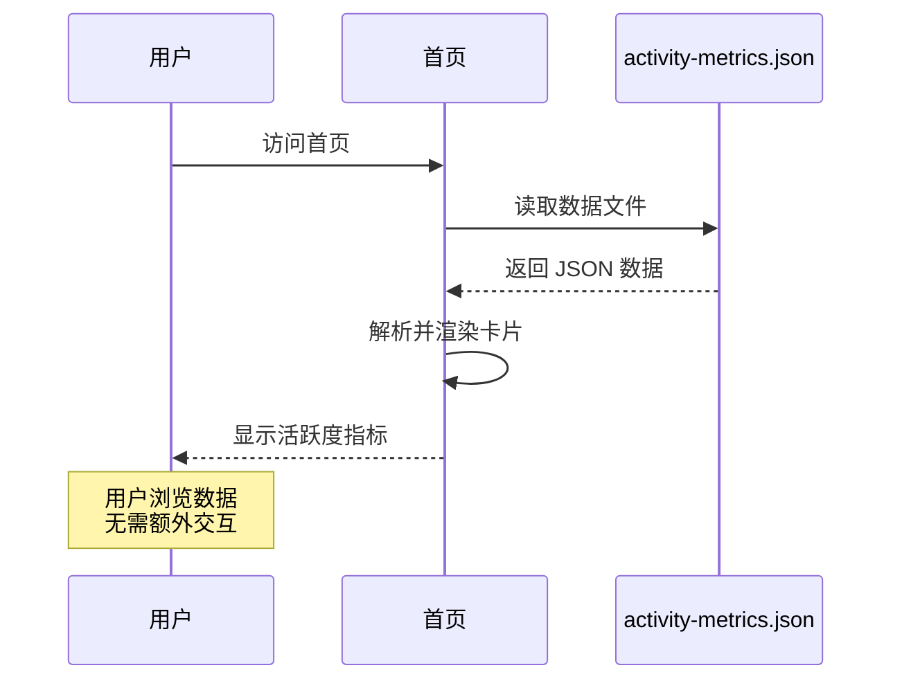
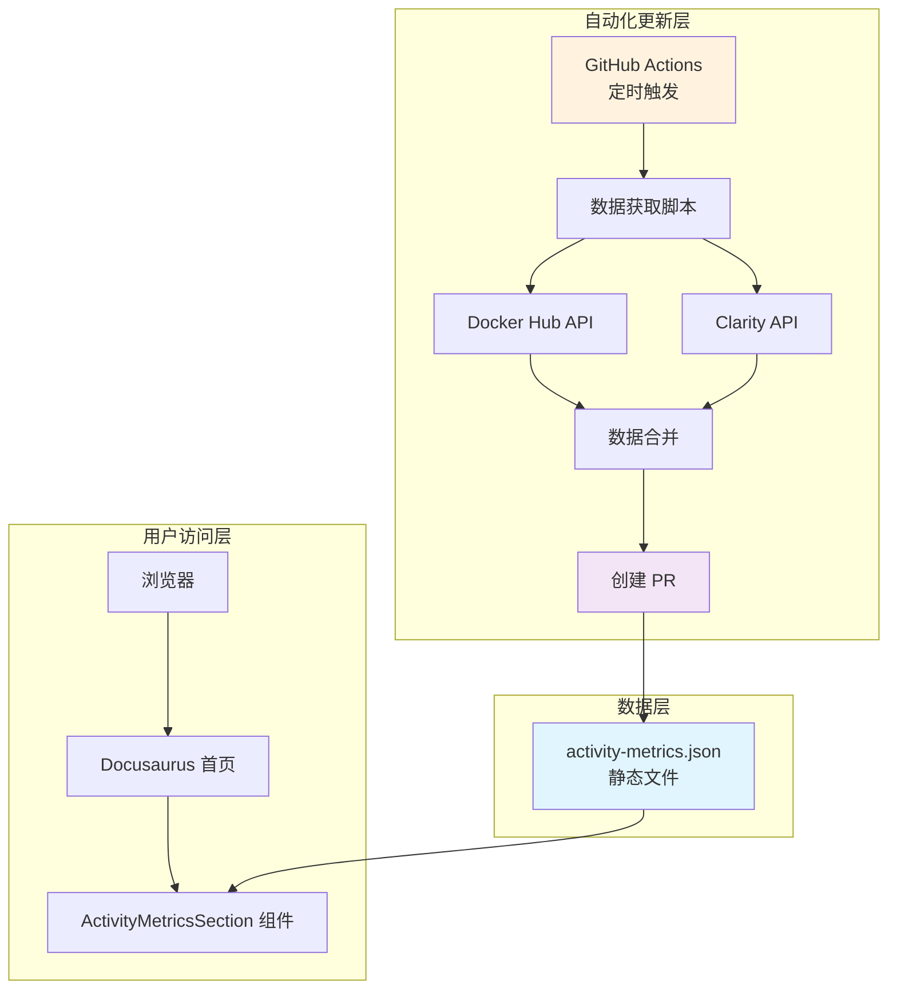

# Design: 首页展示项目活跃度数据

## Context

Hagicode 文档站点基于 Docusaurus 3.x 构建，当前首页展示了产品信息、功能特性和产品截图，但缺少展示项目活跃程度的动态数据指标。项目已集成 GitHub Actions 用于 CI/CD 自动部署，具备通过自动化工作流获取和处理外部数据的基础设施。

### 约束条件

1. **性能要求**: 首页加载速度不能受影响，数据获取必须在后台完成
2. **更新频率**: 每日更新一次即可满足需求，无需实时数据
3. **安全性**: API 密钥不能暴露在前端代码中
4. **可维护性**: 数据更新流程应自动化，减少人工干预
5. **兼容性**: 需兼容 Docusaurus 3.x 的构建流程

### 利益相关者

- 网站访问者：希望快速了解项目活跃度和社区规模
- 项目维护者：希望展示项目增长趋势，增强用户信心
- 运营团队：希望通过数据展示提高转化率

## Goals / Non-Goals

### Goals

1. 在首页展示 Docker Hub Pull 数量、活跃用户数、活跃会话数
2. 通过 GitHub Actions 自动化数据更新流程
3. 使用静态数据文件，确保前端加载性能
4. 提供美观、响应式的 UI 组件展示数据

### Non-Goals

1. 实时数据展示（每日更新即可）
2. 复杂的数据可视化图表（简单的数字卡片展示）
3. 用户交互式数据筛选或排序
4. 历史趋势图表展示

## Decisions

### 决策 1: 使用 GitHub Actions 定时更新数据

**选择**: 创建 GitHub Actions 定时工作流（每日 UTC 00:00 触发）

**理由**:
- 项目已有 GitHub Actions 基础设施，无需引入新服务
- 免费额度足够支持每日执行
- 自动创建 PR 流程，可审核数据变更
- 与现有 CI/CD 流程一致

**替代方案**:
- **Webhook 方式**: 需要搭建接收服务器，增加复杂度
- **手动更新**: 维护成本高，容易遗漏
- **客户端实时请求**: 影响页面加载速度，暴露 API 密钥

### 决策 2: 数据存储格式选择

**选择**: JSON 格式存储在 `src/data/activity-metrics.json`

**理由**:
- JSON 格式易于 JavaScript 解析
- Docusaurus 支持 import JSON 文件
- 文件体积小，加载快速
- 易于版本控制和变更审核

**数据结构**:
```json
{
  "lastUpdated": "2026-01-21T00:00:00Z",
  "dockerHub": {
    "pullCount": 12345,
    "repository": "hagicode/hagicode"
  },
  "clarity": {
    "activeUsers": 1234,
    "activeSessions": 456,
    "dateRange": "3Days"
  }
}
```

### 决策 3: 展示位置

**选择**: 在 Hero Section 和 FeaturesShowcase 之间插入 ActivityMetricsSection

**理由**:
- Hero 区域吸引用户注意后，立即展示数据增强信任
- 不破坏现有首页布局结构
- 移动端友好，可折叠到单列

### 决策 4: UI 组件设计

**选择**: 三列卡片布局，每张卡片展示一个指标

**理由**:
- 简洁直观，易于理解
- 与首页现有卡片设计风格一致
- 响应式布局支持多设备

## UI/UX Design

### 活跃度指标区域设计

```
┌─────────────────────────────────────────────────────────────────┐
│                      📊 项目活跃度                               │
│                   Project Activity Metrics                       │
├─────────────────────────────────────────────────────────────────┤
│                                                                   │
│   ┌───────────────┐  ┌───────────────┐  ┌───────────────┐       │
│   │               │  │               │  │               │       │
│   │      🐳       │  │      👥       │  │      💬       │       │
│   │               │  │               │  │               │       │
│   │  Docker Hub   │  │   活跃用户     │  │   活跃会话    │       │
│   │               │  │               │  │               │       │
│   │               │  │               │  │               │       │
│   │   12,345      │  │    1,234      │  │     456       │       │
│   │   Pulls       │  │   过去3天     │  │   当前数量    │       │
│   │               │  │               │  │               │       │
│   └───────────────┘  └───────────────┘  └───────────────┘       │
│                                                                   │
└─────────────────────────────────────────────────────────────────┘
```

### 卡片状态设计

**正常状态**:
- 渐变边框（与首页其他卡片一致）
- 白色/深色背景（根据主题）
- 图标、标题、数值、说明四层结构

**悬停状态**:
- 边框高亮效果
- 轻微上移动画（translateY: -4px）
- 阴影增强

**加载/错误状态**:
- 数据文件不存在：隐藏组件或显示占位符
- 数据格式错误：显示错误提示

### 响应式布局

| 屏幕尺寸 | 列数 | 卡片宽度 |
|---------|------|---------|
| >1024px | 3 | 32% |
| 768-1024px | 3 | 32% |
| <768px | 1 | 100% |

### 用户交互流程



## Technical Design

### 系统架构图



### 数据获取脚本设计

**脚本位置**: `scripts/update-activity-metrics.js`

**主要功能**:
1. 获取 Docker Hub Pull 数量
2. 获取 Clarity 活跃用户和会话数据
3. 合并数据并写入 JSON 文件
4. 创建 Git 分支并提交变更
5. 创建 Pull Request

**错误处理**:
- API 请求失败：使用上一次的数据或默认值
- 文件写入失败：脚本退出并返回错误码
- Git 操作失败：记录日志并创建 issue

### GitHub Actions 工作流设计

**文件位置**: `.github/workflows/update-activity-metrics.yml`

**触发条件**:
- 定时触发：每日 UTC 00:00
- 手动触发：workflow_dispatch

**环境变量**:
- `DOCKER_HUB_USERNAME`: Docker Hub 用户名（可选，公开数据无需认证）
- `DOCKER_HUB_PASSWORD`: Docker Hub 密码（可选）
- `CLARITY_API_KEY`: Microsoft Clarity API 密钥
- `CLARITY_PROJECT_ID`: Clarity 项目 ID

**权限设置**:
```yaml
permissions:
  contents: write
  pull-requests: write
```

### 组件实现设计

**文件结构**:
```
src/
├── components/
│   └── home/
│       ├── ActivityMetricsSection.tsx
│       └── activityMetricsSection.module.css
├── data/
│   └── activity-metrics.json
└── pages/
    └── index.tsx (修改)
```

**组件 Props**:
```typescript
interface ActivityMetricCardProps {
  icon: string;
  title: string;
  value: number | string;
  description: string;
}
```

**数据读取**:
```typescript
import metricsData from '@site/data/activity-metrics.json';
```

### API 集成设计

#### Docker Hub API

**端点**: `GET https://hub.docker.com/v2/repositories/hagicode/hagicode`

**响应示例**:
```json
{
  "pull_count": 12345,
  "name": "hagicode",
  "namespace": "hagicode"
}
```

**无需认证**：公开数据可直接获取

#### Microsoft Clarity Data Export API

**端点**: `GET https://www.clarity.ms/ExportMetricsData`

**请求头**:
```
Authorization: Bearer {CLARITY_API_KEY}
```

**查询参数**:
- `deviceId`: Clarity 项目 ID
- `dateRange`: 3DAYS (过去3天)
- `metrics`: users, sessions

**响应示例**:
```json
{
  "users": 1234,
  "sessions": 456
}
```

### 代码变更清单

| 文件路径 | 变更类型 | 变更原因 | 影响范围 |
|---------|---------|---------|---------|
| `src/components/home/ActivityMetricsSection.tsx` | 新增 | 活跃度指标展示组件 | 首页 UI |
| `src/components/home/activityMetricsSection.module.css` | 新增 | 组件样式文件 | 首页样式 |
| `src/data/activity-metrics.json` | 新增 | 活跃度数据存储 | 数据层 |
| `src/pages/index.tsx` | 修改 | 添加 ActivityMetricsSection 组件引用 | 首页布局 |
| `.github/workflows/update-activity-metrics.yml` | 新增 | 数据更新自动化工作流 | CI/CD |
| `scripts/update-activity-metrics.js` | 新增 | 数据获取和更新脚本 | 自动化工具 |

### 详细组件变更

#### ActivityMetricsSection.tsx

| 组件/属性 | 变更类型 | 具体变更 | 变更原因 |
|----------|---------|---------|---------|
| ActivityMetricsSection | 新增组件 | 创建新的展示组件 | 展示活跃度数据 |
| ActivityMetricCard | 新增子组件 | 单个指标卡片组件 | 复用卡片 UI |
| useActivityMetrics | 新增 Hook | 读取并解析 JSON 数据 | 数据管理 |

#### index.tsx

| 变更 | 变更类型 | 具体变更 | 变更原因 |
|------|---------|---------|---------|
| 导入语句 | 新增 | `import ActivityMetricsSection from '@site/src/components/home/ActivityMetricsSection';` | 引入新组件 |
| JSX 结构 | 修改 | 在 HeroSection 和 FeaturesShowcase 之间插入 `<ActivityMetricsSection />` | 添加数据展示区域 |

## Risks / Trade-offs

### 风险 1: API 配额限制

**描述**: Docker Hub 和 Clarity API 可能有请求频率限制

**缓解措施**:
- 每日仅请求一次，配额充足
- API 请求失败时保留旧数据
- 监控 API 使用情况

### 风险 2: 数据准确性

**描述**: Docker Hub Pull 数量包含所有历史下载，不代表当前活跃度

**缓解措施**:
- 标注为"总下载量"而非"活跃下载"
- 配合 Clarity 的活跃用户数据一起展示
- 用户/会话数据使用"过去3天"更准确反映活跃度

### 风险 3: GitHub Actions 执行失败

**描述**：工作流可能因网络问题或 API 变更而失败

**缓解措施**:
- 配置错误通知
- 失败时自动创建 issue
- 保留手动更新脚本作为备选方案

### 权衡 1: 更新频率 vs 成本

**选择**: 每日更新一次

**权衡**:
- 优点: 减少资源消耗，避免频繁请求
- 缺点: 数据不是完全实时

**结论**: 每日更新满足需求，实时性要求不高

### 权衡 2: 静态数据 vs 实时请求

**选择**: 使用静态 JSON 文件

**权衡**:
- 优点: 页面加载快，无 API 延迟
- 缺点: 数据有延迟（最多一天）

**结论**: 用户体验优先，每日更新可接受

## Migration Plan

### 实施步骤

1. **创建数据文件和目录结构**
   ```bash
   mkdir -p src/data
   touch src/data/activity-metrics.json
   ```

2. **创建 React 组件**
   - 创建 `ActivityMetricsSection.tsx`
   - 创建 `activityMetricsSection.module.css`
   - 实现卡片布局和响应式设计

3. **集成到首页**
   - 修改 `src/pages/index.tsx`
   - 在适当位置插入组件

4. **创建数据更新脚本**
   - 创建 `scripts/update-activity-metrics.js`
   - 实现 API 调用逻辑
   - 实现文件写入逻辑

5. **配置 GitHub Actions**
   - 创建工作流文件
   - 配置环境变量和密钥
   - 测试工作流执行

6. **验证功能**
   - 本地测试组件渲染
   - 测试数据更新脚本
   - 验证 GitHub Actions 执行

### 回滚计划

如果功能出现问题：
1. 从 `index.tsx` 中移除组件引用
2. 删除或禁用 GitHub Actions 工作流
3. 删除新增的组件文件

### 测试策略

**单元测试**:
- 数据解析逻辑
- 组件渲染

**集成测试**:
- 完整工作流执行
- PR 创建流程

**手动测试**:
- 首页在不同设备上的显示效果
- 主题切换（深色/浅色模式）
- 数据缺失时的降级显示

## Open Questions

1. **Clarity API 访问权限**: 当前 Clarity Project ID 已配置，但 Data Export API 需要额外配置，需确认 API Key 获取方式

2. **Docker Hub 仓库路径**: 需确认 Hagicode 镜像在 Docker Hub 上的完整路径（如 `hagicode/hagicode`）

3. **数据展示格式**: 数字是否需要添加千分位分隔符？大数字是否需要简化显示（如 1.2k、1.2M）？

4. **历史数据**: 是否需要保存历史数据以展示趋势变化？
