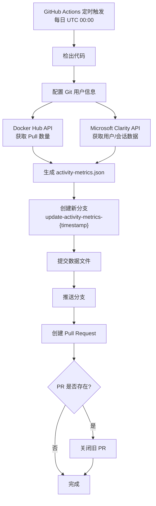
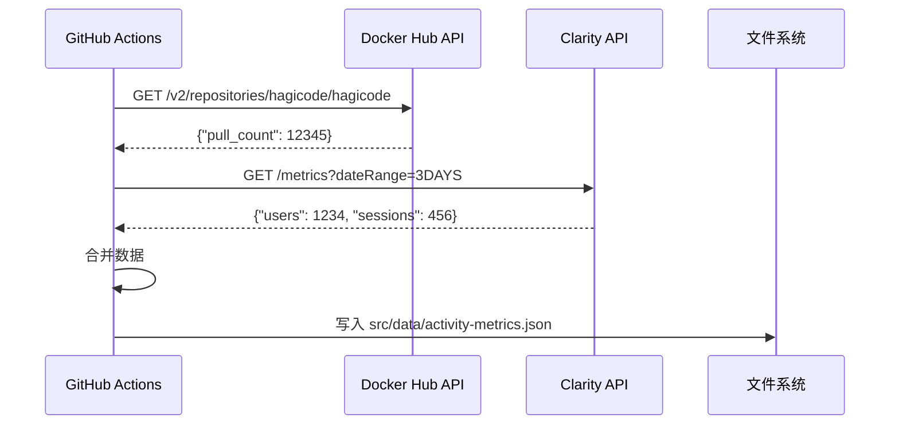
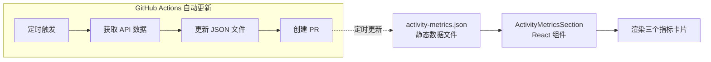

# Change: 首页展示项目活跃度数据

## Why

当前 Hagicode 文档站点首页无法向用户直观展示项目的活跃程度和使用情况（如 Docker Hub 镜像下载量、活跃用户数、活跃会话数等）。缺乏这些动态数据指标，用户难以快速了解 Hagicode 的社区活跃度和可信度。

通过在首页展示项目活跃度数据，可以：
1. 增强用户对项目的信心
2. 展示社区规模和增长趋势
3. 提供透明的项目健康度指标

## What Changes

- 在首页 Hero Section 下方新增 ActivityMetricsSection 组件，展示项目活跃度数据
- 创建 GitHub Actions 定时工作流，自动获取并更新活跃度数据
- 添加 Docker Hub Pull 数量统计（通过 Docker Hub API）
- 添加 Microsoft Clarity 活跃用户和活跃会话统计（通过 Clarity Data Export API）
- 数据以 JSON 格式存储在 `src/data/activity-metrics.json`，由 GitHub Actions 定期更新并自动创建 PR

## UI 设计变更

### 新增活跃度指标卡片区域

在 Hero Section 和 FeaturesShowcase 之间插入新的 ActivityMetricsSection 组件。

```
┌─────────────────────────────────────────────────────────────────┐
│                         Hero Section                              │
│                    (现有标题、描述、按钮)                          │
└─────────────────────────────────────────────────────────────────┘
                                ↓
┌─────────────────────────────────────────────────────────────────┐
│                    活跃度数据指标                                 │
├─────────────────────────────────────────────────────────────────┤
│                                                                   │
│   ┌─────────────┐    ┌─────────────┐    ┌─────────────┐        │
│   │             │    │             │    │             │        │
│   │   🐳        │    │   👥       │    │   💬        │        │
│   │             │    │             │    │             │        │
│   │  Docker Hub │    │  活跃用户    │    │  活跃会话   │        │
│   │             │    │             │    │             │        │
│   │  12,345     │    │   1,234     │    │   456       │        │
│   │  Pulls      │    │  过去3天    │    │  当前数量   │        │
│   │             │    │             │    │             │        │
│   └─────────────┘    └─────────────┘    └─────────────┘        │
│                                                                   │
└─────────────────────────────────────────────────────────────────┘
                                ↓
┌─────────────────────────────────────────────────────────────────┐
│                    Features Showcase                             │
│                   (现有功能展示区域)                              │
└─────────────────────────────────────────────────────────────────┘
```

### 活跃度指标卡片设计

每个指标卡片包含：
- **图标**：使用 emoji 表示数据类型
- **标题**：数据指标名称（Docker Hub / 活跃用户 / 活跃会话）
- **数值**：当前数据值
- **说明**：数据含义（Pulls / 过去3天 / 当前数量）

### 交互效果

- 卡片悬停时显示边框高亮效果
- 使用 CSS 渐变边框与首页其他卡片保持一致
- 响应式布局：桌面端 3 列，平板端 2 列，移动端 1 列

### 加载状态

- 数据从静态 JSON 文件读取，无加载延迟
- 若数据文件不存在或格式错误，显示占位符或隐藏该指标

## 代码流程变更

### 数据更新流程图



### 数据获取序列图



### 组件数据流图



## Impact

- **影响范围**: 首页布局、新增数据目录、GitHub Actions 工作流
- **新增文件**:
  - `src/components/home/ActivityMetricsSection.tsx`
  - `src/components/home/activityMetricsSection.module.css`
  - `src/data/activity-metrics.json`
  - `.github/workflows/update-activity-metrics.yml`
  - `scripts/update-activity-metrics.js`
- **修改文件**:
  - `src/pages/index.tsx` - 添加 ActivityMetricsSection 组件
- **依赖新增**:
  - 需要配置 GitHub Secrets: `DOCKER_HUB_USERNAME`、`DOCKER_HUB_PASSWORD`、`CLARITY_API_KEY`
- **数据源**:
  - Docker Hub API (无需认证即可获取公开数据)
  - Microsoft Clarity Data Export API (需要 API Key)
