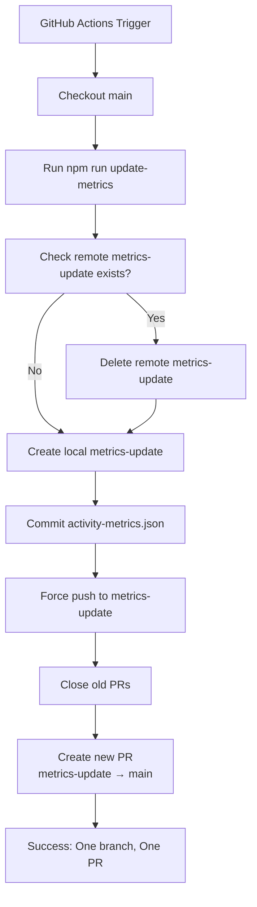

# Design Document: 优化 Hagicode 统计更新工作流

## Context

### 背景

Hagicode 文档站点使用 GitHub Actions 工作流每天自动更新首页的活动指标数据(Docker Hub 拉取次数、Microsoft Clarity 活跃用户和会话数)。当前实现存在分支管理问题:

1. 每次运行创建带有时间戳的独立分支(如 `update-activity-metrics-1737696000`)
2. 虽然旧的 PR 会被自动关闭,但分支本身不会被清理
3. 长期运行导致远程仓库积累大量已废弃的临时分支
4. 分支命名不固定,不利于追踪和调试

### 约束条件

- **不影响主分支**: 任何修改都不能影响 `main` 分支的内容和部署流程
- **保持数据完整性**: 统计数据必须准确且可追溯
- **最小化变更**: 仅修改必要的部分,避免引入不必要的复杂性
- **向后兼容**: 变更不应破坏现有的 PR 创建和关闭逻辑
- **可回滚**: 如果出现问题,必须能够快速回滚到之前的行为

### 利益相关者

- **开发团队**: 需要简洁的分支结构,便于维护和调试
- **项目维护者**: 需要可靠的统计数据更新机制
- **文档站点用户**: 期望首页显示准确的实时统计数据

## Goals / Non-Goals

### Goals

1. **简化分支管理**: 远程仓库只保留一个用于统计更新的分支
2. **提高一致性**: 每次更新使用相同的分支名称,便于理解和追踪
3. **减少维护成本**: 自动清理旧分支,无需手动干预
4. **保持可靠性**: 工作流稳定运行,统计数据准确无误

### Non-Goals

1. **不修改指标计算逻辑**: 数据获取和计算方式保持不变
2. **不改变 PR 管理流程**: 继续关闭旧 PR 并创建新 PR
3. **不影响其他工作流**: 部署工作流和其他自动化不受影响
4. **不增加新的外部依赖**: 继续使用现有的 GitHub Actions 和 GitHub CLI

## Decisions

### Decision 1: 使用固定分支名称

**选择**: 将分支名称从 `update-activity-metrics-$(date +%s)` 改为 `metrics-update`

**理由**:
- 固定名称具有明确的语义,易于理解和记忆
- 每次运行使用同一分支,自动覆盖旧内容
- 便于在日志和调试中快速定位相关分支
- 符合单一职责原则:一个分支专门用于统计更新

**替代方案**:
1. **使用日期作为分支名称** (如 `update-activity-metrics-2026-01-24`)
   - 优点: 保留时间信息,便于历史追溯
   - 缺点: 仍会积累多个分支,未解决根本问题
   - 结论: 不采纳,未解决核心问题

2. **使用随机标识符作为分支名称**
   - 优点: 避免命名冲突
   - 缺点: 失去可读性,不利于调试
   - 结论: 不采纳,引入不必要的复杂性

**实施细节**:
```yaml
- name: Create feature branch
  run: |
    BRANCH_NAME="metrics-update"
    git checkout -b "$BRANCH_NAME"
```

### Decision 2: 采用强制推送策略

**选择**: 使用 `git push --force` 而非普通推送

**理由**:
- 每次更新都是完全替换旧数据,不需要保留分支历史
- 强制推送确保分支内容始终与最新提交一致
- 避免推送冲突和合并提交
- 简化逻辑,无需处理分支已存在的情况

**替代方案**:
1. **使用普通推送 + 合并策略**
   - 优点: 保留完整的提交历史
   - 缺点: 可能产生不必要的合并提交;分支历史会不断增长
   - 结论: 不采纳,统计数据不需要在特性分支上保留历史

2. **先删除分支再创建**
   - 优点: 确保每次都是全新的分支
   - 缺点: 需要两次操作,增加复杂性和失败点
   - 结论: 部分采纳,在推送前删除远程分支,但本地使用强制推送

**安全考虑**:
- 使用 `--force-with-lease` 而非 `--force` 作为更安全的选项
- `--force-with-lease` 会在远程分支有新提交时拒绝推送,避免意外覆盖
- 由于工作流是定时任务且设置了并发控制,冲突风险极低

**实施细节**:
```yaml
- name: Delete remote branch if exists
  run: |
    if git ls-remote --heads origin metrics-update | grep -q "metrics-update"; then
      echo "Deleting existing remote branch metrics-update"
      git push origin --delete metrics-update
    else
      echo "Remote branch metrics-update does not exist"
    fi

- name: Push branch
  run: |
    git push origin metrics-update --force-with-lease
```

### Decision 3: 保持 PR 创建和关闭逻辑不变

**选择**: 继续使用现有的 PR 管理逻辑

**理由**:
- 现有逻辑运行良好,能够正确关闭旧 PR 并创建新 PR
- 用户已经熟悉当前的工作流程
- 固定分支名称不会影响 PR 的创建和关闭

**实施细节**:
- "Close previous activity metrics PRs" 步骤保持不变
- "Create Pull Request" 步骤保持不变
- PR 始终从 `metrics-update` 分支创建到 `main` 分支

## Technical Design

### 架构变更

#### 变更前

```
┌─────────────────────────────────────────────────────────────┐
│                     GitHub Actions Workflow                  │
└─────────────────────────────────────────────────────────────┘
                              │
                              ▼
┌─────────────────────────────────────────────────────────────┐
│  Create Branch: update-activity-metrics-{timestamp}          │
│  - 每次运行创建新分支                                         │
│  - 分支名称包含时间戳                                        │
└─────────────────────────────────────────────────────────────┘
                              │
                              ▼
┌─────────────────────────────────────────────────────────────┐
│  Commit & Push                                               │
│  - 普通推送                                                   │
│  - 创建新远程分支                                             │
└─────────────────────────────────────────────────────────────┘
                              │
                              ▼
┌─────────────────────────────────────────────────────────────┐
│  Close Old PRs & Create New PR                              │
│  - 关闭旧的统计更新 PR                                       │
│  - 创建新 PR                                                 │
└─────────────────────────────────────────────────────────────┘
                              │
                              ▼
                        [问题: 旧分支遗留]
```

#### 变更后

```
┌─────────────────────────────────────────────────────────────┐
│                     GitHub Actions Workflow                  │
└─────────────────────────────────────────────────────────────┘
                              │
                              ▼
┌─────────────────────────────────────────────────────────────┐
│  Delete Remote Branch (if exists)                           │
│  - 检查远程 metrics-update 分支是否存在                       │
│  - 如果存在则删除                                             │
└─────────────────────────────────────────────────────────────┘
                              │
                              ▼
┌─────────────────────────────────────────────────────────────┐
│  Create Branch: metrics-update                              │
│  - 固定分支名称                                               │
│  - 每次运行使用同一分支                                       │
└─────────────────────────────────────────────────────────────┘
                              │
                              ▼
┌─────────────────────────────────────────────────────────────┐
│  Commit & Force Push                                        │
│  - 使用 --force-with-lease 强制推送                          │
│  - 完全替换远程分支内容                                       │
└─────────────────────────────────────────────────────────────┘
                              │
                              ▼
┌─────────────────────────────────────────────────────────────┐
│  Close Old PRs & Create New PR                              │
│  - 关闭旧的统计更新 PR                                       │
│  - 从 metrics-update 创建新 PR                               │
└─────────────────────────────────────────────────────────────┘
                              │
                              ▼
                        [结果: 只有一个分支]
```

### 工作流步骤变更

#### 修改的步骤

1. **Create feature branch** (第 185-190 行)
   ```yaml
   # 变更前
   - name: Create feature branch
     id: create-branch
     run: |
       BRANCH_NAME="update-activity-metrics-$(date +%s)"
       git checkout -b "$BRANCH_NAME"
       echo "branch_name=$BRANCH_NAME" >> $GITHUB_OUTPUT

   # 变更后
   - name: Create feature branch
     run: |
       BRANCH_NAME="metrics-update"
       git checkout -b "$BRANCH_NAME"
       echo "Created branch: $BRANCH_NAME"
   ```

2. **新增: Delete remote branch** (在 Push branch 之前)
   ```yaml
   - name: Delete remote branch if exists
     run: |
       if git ls-remote --heads origin metrics-update | grep -q "metrics-update"; then
         echo "Deleting existing remote branch metrics-update"
         git push origin --delete metrics-update
       else
         echo "Remote branch metrics-update does not exist"
       fi
   ```

3. **Push branch** (第 199-201 行)
   ```yaml
   # 变更前
   - name: Push branch
     run: |
       git push origin "${{ steps.create-branch.outputs.branch_name }}"

   # 变更后
   - name: Push branch
     run: |
       git push origin metrics-update --force-with-lease
   ```

4. **Create Pull Request** (第 224-268 行)
   ```yaml
   # 变更前
   --head "${{ steps.create-branch.outputs.branch_name }}"

   # 变更后
   --head "metrics-update"
   ```

### 数据流



### 错误处理

1. **远程分支删除失败**
   - 场景: 远程分支存在但删除失败(权限问题、网络问题)
   - 处理: 工作流将继续,强制推送可能失败并报告错误
   - 后续: 下次运行时会重试

2. **强制推送失败**
   - 场景: 远程分支有新提交(极少可能)
   - 处理: `--force-with-lease` 会拒绝推送,工作流失败
   - 后续: 手动检查并删除冲突分支后重新运行

3. **PR 创建失败**
   - 场景: GitHub API 限流、权限问题
   - 处理: 工作流失败,不删除已推送的分支
   - 后续: 修复问题后重新运行,会覆盖旧分支

## Risks / Trade-offs

### 风险评估

| 风险 | 影响 | 概率 | 缓解措施 |
|------|------|------|----------|
| 强制推送覆盖分支历史 | 统计数据历史丢失 | 低 | 数据可通过 PR 历史、Git reflog 和 main 分支恢复 |
| 并发冲突 | 推送失败或数据不一致 | 极低 | 工作流已设置并发控制;定时任务很少并发 |
| 固定分支名称冲突 | 与其他功能冲突 | 极低 | `metrics-update` 名称具有明确语义 |
| 工作流失败导致无 PR | 统计数据未更新 | 低 | 工作流失败会发送通知;可手动触发 |

### 权衡分析

1. **分支历史 vs 简洁性**
   - 权衡: 强制推送会丢失分支的提交历史
   - 决策: 选择简洁性,因为统计数据的历史可以通过其他方式追溯
   - 理由: 分支的提交历史价值不高,main 分支和 PR 历史已足够

2. **强制推送 vs 安全性**
   - 权衡: 强制推送可能意外覆盖数据
   - 决策: 使用 `--force-with-lease` 平衡便利性和安全性
   - 理由: 在工作流控制良好的环境下,风险可控

3. **固定分支 vs 灵活性**
   - 权衡: 固定分支名称降低了并发处理的可能性
   - 决策: 选择固定分支,因为并发场景极少
   - 理由: 简化的收益大于并发处理的需求

## Migration Plan

### 实施步骤

1. **准备阶段**
   - 确认工作流文件路径: `.github/workflows/update-activity-metrics.yml`
   - 备份当前工作流配置(可选,通过 Git 历史)

2. **修改阶段**
   - 按照技术设计部分的说明修改工作流文件
   - 提交修改到特性分支
   - 创建 PR 并进行代码审查

3. **测试阶段**
   - 合并 PR 后,手动触发工作流进行测试
   - 验证工作流成功完成
   - 检查远程分支和 PR 状态

4. **监控阶段**
   - 观察下一次定时运行(UTC 00:00)
   - 确认工作流自动运行成功
   - 验证统计数据更新正常

5. **清理阶段(可选)**
   - 识别并删除旧的 `update-activity-metrics-*` 分支
   - 验证远程仓库分支列表干净

### 回滚计划

如果优化后出现问题,可以快速回滚:

1. **修改工作流文件**
   ```yaml
   # 恢复动态分支命名
   BRANCH_NAME="update-activity-metrics-$(date +%s)"

   # 移除远程分支删除步骤

   # 恢复普通推送
   git push origin "${{ steps.create-branch.outputs.branch_name }}"

   # 恢复动态分支引用
   --head "${{ steps.create-branch.outputs.branch_name }}"
   ```

2. **删除 metrics-update 分支**
   ```bash
   git push origin --delete metrics-update
   ```

3. **重新部署工作流**
   - 提交回滚修改
   - 合并到 main 分支

回滚操作简单且无风险,因为不涉及 main 分支的修改。

## Open Questions

目前没有未解决的问题。所有关键技术决策都已明确,风险已评估并有相应的缓解措施。
