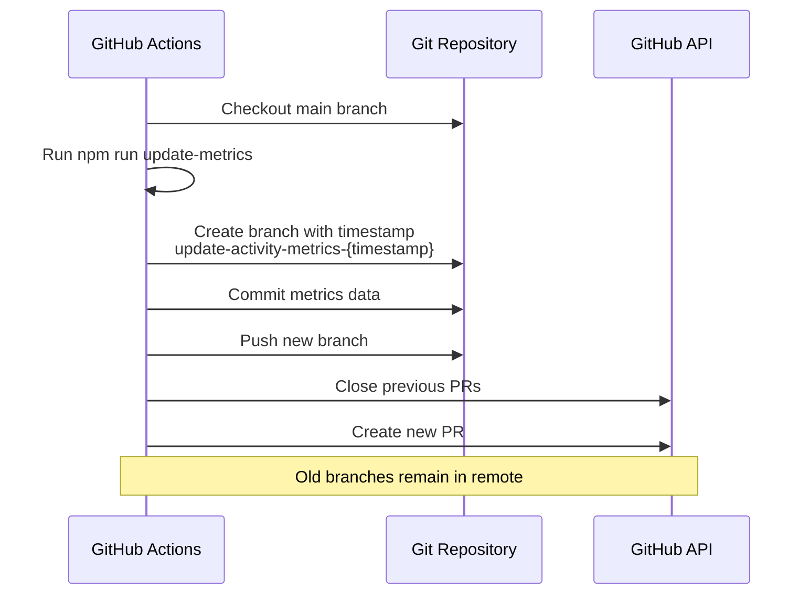
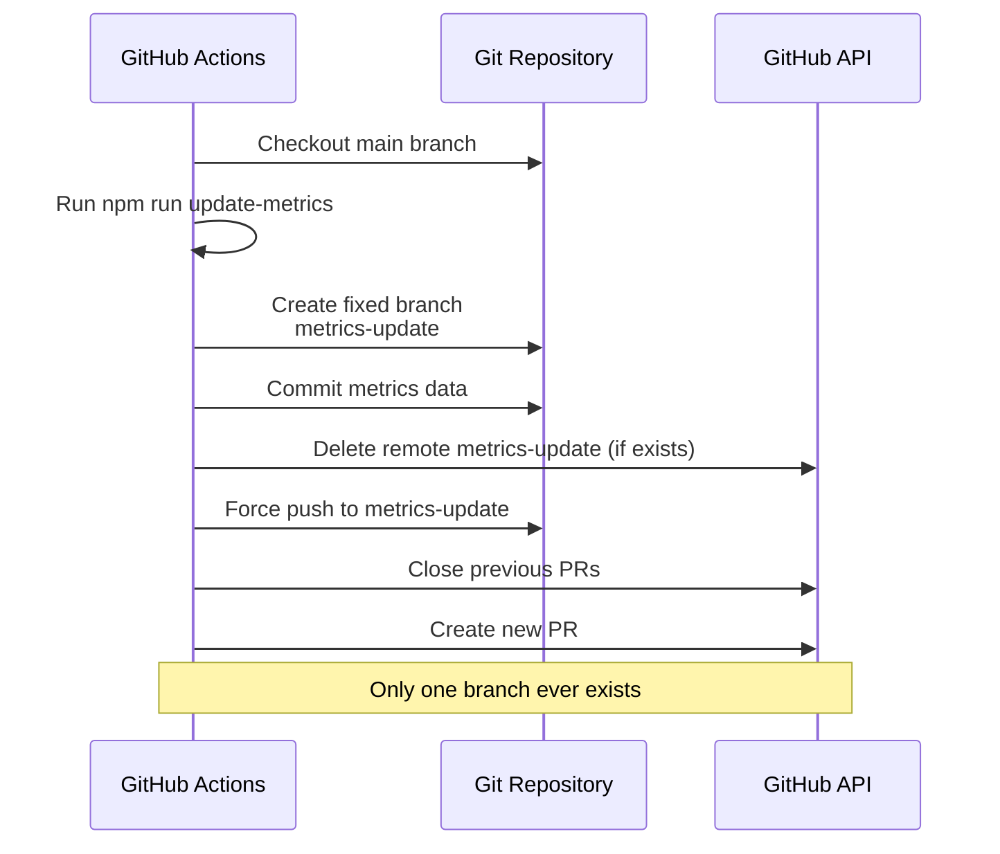

# Change: 优化 Hagicode 文档站点统计更新工作流

## Why

当前 Hagicode 文档站点的首页实时统计功能通过 GitHub Actions 工作流定期更新数据,但存在以下问题:

1. **分支命名不固定**: 每次运行创建带有时间戳的不同分支名称(如 `update-activity-metrics-1737696000`),导致仓库中积累多个临时分支
2. **分支管理复杂**: 虽然工作流会自动关闭旧的 PR,但分支本身不会被清理,长期运行会在远程仓库积累大量已合并或已关闭的分支
3. **推送方式不一致**: 当前使用普通推送方式,虽然每次都是新分支,但在异常情况下可能导致分支状态不一致
4. **历史记录碎片化**: 每次运行创建独立分支,不利于追踪统计数据的历史变化趋势

这些问题增加了仓库管理负担,可能导致混淆,并影响统计数据的可追溯性。

## What Changes

### 核心变更

1. **固定分支名称**
   - 将动态分支名称 `update-activity-metrics-$(date +%s)` 改为固定名称 `metrics-update`
   - 确保每次工作流运行都使用同一分支
   - 避免创建新的临时分支

2. **采用 Fresh Push 方式**
   - 使用 `git push --force` 强制推送策略
   - 每次推送前先删除远程分支(如果存在)
   - 每次推送时完全替换分支内容,确保分支内容始终是最新的统计数据
   - 添加 `--force-with-lease` 作为更安全的强制推送选项

3. **工作流优化**
   - 在推送前检查远程分支是否存在,如存在则先删除
   - 使用 `git push origin --delete metrics-update` 清理旧分支
   - 确保每次推送都是"干净"的提交
   - 保持 PR 关闭逻辑不变,确保只有一个活动的统计更新 PR

4. **可追溯性增强**
   - 固定分支名称便于审查统计历史
   - PR 中保留完整的指标变化对比表格
   - 每次更新都包含时间戳和详细的变化数据

### 保持不变

- **PR 创建和关闭逻辑**: 继续关闭旧的 PR 并创建新的 PR
- **主分支部署流程**: 不影响 `main` 分支的部署工作流
- **指标数据计算方式**: 保持现有的指标计算和对比逻辑
- **定时触发机制**: 继续每天 UTC 00:00 运行

## UI Design Changes

不适用。此变更为后端工作流优化,不涉及 UI 界面变更。

## Code Flow Changes

### 当前流程

### 优化后流程

### 关键变更点

1. **分支创建**: 从动态命名改为固定命名
2. **推送策略**: 添加远程分支删除步骤,使用强制推送
3. **分支清理**: 确保远程只保留一个 `metrics-update` 分支

## Impact

### 受影响的功能区域

- **GitHub Actions 工作流**: `.github/workflows/update-activity-metrics.yml`
- **仓库分支管理**: 减少临时分支数量
- **PR 管理流程**: PR 创建逻辑不变,但始终使用相同的源分支

### 不受影响的功能区域

- **文档站点部署**: `deploy.yml` 工作流不受影响
- **主分支内容**: `main` 分支的任何内容都不会被修改
- **文档构建和发布**: 文档站点的构建和部署流程完全不变
- **指标数据计算**: 数据获取和计算逻辑保持不变

### 预期收益

1. **简化分支管理**: 仓库中仅保留一个用于统计更新的分支 (`metrics-update`)
2. **提高数据一致性**: 每次强制推送确保统计数据完全同步,无历史残留
3. **降低维护成本**: 无需手动清理多个临时分支
4. **增强可追溯性**: 固定分支名称便于审查统计历史和调试
5. **减少仓库噪音**: 避免大量已废弃的临时分支占用分支列表

### 潜在风险与缓解措施

| 风险 | 影响 | 概率 | 缓解措施 |
|------|------|------|----------|
| 强制推送可能覆盖分支历史 | 统计数据历史丢失 | 低 | 数据可通过 PR 历史和 Git reflog 恢复;统计数据主要存储在 `data/activity-metrics.json`,该文件在 main 分支有完整历史 |
| 并发冲突(多个工作流同时运行) | 推送失败或数据不一致 | 极低 | 工作流已设置 `concurrency` 控制,且为每日定时任务,极少可能并发 |
| 强制推送失败导致工作流中断 | 统计更新无法完成 | 低 | 使用 `--force-with-lease` 更安全;添加错误处理和重试逻辑 |
| 固定分支名称与其他功能冲突 | 分支名称冲突 | 极低 | `metrics-update` 名称具有明确语义,与其他功能冲突可能性极低 |

### 数据恢复方案

如果强制推送导致数据意外丢失,可以通过以下方式恢复:

1. **从 PR 历史恢复**: 所有 PR 都包含完整的指标数据,可从已关闭的 PR 中恢复历史数据
2. **从 Git reflog 恢复**: Git reflog 保留分支历史记录,可恢复之前的提交
3. **从 main 分支恢复**: main 分支的 `data/activity-metrics.json` 有完整的历史记录
4. **重新运行工作流**: 可手动触发工作流重新获取最新数据

### 实施范围

- **仅影响**: 首页实时统计相关的 GitHub Actions 工作流 (`.github/workflows/update-activity-metrics.yml`)
- **不改变**:
  - 主分支 (`main`) 的部署流程
  - 文档站点的其他功能和内容
  - 指标数据的计算和展示逻辑
  - 定时任务的触发时间和频率

### 兼容性

- **向后兼容**: 此变更不破坏任何现有功能或 API
- **配置兼容**: 不需要修改 GitHub 仓库配置或密钥设置
- **工具兼容**: 继续使用现有的 GitHub Actions 和 GitHub CLI 工具

### 监控和验证

实施后需要验证:

1. 工作流成功运行并创建 PR
2. 远程仓库只存在一个 `metrics-update` 分支
3. PR 包含正确的指标数据和变化对比
4. 旧的 PR 被正确关闭
5. 数据在合并到 main 分支后正确显示在首页

### 回滚方案

如果优化后出现问题,可以快速回滚:

1. 修改工作流文件,恢复动态分支命名
2. 删除 `metrics-update` 分支
3. 重新部署工作流

回滚操作简单且无风险,因为不涉及 main 分支的修改。
