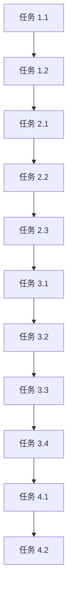

# 任务列表

## 阶段 1：研究与准备

### 任务 1.1：检查 Docusaurus 主题系统文档
- **描述**：查看 Docusaurus 3.x 官方文档中关于主题配置和初始化的说明
- **负责人**：AI Assistant
- **依赖**：无
- **验收标准**：了解 Docusaurus 主题系统的工作原理

### 任务 1.2：查找当前主题切换实现
- **描述**：搜索代码库中与主题切换相关的组件和逻辑
- **负责人**：AI Assistant
- **依赖**：任务 1.1
- **验收标准**：找到主题切换的实现位置和相关文件

## 阶段 2：实现默认暗色主题

### 任务 2.1：修改 docusaurus.config.ts 配置
- **描述**：检查并更新主题配置，设置默认暗色主题
- **负责人**：AI Assistant
- **依赖**：任务 1.2
- **验收标准**：配置文件正确设置默认主题
- **文件修改**：docusaurus.config.ts

### 任务 2.2：创建主题初始化组件
- **描述**：实现主题初始化逻辑，检查 localStorage 并设置默认暗色主题
- **负责人**：AI Assistant
- **依赖**：任务 2.1
- **验收标准**：组件正确实现主题初始化和持久化存储
- **文件修改**：可能需要创建新文件或修改现有文件

### 任务 2.3：集成主题初始化逻辑
- **描述**：将主题初始化组件集成到应用入口点
- **负责人**：AI Assistant
- **依赖**：任务 2.2
- **验收标准**：应用启动时正确初始化主题
- **文件修改**：可能修改 src/pages/index.tsx 或 theme 组件

## 阶段 3：验证与测试

### 任务 3.1：本地开发环境测试
- **描述**：运行 `npm start` 验证首次访问为暗色主题
- **负责人**：AI Assistant
- **依赖**：任务 2.3
- **验收标准**：首次访问时显示暗色主题

### 任务 3.2：主题切换功能测试
- **描述**：验证主题切换功能仍然正常工作
- **负责人**：AI Assistant
- **依赖**：任务 3.1
- **验收标准**：主题切换功能正常，状态正确持久化

### 任务 3.3：生产构建验证
- **描述**：运行 `npm run build` 确保无错误
- **负责人**：AI Assistant
- **依赖**：任务 3.2
- **验收标准**：生产构建成功，无错误

### 任务 3.4：TypeScript 类型检查
- **描述**：运行 `npm run typecheck` 验证 TypeScript 类型正确性
- **负责人**：AI Assistant
- **依赖**：任务 3.3
- **验收标准**：TypeScript 类型检查通过，无错误

## 阶段 4：文档与归档

### 任务 4.1：更新相关文档
- **描述**：如果需要，更新文档以说明默认暗色主题
- **负责人**：AI Assistant
- **依赖**：任务 3.4
- **验收标准**：文档准确反映新的默认主题行为

### 任务 4.2：提案归档准备
- **描述**：为提案归档做准备，包括完成任务列表和验证检查
- **负责人**：AI Assistant
- **依赖**：任务 4.1
- **验收标准**：提案已准备好进行归档

## 依赖关系图

## 可并行任务

- 任务 1.1 和任务 1.2 可以并行执行
- 阶段 3 的测试任务可以按顺序执行，但部分可以重叠

## 验收标准

### 功能验收

- [x] 用户首次访问时自动显示暗色主题
- [x] 主题切换功能正常工作（明/暗切换）
- [x] 主题偏好正确持久化到 localStorage
- [x] 已有的外观自定义功能保持不变

### 技术验收

- [x] `npm start` 正常启动，无错误
- [x] `npm run build` 成功，无错误
- [x] `npm run typecheck` 通过，无 TypeScript 错误（注：存在与修改无关的现有类型错误）
- [x] 所有文档链接正常
- [x] 响应式设计在不同设备上正常工作
