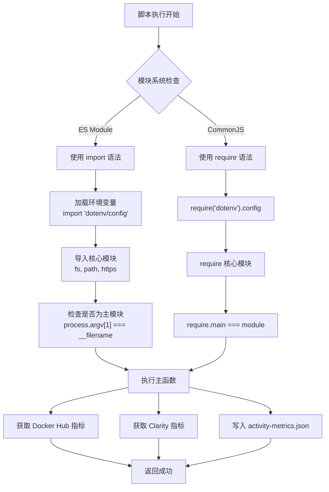

# Change: 将活动指标脚本迁移到ES模块

## Why

在 GitHub Actions CI/CD 部署流程中运行 `npm run update-metrics` 脚本时失败,错误为 `ReferenceError: require is not defined in ES module scope`。

根本原因是项目在 `package.json` 中配置了 `"type": "module"`,将所有 `.js` 文件视为 ES 模块,但 `scripts/update-activity-metrics.js` 仍使用 CommonJS 语法(`require`、`module.exports`)。

这导致 CI/CD 构建失败,阻止站点正常部署。

## What Changes

- **MODIFIED** `scripts/update-activity-metrics.js` - 将脚本从 CommonJS 迁移到 ES 模块语法
  - 替换 `require('dotenv').config()` → `import 'dotenv/config'`
  - 替换 `require('fs')` → `import fs from 'fs'`
  - 替换 `require('path')` → `import path from 'path'`
  - 替换 `require('https')` → `import https from 'https'`
  - 替换 `require.main === module` → 使用 `import.meta.url` 检查
  - 替换 `module.exports` → `export` 语句
  - 添加 `__filename` 和 `__dirname` 的 ES 模块等效实现

## UI Design Changes

不适用 - 此更改仅涉及构建脚本,不影响用户界面。

## Code Flow Changes

**模块系统对比:**

| 功能 | CommonJS (旧) | ES Module (新) |
|------|--------------|----------------|
| 环境变量加载 | `require('dotenv').config()` | `import 'dotenv/config'` |
| 模块导入 | `const fs = require('fs')` | `import fs from 'fs'` |
| 主模块检查 | `require.main === module` | `process.argv[1] === __filename` |
| 模块导出 | `module.exports = { ... }` | `export { ... }` |
| 当前文件路径 | `__filename` (内置) | `fileURLToPath(import.meta.url)` |
| 当前目录路径 | `__dirname` (内置) | `dirname(fileURLToPath(import.meta.url))` |

## Impact

### 影响的规格

- `build-scripts` - 添加 ES 模块脚本支持需求

### 影响的文件/代码

- **修改**: `scripts/update-activity-metrics.js` (约370行代码)
  - 第 28 行: `require('dotenv').config()` → `import 'dotenv/config'`
  - 第 30-32 行: `require` 语句 → `import` 语句
  - 第 49 行: `path.join(__dirname, ...)` → 使用 ES 模块的 `__dirname`
  - 第 354 行: `require.main === module` → 使用 `import.meta.url` 检查
  - 第 369 行: `module.exports` → `export` 语句

### 预期收益

- ✅ **修复 CI/CD 构建**: GitHub Actions 工作流将成功完成 `npm run update-metrics` 步骤
- ✅ **模块系统一致性**: 所有脚本使用统一的 ES 模块语法,符合项目配置
- ✅ **向后兼容**: 脚本的 `npm run update-metrics` 调用方式保持不变
- ✅ **本地开发兼容**: 本地运行脚本的行为与 CI 环境一致

### 风险评估

- ⚠️ **低风险**: 语法迁移不改变脚本功能逻辑
- ⚠️ **测试需求**: 需要在本地和 CI 环境验证脚本正常工作
- ⚠️ **环境变量**: 确保 `.env` 文件配置正确(使用 `import 'dotenv/config'` 方式)

### 迁移计划

1. **准备阶段**
   - 确认 `.env` 文件配置正确
   - 备份现有脚本

2. **实施阶段**
   - 更新 `scripts/update-activity-metrics.js` 的模块导入语法
   - 更新主模块检查逻辑
   - 更新模块导出语法

3. **验证阶段**
   - 本地运行 `npm run update-metrics` 验证脚本功能
   - 检查生成的 `public/activity-metrics.json` 文件
   - 提交代码并观察 GitHub Actions 工作流

4. **回滚计划**
   - 如果出现意外问题,可以恢复到 CommonJS 版本
   - 备选方案: 将脚本重命名为 `.cjs` 扩展名(作为临时方案)

## Open Questions

无 - 此迁移是直接且低风险的语法转换。
