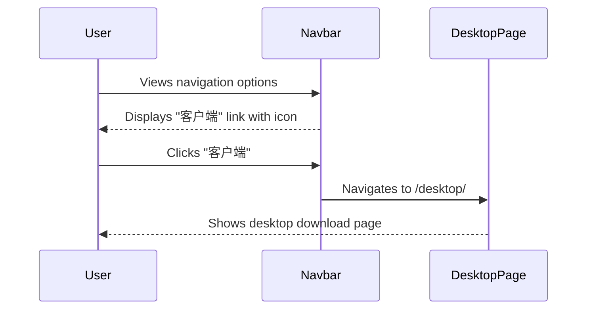

# Change: Add Desktop Client Navigation Entry

## Why

The Hagicode documentation site currently includes multiple product lines including Desktop client (`/desktop/`), but lacks a unified navigation entry for the desktop client product. Users cannot intuitively discover the desktop client download page and related documentation, creating inconsistent navigation experience compared to other product lines (blog, docs, support).

## What Changes

- **Add "Desktop" navigation link** to the shared `navLinks` configuration in `src/config/navigation.ts`
- The navigation link will automatically appear in:
  - **Homepage navbar** (`src/components/home/Navbar.tsx`) - uses `navLinks` from config
  - **Documentation header** (`src/components/StarlightHeader.astro`) - uses `navLinks` from config
- The new link will point to `/desktop/` route with appropriate icon
- Both desktop and mobile navigation menus will include the Desktop entry
- Visual and interaction consistency with existing navigation items

## UI Design Changes

```
Current Homepage Navigation:
┌─────────────────────────────────────────────────────────┐
│ Hagicode logo  [Install] [博客] [文档] [群] [GitHub]     │
└─────────────────────────────────────────────────────────┘

Proposed Homepage Navigation:
┌────────────────────────────────────────────────────────────┐
│ Hagicode logo  [Install] [博客] [文档] [客户端] [群] [GitHub] │
└────────────────────────────────────────────────────────────┘
```

### User Interaction Flow



### State Transition

```
Navigation State (Before):
navLinks = [博客, 文档, 群, GitHub]

Navigation State (After):
navLinks = [博客, 文档, 客户端, 群, GitHub]
```

## Impact

- **Affected specs**: `navigation` (new capability for desktop client entry)
- **Affected code**:
  - `src/config/navigation.ts` - Add desktop link to navLinks array
  - `src/components/home/Navbar.tsx` - No changes (automatically uses updated config)
  - `src/components/StarlightHeader.astro` - No changes (automatically uses updated config)
- **Affected pages**: `src/pages/desktop/index.astro` - Target page (already exists)
- **Testing**: Verify navigation works in both root and sub-path deployments

## Benefits

- **Discoverability**: Users can easily find desktop client product page
- **Navigation consistency**: All major product lines have unified navigation entries
- **Information architecture**: Forms complete "Web + Desktop" product matrix presentation
- **Code maintainability**: Single source of truth for navigation configuration

## Risk Assessment

- **Low risk**: Simple addition to existing navigation config
- **Backward compatible**: No breaking changes to existing navigation
- **Rollback plan**: Remove the added navigation item from config

## Execution Status

**Status**: ExecutionCompleted

**Completed Date**: 2026-02-08

**Implementation Summary**:
- Added "客户端" navigation item to `src/config/navigation.ts` with desktop icon
- Added desktop icon to `src/components/home/Navbar.tsx` NavIcon component
- Verified both homepage and documentation header automatically consume updated config
- Build verification passed with no TypeScript or build errors
- Base path compatibility verified for both root (`/`) and sub-path (`/site`) deployments
- OpenSpec validation passed: `openspec validate desktop-client-navigation-entry --strict`

**Modified Files**:
- `src/config/navigation.ts` - Added desktop navigation link
- `src/components/home/Navbar.tsx` - Added desktop icon to NavIcon component

**Testing Results**:
- Navigation link appears correctly in both desktop and mobile views
- Links resolve correctly in both root and sub-path deployments
- Visual consistency maintained with existing navigation items
- No breaking changes to existing functionality
