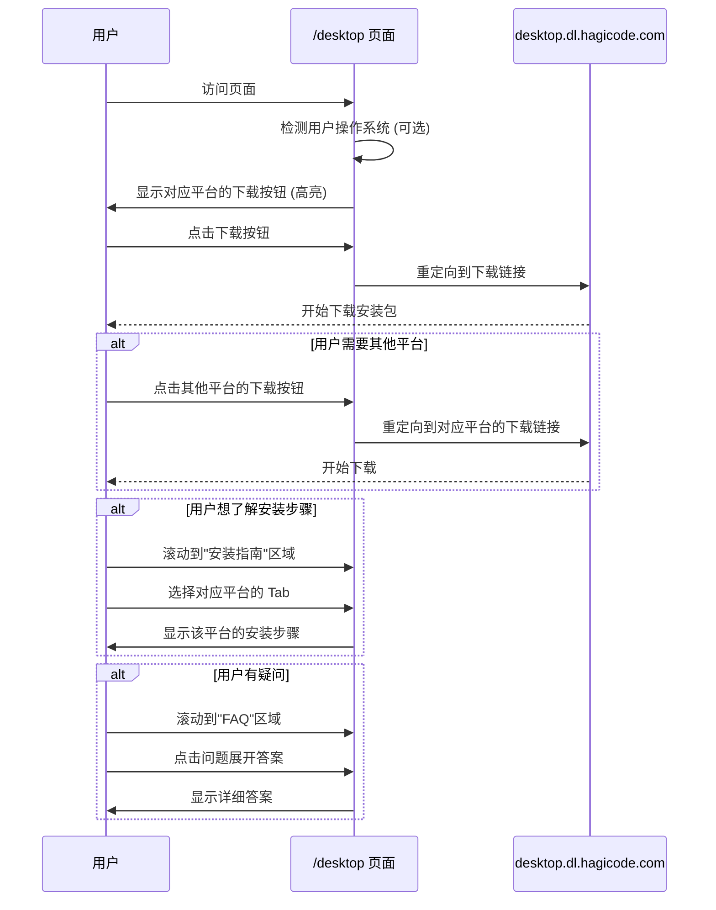
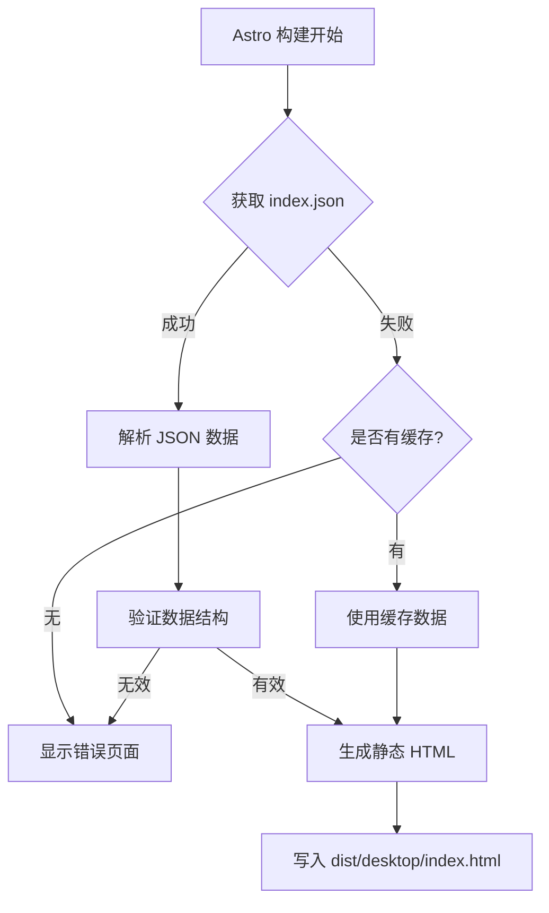
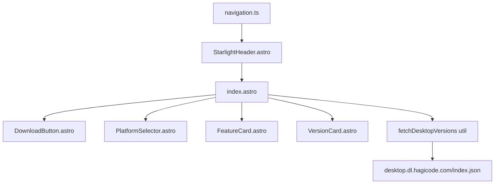

# 设计文档: Hagicode Desktop 产品展示和下载页面

## 概述

本文档详细描述了 Hagicode Desktop 产品展示和下载页面的技术设计决策、UI/UX 设计和实现细节。该页面旨在为用户提供一站式 Desktop 产品信息展示和下载体验,整合现有分散在 `desktop.dl.hagicode.com` 的下载资源。

## 目标 / 非目标

### 目标

- 创建一个清晰、美观的产品展示页面,突出 Hagicode Desktop 的核心价值
- 提供便捷的多平台下载入口,减少用户跳转
- 展示版本历史和更新日志,帮助用户了解产品演进
- 提供详细的安装指南和常见问题解答
- 与现有文档站点保持视觉一致性
- 支持浅色和深色主题切换
- 确保页面在各设备上的响应式显示

### 非目标

- 不提供动态的用户认证或账户管理功能
- 不实现客户端状态管理或复杂的交互逻辑
- 不创建与在线版本的功能对比页面 (可后续添加)
- 不提供用户评价或反馈收集功能 (可后续添加)

## 技术决策

### 决策 1: 使用 Astro 静态生成

**选择**: 在构建时获取版本数据并生成静态 HTML

**理由**:
- Astro 已是项目的技术栈,保持技术一致性
- 静态生成确保页面加载性能最优
- 无需客户端数据请求,减少 JavaScript 依赖
- 更好的 SEO 支持

**替代方案考虑**:
- **客户端数据获取**: 被拒绝,因为会增加页面加载时间和 JavaScript 依赖
- **Server-Side Rendering (SSR)**: 被拒绝,因为项目使用静态站点部署,无 SSR 支持

### 决策 2: 数据源集成方式

**选择**: 构建时从 `https://desktop.dl.hagicode.com/index.json` 获取版本信息

**理由**:
- 复用现有的数据源,避免重复维护
- `index.json` 已包含版本、平台、下载链接等必需信息
- 构建时获取确保数据实时性

**风险缓解**:
- 实现 30 秒超时机制
- 提供友好的错误处理和降级方案
- 考虑实现数据缓存 (未来增强)

### 决策 3: 组件架构

**选择**: 使用 Astro 组件 (`.astro` 文件) 而非纯 React 组件

**理由**:
- Astro 组件支持服务器端渲染,无需客户端 hydration
- 更小的 JavaScript 包大小
- 与现有页面结构一致
- 可按需引入 React 交互组件

**组件列表**:
- `DownloadButton.astro` - 下载按钮 (静态)
- `PlatformSelector.astro` - 平台选择器 (轻量交互)
- `FeatureCard.astro` - 功能特性卡片 (静态)
- `VersionCard.astro` - 版本信息卡片 (静态)

### 决策 4: 导航集成

**选择**: 通过 `src/config/navigation.ts` 统一配置导航链接

**理由**:
- 复用现有的导航配置系统
- 确保导航链接在所有组件中保持一致
- 支持 `withBasePath` 工具函数处理基础路径

**实现方式**:
```typescript
// src/config/navigation.ts
export const navLinks: NavLink[] = [
  // ... 现有链接
  {
    label: "桌面客户端",
    href: withBasePath("/desktop"),
    icon: "laptop",
  },
];
```

## UI/UX 设计

### 页面布局

#### Hero Section

```
┌─────────────────────────────────────────────────────────────┐
│                                                              │
│         ┌─────────────────────────────────────────┐         │
│         │                                         │         │
│         │         Hagicode Desktop                │         │
│         │    本地化的 AI 代码助手                  │         │
│         │                                         │         │
│         │  保护隐私 • 快速响应 • 跨平台支持        │         │
│         │                                         │         │
│         │  ┌─────────┐ ┌─────────┐ ┌─────────┐   │         │
│         │  │Windows  │ │ macOS   │ │ Linux   │   │         │
│         │  │ 下载    │ │ 下载    │ │ 下载    │   │         │
│         │  └─────────┘ └─────────┘ └─────────┘   │         │
│         │                                         │         │
│         │  最新版本: v1.0.0 | 2026-01-15         │         │
│         │                                         │         │
│         └─────────────────────────────────────────┘         │
│                                                              │
└─────────────────────────────────────────────────────────────┘
```

**设计说明**:
- 使用居中布局突出产品名称和价值主张
- 三个下载按钮并排显示,使用平台图标和标签
- 最新版本信息使用较小字体显示在按钮下方
- 支持响应式布局: 移动端垂直堆叠按钮

### 功能特性区域

```
┌─────────────────────────────────────────────────────────────┐
│  功能特性                                                    │
│                                                              │
│  ┌─────────────┐ ┌─────────────┐ ┌─────────────┐          │
│  │  🚀 本地运行 │ │  🔒 隐私保护 │ │  ⚡ 快速响应 │          │
│  │  ─────────  │ │  ─────────  │ │  ─────────  │          │
│  │  所有数据    │ │  代码不上传  │ │  毫秒级响应  │          │
│  │  本地处理    │ │  完全离线    │ │  无需等待    │          │
│  └─────────────┘ └─────────────┘ └─────────────┘          │
│                                                              │
│  ┌─────────────┐ ┌─────────────┐ ┌─────────────┐          │
│  │  💻 跨平台   │ │  🔄 自动更新 │ │  🌍 多语言  │          │
│  │  ─────────  │ │  ─────────  │ │  ─────────  │          │
│  │  Win/Mac/   │ │  自动检查    │ │  中英文界面  │          │
│  │  Linux      │ │  无缝升级    │ │  国际化支持  │          │
│  └─────────────┘ └─────────────┘ └─────────────┘          │
└─────────────────────────────────────────────────────────────┘
```

**设计说明**:
- 使用 3 列网格布局 (桌面端)
- 每个特性卡片包含图标、标题、描述
- 使用 Starlight 图标系统保持一致性
- 悬停时卡片轻微上移并显示边框高亮

### 系统要求区域

使用 Tabs 组件分离不同平台:

```markdown
### 系统要求

import { Tabs, TabItem } from '@astrojs/starlight/components';

<Tabs>
  <TabItem label="Windows">
    **操作系统**: Windows 10/11 (64-bit)
    **处理器**: Intel Core i3 或同等性能处理器
    **内存**: 4GB RAM (推荐 8GB)
    **磁盘空间**: 2GB 可用空间
    **网络**: 初始下载需要网络连接 (后续可离线使用)
  </TabItem>
  <TabItem label="macOS">
    **操作系统**: macOS 12+ (Monterey 或更高版本)
    **处理器**: Apple Silicon (M1/M2/M3) 或 Intel Core i3+
    **内存**: 4GB RAM (推荐 8GB)
    **磁盘空间**: 2GB 可用空间
    **网络**: 初始下载需要网络连接 (后续可离线使用)
  </TabItem>
  <TabItem label="Linux">
    **操作系统**: Ubuntu 20.04+ / Debian 11+ / 其他主流发行版
    **处理器**: Intel Core i3 或同等性能处理器
    **内存**: 4GB RAM (推荐 8GB)
    **磁盘空间**: 2GB 可用空间
    **网络**: 初始下载需要网络连接 (后续可离线使用)
    **注意**: 需要安装图形界面环境
  </TabItem>
</Tabs>
```

### 安装指南区域

同样使用 Tabs 组件,为每个平台提供详细的安装步骤:

```
┌─────────────────────────────────────────────────────────────┐
│  安装指南                                                    │
│                                                              │
│  [Windows] [macOS] [Linux]                                  │
│  ─────────────────────────────────────────────────────────  │
│                                                              │
│  ### Windows 安装步骤                                        │
│                                                              │
│  1. **下载安装包**                                           │
│     - 点击上方的 "Windows 下载" 按钮                          │
│     - 下载 `Hagicode-Desktop-Setup-x.x.x.exe` 文件           │
│                                                              │
│  2. **运行安装程序**                                         │
│     - 双击下载的 `.exe` 文件                                 │
│     - 在 Windows SmartScreen 提示时点击"更多信息"然后"运行"  │
│                                                              │
│  3. **完成安装**                                             │
│     - 按照安装向导完成安装                                   │
│     - 安装完成后可以从开始菜单启动 Hagicode Desktop          │
│                                                              │
│  ### 常见问题                                                │
│                                                              │
│  ::tip[安装失败]
│  如果安装失败,请确保:                                         │
│  - 已关闭正在运行的 Hagicode Desktop 实例                    │
│  - 有管理员权限                                              │
│  - 系统满足最低要求                                          │
│  :::                                                         │
└─────────────────────────────────────────────────────────────┘
```

### 版本历史区域

```
┌─────────────────────────────────────────────────────────────┐
│  版本历史                                                    │
│                                                              │
│  ┌───────────────────────────────────────────────────────┐  │
│  │ v1.0.0 - 2026-01-15                       [展开 v ▼]  │  │
│  │ • 初始发布版本                                         │  │
│  │ • 支持基础对话功能                                     │  │
│  │ • 支持 Windows/macOS/Linux 三大平台                   │  │
│  │ • 集成本地 AI 模型支持                                │  │
│  └───────────────────────────────────────────────────────┘  │
│                                                              │
│  ┌───────────────────────────────────────────────────────┐  │
│  │ v0.9.0-beta - 2026-01-01                 [展开 v ▼]  │  │
│  │ • 公开测试版本                                         │  │
│  │ • 新增自动更新功能                                     │  │
│  │ • 优化启动速度和内存占用                               │  │
│  │ • 修复多个已知问题                                     │  │
│  └───────────────────────────────────────────────────────┘  │
│                                                              │
│  [查看所有历史版本]                                          │
└─────────────────────────────────────────────────────────────┘
```

**设计说明**:
- 每个版本显示版本号、发布日期和更新日志摘要
- 支持"展开/折叠"查看完整日志
- 最新版本显示在顶部
- 提供"查看所有历史版本"链接 (可选,链接到 `desktop.dl.hagicode.com`)

### FAQ 区域

使用 Starlight Details 组件:

```
┌─────────────────────────────────────────────────────────────┐
│  常见问题                                                    │
│                                                              │
│  ▼ Desktop 和在线版本有什么区别?                             │
│    Desktop 版本完全在本地运行,所有代码数据处理都在你的电脑   │
│    上进行,不会上传到任何服务器。这意味着:                     │
│    • 更好的隐私保护                                         │
│    • 无需网络连接即可使用                                    │
│    • 更快的响应速度                                         │
│    在线版本则提供云端协作和跨设备同步功能。                   │
│                                                              │
│  ▼ 如何检查更新?                                             │
│    Desktop 会自动检查更新。当有新版本可用时,会在界面右上角   │
│    显示提示。你也可以在"设置"中手动检查更新。                 │
│                                                              │
│  ▼ 支持哪些 AI 模型?                                         │
│    Hagicode Desktop 支持多种本地 AI 模型,包括:              │
│    • Claude (通过 API)                                      │
│    • OpenAI GPT 系列 (通过 API)                             │
│    • 本地开源模型 (如 LLaMA、Mistral 等)                     │
│                                                              │
│  ▼ 数据存储在哪里?                                           │
│    所有数据都存储在你的本地电脑上:                           │
│    • Windows: `C:\Users\<用户名>\AppData\Local\Hagicode`   │
│    • macOS: `~/Library/Application Support/Hagicode`        │
│    • Linux: `~/.local/share/Hagicode`                       │
│                                                              │
│  ▼ 如何卸载?                                                 │
│    • Windows: 通过"设置 > 应用"卸载,或运行卸载程序           │
│    • macOS: 删除 Applications 文件夹中的 Hagicode Desktop    │
│    • Linux: 使用包管理器卸载或删除 AppImage 文件             │
│                                                              │
└─────────────────────────────────────────────────────────────┘
```

### 用户交互流程



### 响应式设计

#### 移动端 (< 768px)

```
┌──────────────────────────┐
│  Hagicode Desktop        │
│  本地化的 AI 代码助手     │
│                          │
│  保护隐私 • 快速响应      │
│                          │
│  ┌──────────────────┐   │
│  │   Windows 下载   │   │
│  └──────────────────┘   │
│  ┌──────────────────┐   │
│  │    macOS 下载    │   │
│  └──────────────────┘   │
│  ┌──────────────────┐   │
│  │    Linux 下载    │   │
│  └──────────────────┘   │
│                          │
│  最新版本: v1.0.0        │
└──────────────────────────┘
```

- 下载按钮垂直堆叠
- 功能特性卡片单列显示
- Tab 组件保持水平滚动或垂直堆叠

#### 平板端 (768px - 1024px)

```
┌────────────────────────────────────────┐
│  Hagicode Desktop                      │
│  本地化的 AI 代码助手                   │
│                                        │
│  ┌──────────┐ ┌──────────┐            │
│  │Windows   │ │ macOS    │            │
│  └──────────┘ └──────────┘            │
│  ┌──────────┐                         │
│  │ Linux    │                         │
│  └──────────┘                         │
│                                        │
│  ┌────────────┐ ┌────────────┐        │
│  │ 本地运行   │ │ 隐私保护   │        │
│  └────────────┘ └────────────┘        │
│  ┌────────────┐ ┌────────────┐        │
│  │ 快速响应   │ │ 跨平台     │        │
│  └────────────┘ └────────────┘        │
└────────────────────────────────────────┘
```

- 下载按钮 2 列或 3 列布局
- 功能特性卡片 2 列布局

#### 桌面端 (> 1024px)

- 使用完整的布局设计
- 所有组件按设计稿排列

### 状态和错误处理

#### 加载状态

由于使用静态生成,不需要显示加载状态。数据在构建时获取。

#### 数据获取失败

```
┌─────────────────────────────────────────────────────────────┐
│  ⚠️ 无法加载版本信息                                         │
│                                                              │
│  抱歉,我们无法从服务器获取最新的版本信息。                     │
│                                                              │
│  你可以:                                                     │
│  • [重试] 刷新页面重试                                       │
│  • [访问下载页面] 前往 desktop.hagicode.com 获取最新版本      │
│                                                              │
│  如果问题持续存在,请联系技术支持。                             │
└─────────────────────────────────────────────────────────────┘
```

#### 空数据状态

如果 `index.json` 返回空数组或无效数据:

```
┌─────────────────────────────────────────────────────────────┐
│  📦 暂无可用的下载版本                                       │
│                                                              │
│  当前没有可用的 Hagicode Desktop 版本。                       │
│                                                              │
│  • [查看 GitHub Releases] 了解发布历史                       │
│  • [联系支持] 获取帮助                                        │
└─────────────────────────────────────────────────────────────┘
```

## 技术设计

### 数据流



### 组件关系



### 代码变更清单

| 文件路径 | 变更类型 | 变更原因 | 影响范围 |
|---------|---------|---------|---------|
| `src/pages/desktop/index.astro` | 新增 | 创建 Desktop 展示和下载主页面 | 新页面路由 |
| `src/components/desktop/DownloadButton.astro` | 新增 | 下载按钮组件,支持多平台 | UI 组件 |
| `src/components/desktop/PlatformSelector.astro` | 新增 | 平台选择器组件 (可选) | UI 组件 |
| `src/components/desktop/FeatureCard.astro` | 新增 | 功能特性卡片组件 | UI 组件 |
| `src/components/desktop/VersionCard.astro` | 新增 | 版本信息卡片组件 | UI 组件 |
| `src/types/desktop.ts` | 新增 | Desktop 数据类型定义 | TypeScript 类型 |
| `src/utils/desktop.ts` | 新增 | Desktop 数据获取工具函数 | 工具函数 |
| `src/config/navigation.ts` | 修改 | 添加"桌面客户端"导航链接 | 导航配置 |

### 关键代码片段

#### 平台推断函数

由于 `index.json` 不包含平台分类,需要从文件名推断:

```typescript
// src/utils/desktop.ts

export enum AssetType {
  WindowsSetup = 'windows-setup',          // 推荐 Windows 安装程序
  WindowsPortable = 'windows-portable',    // Windows 便携版
  WindowsStore = 'windows-store',          // Microsoft Store
  MacOSApple = 'macos-apple',              // Apple Silicon (推荐)
  MacOSIntel = 'macos-intel',              // Intel/通用
  LinuxAppImage = 'linux-appimage',        // AppImage (推荐)
  LinuxDeb = 'linux-deb',                  // Debian 包
  LinuxTarball = 'linux-tarball',          // 压缩包
  Source = 'source',                       // 源代码
  Unknown = 'unknown',
}

export function inferAssetType(filename: string): AssetType {
  const name = filename.toLowerCase();

  // Windows
  if (name.includes('setup') && name.endsWith('.exe')) {
    return AssetType.WindowsSetup;
  }
  if (name.endsWith('.exe')) {
    return AssetType.WindowsPortable;
  }
  if (name.endsWith('.appx')) {
    return AssetType.WindowsStore;
  }

  // macOS
  if (name.includes('arm64') && name.endsWith('.dmg')) {
    return AssetType.MacOSApple;
  }
  if (name.endsWith('.dmg')) {
    return AssetType.MacOSIntel;
  }
  if (name.includes('-mac.zip') || name.includes('arm64-mac.zip')) {
    return name.includes('arm64') ? AssetType.MacOSApple : AssetType.MacOSIntel;
  }

  // Linux
  if (name.endsWith('.appimage')) {
    return AssetType.LinuxAppImage;
  }
  if (name.includes('_amd64.deb')) {
    return AssetType.LinuxDeb;
  }
  if (name.endsWith('.tar.gz')) {
    return AssetType.LinuxTarball;
  }

  return AssetType.Unknown;
}

export function formatFileSize(bytes: number): string {
  const gb = bytes / (1024 * 1024 * 1024);
  if (gb >= 1) {
    return `${gb.toFixed(1)} GB`;
  }
  const mb = bytes / (1024 * 1024);
  return `${mb.toFixed(0)} MB`;
}
```

#### 数据获取和转换

```typescript
// src/utils/desktop.ts
import type { DesktopIndexResponse, DesktopAsset, PlatformDownload } from '@/types/desktop';

const INDEX_JSON_URL = 'https://desktop.dl.hagicode.com/index.json';
const TIMEOUT_MS = 30000;

export async function fetchDesktopVersions(): Promise<DesktopIndexResponse> {
  const controller = new AbortController();
  const timeoutId = setTimeout(() => controller.abort(), TIMEOUT_MS);

  try {
    const response = await fetch(INDEX_JSON_URL, {
      signal: controller.signal,
    });
    clearTimeout(timeoutId);

    if (!response.ok) {
      throw new Error(`HTTP ${response.status}: ${response.statusText}`);
    }

    const data: DesktopIndexResponse = await response.json();

    // 验证数据结构
    if (!Array.isArray(data.versions)) {
      throw new Error('Invalid data structure: missing versions array');
    }

    return data;
  } catch (error) {
    if (error.name === 'AbortError') {
      throw new Error('Request timeout: failed to fetch version data');
    }
    throw error;
  }
}

export function groupAssetsByPlatform(assets: DesktopAsset[]): Map<string, PlatformDownload[]> {
  const platformGroups = new Map<string, PlatformDownload[]>();

  for (const asset of assets) {
    const assetType = inferAssetType(asset.name);
    if (assetType === AssetType.Unknown) continue;

    let platform: string;
    switch (assetType) {
      case AssetType.WindowsSetup:
      case AssetType.WindowsPortable:
      case AssetType.WindowsStore:
        platform = 'windows';
        break;
      case AssetType.MacOSApple:
      case AssetType.MacOSIntel:
        platform = 'macos';
        break;
      case AssetType.LinuxAppImage:
      case AssetType.LinuxDeb:
      case AssetType.LinuxTarball:
        platform = 'linux';
        break;
      default:
        continue;
    }

    if (!platformGroups.has(platform)) {
      platformGroups.set(platform, []);
    }

    platformGroups.get(platform)!.push({
      url: `${INDEX_JSON_URL.replace('/index.json', '/')}${asset.path}`,
      size: formatFileSize(asset.size),
      filename: asset.name,
      assetType,
    });
  }

  return platformGroups;
}
```

#### 类型定义

```typescript
// src/types/desktop.ts

// 实际的 index.json 响应结构
export interface DesktopIndexResponse {
  updatedAt: number;          // Unix 时间戳
  versions: DesktopVersion[];
}

// 版本信息 (实际结构)
export interface DesktopVersion {
  version: string;            // 版本号 (如 "v0.1.1")
  files: string[];            // 文件名数组
  assets: DesktopAsset[];     // 详细文件信息
}

// 文件资源信息
export interface DesktopAsset {
  name: string;               // 文件名
  path: string;               // 相对路径
  size: number;               // 文件大小 (字节)
  lastModified: number | null;
}

// 应用层使用的平台分类 (从文件名推断)
export interface PlatformDownload {
  url: string;                // 完整下载链接
  size: string;               // 格式化的文件大小
  filename: string;           // 文件名
  assetType: AssetType;       // 资源类型
}

// 资源类型枚举
export enum AssetType {
  WindowsSetup = 'windows-setup',
  WindowsPortable = 'windows-portable',
  WindowsStore = 'windows-store',
  MacOSApple = 'macos-apple',
  MacOSIntel = 'macos-intel',
  LinuxAppImage = 'linux-appimage',
  LinuxDeb = 'linux-deb',
  LinuxTarball = 'linux-tarball',
  Source = 'source',
  Unknown = 'unknown',
}
```

#### 页面主文件

```astro
---
// src/pages/desktop/index.astro
import Layout from '@/layouts/Layout.astro';
import { fetchDesktopVersions, groupAssetsByPlatform } from '@/utils/desktop';
import VersionDownloads from '@/components/desktop/VersionDownloads.astro';
import FeatureCard from '@/components/desktop/FeatureCard.astro';

// 在构建时获取版本数据
let versionData = null;
let error = null;

try {
  versionData = await fetchDesktopVersions();
} catch (e) {
  error = e.message;
  console.error('Failed to fetch desktop versions:', e);
}

const latestVersion = versionData?.versions?.[0] || null;
---

<Layout title="Hagicode Desktop - 下载">
  <header class="hero">
    <h1>Hagicode Desktop</h1>
    <p>本地化的 AI 代码助手,保护隐私,提升效率</p>

    {error ? (
      <div class="error-message">
        <p>⚠️ 无法加载版本信息</p>
        <p>{error}</p>
        <a href="https://desktop.dl.hagicode.com/" class="btn">
          前往下载页面
        </a>
      </div>
    ) : latestVersion ? (
      <>
        <VersionDownloads version={latestVersion} />
        <p class="version-info">
          最新版本: {latestVersion.version}
        </p>
      </>
    ) : (
      <p>暂无可用的下载版本</p>
    )}
  </header>

  <!-- 功能特性、系统要求、安装指南、版本历史、FAQ 等 -->
</Layout>

<style>
  /* 页面样式 */
</style>
```

## 风险 / 权衡

### 风险 1: 构建时网络依赖

**描述**: 每次构建都需要从 `desktop.dl.hagicode.com` 获取数据,如果网络不稳定可能导致构建失败。

**缓解措施**:
- 设置 30 秒超时
- 提供友好的错误页面
- 考虑实现本地数据缓存 (未来增强)
- 在 CI/CD 中添加重试逻辑

**权衡**: 接受构建时的网络依赖,以换取更好的用户体验和数据实时性。

### 风险 2: 数据格式变更

**描述**: 如果 `index.json` 格式发生变化,可能导致页面无法正确解析数据。

**缓解措施**:
- 使用 TypeScript 接口定义数据结构
- 实现健壮的数据验证
- 在构建时验证数据完整性
- 监控数据格式变化

**权衡**: 依赖外部数据源格式,但通过类型检查和验证降低风险。

### 风险 3: 页面内容维护成本

**描述**: 版本历史、更新日志等内容需要定期维护。

**缓解措施**:
- 自动从 `index.json` 读取版本信息
- 减少手动维护的内容
- 提供清晰的更新流程文档

**权衡**: 接受一定的维护成本,以提供更丰富的用户体验。

## 迁移计划

### 实施步骤

1. **创建页面结构和组件** (任务 2.1-3.4)
2. **实现数据获取和集成** (任务 1.1-2.2)
3. **编写页面内容** (任务 4.1-4.6, 9.1-9.4)
4. **集成到导航系统** (任务 5.1-5.2)
5. **样式适配和响应式设计** (任务 6.1-6.2)
6. **测试和验证** (任务 10.1-10.8)

### 回滚计划

如果出现问题:
1. 从 `src/config/navigation.ts` 中移除导航链接
2. 删除 `src/pages/desktop/` 目录
3. 删除相关组件文件
4. 重新构建站点

由于这是新增功能,回滚不会影响现有功能。

## 开放问题

1. **是否需要实现版本详情页?**
   - 当前计划仅实现主页面 (`/desktop`)
   - 版本详情页 (`/desktop/[version]`) 可作为后续增强

2. **是否需要实现数据缓存机制?**
   - 当前计划每次构建时获取最新数据
   - 如果构建性能成为问题,可考虑实现缓存

3. **是否需要添加下载统计?**
   - 当前计划不包含下载统计功能
   - 可通过 Analytics 工具 (如 Microsoft Clarity) 跟踪下载按钮点击

4. **是否需要支持多语言?**
   - 当前计划仅支持中文 (与站点整体策略一致)
   - 如果需要国际化,需要额外的 i18n 支持

## 后续增强

1. **产品截图和演示视频**
   - 添加 Desktop 应用界面截图
   - 嵌入产品演示视频

2. **用户评价和案例**
   - 展示用户对 Desktop 的评价
   - 添加使用案例和成功故事

3. **版本对比**
   - 添加不同版本的对比功能
   - 突出最新版本的新功能

4. **自动更新检测**
   - 在页面上集成版本更新检测
   - 提示用户当前版本是否为最新

5. **离线安装支持**
   - 提供离线安装包下载
   - 支持企业内部部署场景
