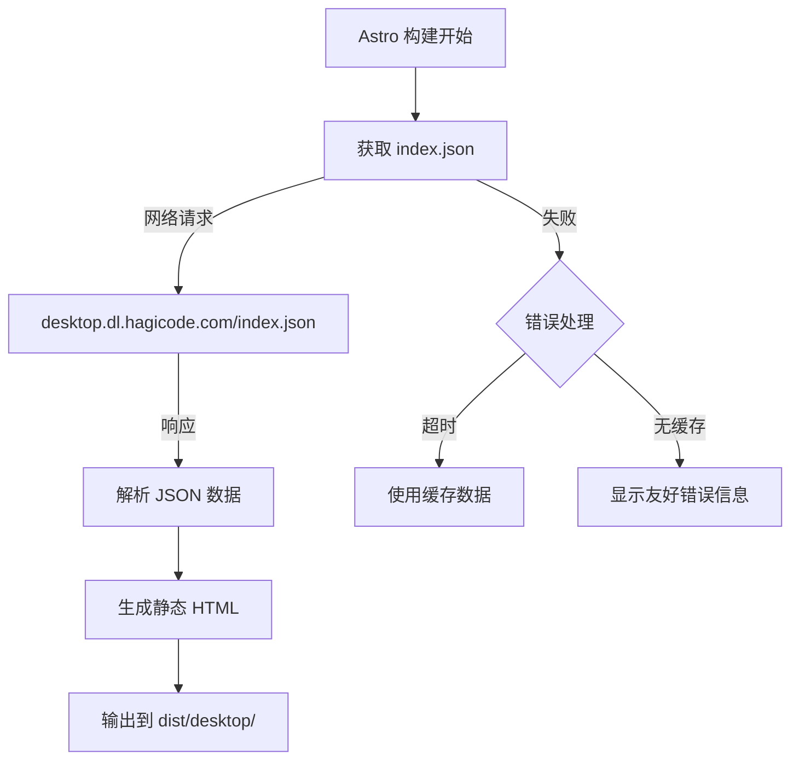
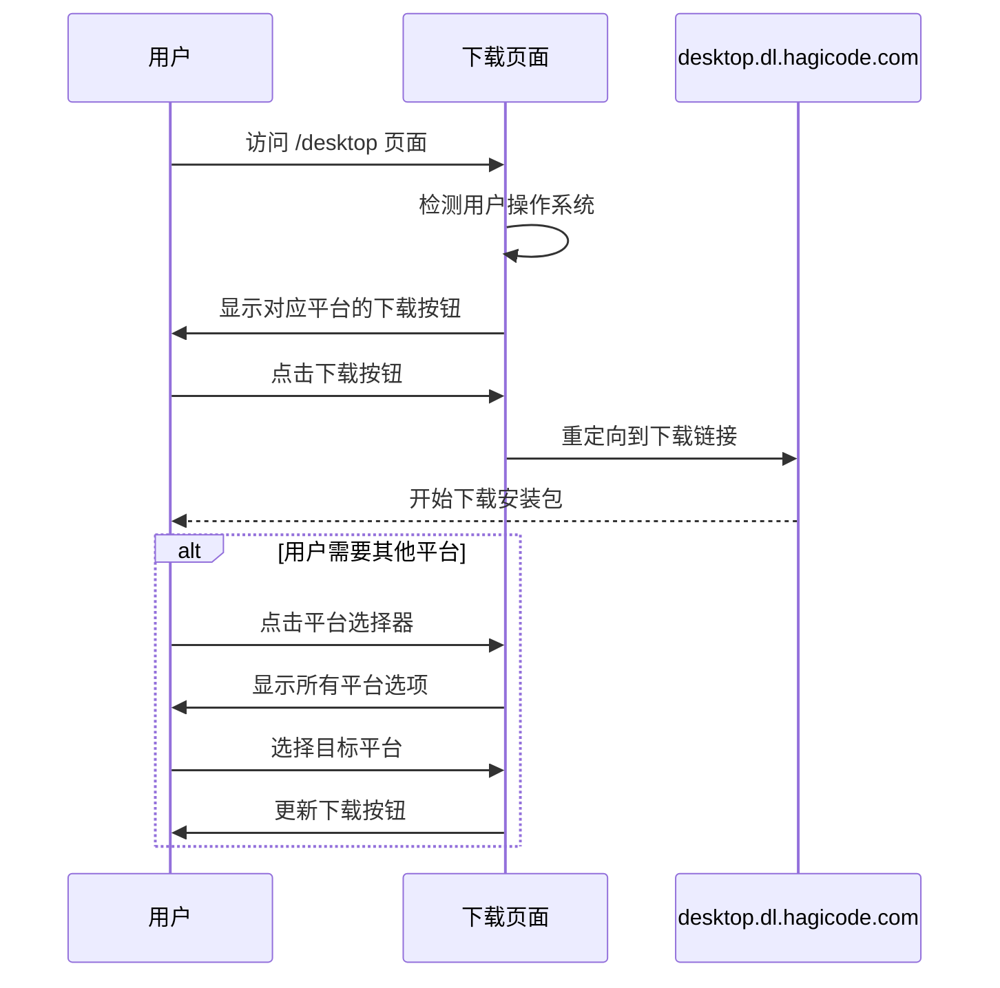

# 提案: 添加 Hagicode Desktop 产品展示和下载页面

## 概述

为 Hagicode 文档站点创建 Hagicode Desktop 产品的专门展示和下载页面,整合现有分散的下载资源 (`desktop.dl.hagicode.com`),提供一站式的产品介绍、版本历史和安装包下载体验。

## 背景

### 当前状态

Hagicode 文档站点目前存在以下问题:

1. **内容缺失**: 文档站点缺少 Hagicode Desktop 的专门展示页面,用户无法在主站点直接了解桌面客户端的功能特性、系统要求和产品亮点

2. **下载体验割裂**: 用户需要跳转到独立的下载域名 `desktop.dl.hagicode.com` 才能获取安装包,造成用户体验不连贯,增加用户获取软件的门槛

3. **静态内容管理**: 当前的 `index.json` 索引文件托管在独立域名,需要手动维护,缺少与文档站点的自动化集成机制

4. **信息展示有限**: 现有的索引文件仅提供基础的下载链接,缺少产品特性介绍、安装指南、版本历史、更新日志等丰富的展示内容

5. **SEO 和可发现性**: 独立的下载域名不利于搜索引擎优化,降低了 Hagicode Desktop 的在线可见度

### 现有资源

- 下载资源托管在 `https://desktop.dl.hagicode.com/`
- 通过 `index.json` 索引文件维护各平台安装包的版本信息、文件列表和下载链接
- **注意**: `index.json` 结构包含 `updatedAt` 时间戳和 `versions` 数组,每个版本包含 `version`、`files` 和 `assets` 字段
- **限制**: `index.json` 不包含平台分类、更新日志 (changelog) 或发布日期,需要从文件名推断平台类型
- 站点使用 Astro 5.16 + Starlight 文档框架
- 已有导航配置系统 `src/config/navigation.ts`
- 已有统一的基础路径管理 `src/utils/path.ts`

## 目标

创建一个新的静态页面用于 Hagicode Desktop 的产品展示和下载,实现:

1. **产品展示**: 清晰展示 Hagicode Desktop 的核心功能、系统要求和产品特性
2. **下载整合**: 在主站点提供各平台安装包的直接下载入口
3. **版本管理**: 展示版本历史和更新日志
4. **安装指南**: 提供各平台的安装说明和常见问题解答
5. **自动化集成**: 构建时自动从 `index.json` 获取最新版本信息

## 范围

### 包含内容

- **新增页面路由**: `src/pages/desktop/index.astro` - 主展示和下载页面
- **数据集成**: 构建时从 `https://desktop.dl.hagicode.com/index.json` 获取版本信息
- **UI 组件**:
  - 下载按钮组件 (支持多平台)
  - 版本选择器 (可选)
  - 特性展示卡片
  - 安装指南 Tabs 组件
- **导航集成**: 在站点导航栏添加 "桌面客户端" 链接
- **样式适配**: 与现有文档站点视觉风格保持一致

### 排除内容

- **不创建动态 API**: 所有数据在构建时获取,不提供运行时数据接口
- **不修改现有文档**: 不影响现有文档内容结构
- **不涉及用户认证**: 下载页面公开访问,无需登录
- **不实现客户端状态管理**: 使用静态 HTML,不涉及复杂客户端状态

## 技术实现

### 文件结构

```
src/
├── pages/
│   └── desktop/
│       ├── index.astro          # 主展示和下载页面
│       └── [...version].astro   # (可选) 特定版本详情页
├── components/
│   └── desktop/
│       ├── DownloadButton.astro     # 下载按钮组件
│       ├── PlatformSelector.astro   # 平台选择器
│       ├── VersionCard.astro        # 版本信息卡片
│       └── FeatureCard.astro        # 功能特性卡片
└── utils/
    └── desktop.ts                   # Desktop 相关工具函数
```

### 数据流



### 版本数据结构

**注意**: 以下类型定义基于 `https://desktop.dl.hagicode.com/index.json` 的实际结构。

```typescript
// 实际的 index.json 响应结构
interface DesktopIndexResponse {
  updatedAt: number;          // Unix 时间戳
  versions: DesktopVersion[];
}

// 版本信息 (实际结构)
interface DesktopVersion {
  version: string;            // 版本号 (如 "v0.1.1")
  files: string[];            // 文件名数组
  assets: DesktopAsset[];     // 详细文件信息
}

// 文件资源信息
interface DesktopAsset {
  name: string;               // 文件名 (如 "Hagicode.Desktop.Setup.0.1.1.exe")
  path: string;               // 相对路径 (如 "v0.1.1/Hagicode.Desktop.Setup.0.1.1.exe")
  size: number;               // 文件大小 (字节)
  lastModified: number | null; // 最后修改时间 (Unix 时间戳)
}

// 应用层需要的平台分类 (从文件名推断)
interface PlatformDownload {
  url: string;                // 完整下载链接
  size: string;               // 格式化的文件大小
  filename: string;           // 文件名
  assetType: AssetType;       // 资源类型
}

// 资源类型枚举
type AssetType =
  | "windows-setup"      // Windows 安装程序 (.exe)
  | "windows-portable"   // Windows 便携版 (.exe)
  | "windows-store"      // Windows Store (.appx)
  | "macos-intel"        // macOS Intel (.dmg)
  | "macos-apple"        // macOS Apple Silicon (.dmg)
  | "macos-universal"    // macOS 通用版 (.dmg)
  | "linux-appimage"     // Linux AppImage
  | "linux-deb"          // Linux Debian 包
  | "linux-tarball"      // Linux 压缩包
  | "source";            // 源代码
```

**数据转换逻辑**:

由于 `index.json` 不包含平台分类,需要从文件名推断平台和类型:

| 文件名模式 | 平台 | 类型 | 推荐下载 |
|-----------|------|------|---------|
| `Hagicode.Desktop.Setup.*.exe` | Windows | 安装程序 | ✅ 推荐 |
| `Hagicode.Desktop.*.exe` | Windows | 便携版 | 备选 |
| `Hagicode.Desktop.*.appx` | Windows | Microsoft Store | 可选 |
| `Hagicode.Desktop-*-arm64.dmg` | macOS | Apple Silicon | ✅ 推荐 (Apple Silicon) |
| `Hagicode.Desktop.*.dmg` | macOS | Intel/通用 | ✅ 推荐 (Intel) |
| `Hagicode.Desktop.*.AppImage` | Linux | AppImage | ✅ 推荐 |
| `hagicode-desktop_*_amd64.deb` | Linux | Debian 包 | 备选 |
| `hagicode-desktop-*.tar.gz` | Linux | 源代码/压缩包 | 可选 |

**版本历史数据源限制**:

`index.json` **不包含** `changelog` (更新日志) 或 `releaseDate` (发布日期)。选项:

1. **选项 A**: 从 GitHub Releases API 获取更新日志
2. **选项 B**: 在页面中手动维护版本历史内容
3. **选项 C**: 暂不显示详细更新日志,仅显示版本号和文件列表

**推荐**: 选项 B - 在页面内容中手动维护版本历史,因为:
- 简单直接,不依赖额外 API
- 可以为用户提供更好的中文描述
- 版本更新频率不高,维护成本可控

## UI 设计

### 页面布局

```
┌─────────────────────────────────────────────────────────────┐
│  Navbar (现有)                                               │
│  [Logo] [文档] [安装指南] [博客] [桌面客户端] [主题切换]      │
├─────────────────────────────────────────────────────────────┤
│                                                              │
│  Hero Section                                                │
│  ┌───────────────────────────────────────────────────────┐  │
│  │  Hagicode Desktop                                      │  │
│  │  本地化的 AI 代码助手,保护隐私,提升效率                │  │
│  │                                                        │  │
│  │  [Windows 下载] [macOS 下载] [Linux 下载]             │  │
│  │  最新版本: v1.0.0 | 发布日期: 2026-01-15             │  │
│  └───────────────────────────────────────────────────────┘  │
│                                                              │
│  Feature Highlights                                          │
│  ┌────────────┐ ┌────────────┐ ┌────────────┐              │
│  │ 🚀 本地运行  │ │ 🔒 隐私保护  │ │ ⚡ 快速响应  │              │
│  │ 所有数据    │ │ 代码不上传  │ │ 毫秒级响应  │              │
│  │ 本地处理    │ │ 完全离线    │ │ 无需等待    │              │
│  └────────────┘ └────────────┘ └────────────┘              │
│                                                              │
│  System Requirements                                         │
│  ┌───────────────────────────────────────────────────────┐  │
│  │  • Windows 10/11 (64-bit)                             │  │
│  │  • macOS 12+ (Apple Silicon 或 Intel)                │  │
│  │  • Linux Ubuntu 20.04+ / Debian 11+                  │  │
│  │  • 4GB RAM, 2GB 可用磁盘空间                          │  │
│  └───────────────────────────────────────────────────────┘  │
│                                                              │
│  Installation Guide (Tabs 组件)                             │
│  ┌───────────────────────────────────────────────────────┐  │
│  │ [Windows] [macOS] [Linux]                             │  │
│  │                                                       │  │
│  │ 1. 下载安装包...                                     │  │
│  │ 2. 运行安装程序...                                   │  │
│  │ 3. 完成安装...                                       │  │
│  └───────────────────────────────────────────────────────┘  │
│                                                              │
│  Version History                                            │
│  ┌───────────────────────────────────────────────────────┐  │
│  │ v1.0.0 - 2026-01-15                                   │  │
│  │ • 初始发布版本                                         │  │
│  │ • 支持基础对话功能                                     │  │
│  │ • 支持 Windows/macOS/Linux                            │  │
│  └───────────────────────────────────────────────────────┘  │
│                                                              │
│  FAQ                                                         │
│  ┌───────────────────────────────────────────────────────┐  │
│  │ Q: Desktop 和在线版本有什么区别?                      │  │
│  │ A: Desktop 版本完全本地运行,所有数据处理...           │  │
│  └───────────────────────────────────────────────────────┘  │
│                                                              │
├─────────────────────────────────────────────────────────────┤
│  Footer (现有)                                              │
└─────────────────────────────────────────────────────────────┘
```

### 下载按钮交互



## 影响

### 受影响的规范

- **astro-site**: 添加新的页面路由和组件
- **directory-routing**: 添加 `/desktop` 路由

### 受影响的代码

- **新增文件**:
  - `src/pages/desktop/index.astro`
  - `src/components/desktop/*.astro`
  - `src/utils/desktop.ts`
- **修改文件**:
  - `src/config/navigation.ts` - 添加导航链接
  - `src/components/StarlightHeader.astro` - 可能需要更新导航配置

### 预期成果

- 用户可以在主文档站点一站式获取 Hagicode Desktop 的产品信息和下载资源
- 减少跳转,提升用户获取桌面客户端的便利性
- 改善 SEO 和产品可发现性
- 为未来可能的桌面客户端专用文档区域预留扩展空间

## 验证标准

### 内容完整性

- [ ] 页面包含所有核心章节(Hero、功能特性、系统要求、安装指南、版本历史、FAQ)
- [ ] 每个章节有清晰的小节结构和逻辑流
- [ ] 下载按钮功能正常,链接有效
- [ ] 版本信息正确显示

### 技术合规性

- [ ] 通过 `npm run typecheck` (TypeScript 严格模式)
- [ ] 通过 `npm run build` (Astro 构建无错误)
- [ ] 所有链接有效且使用正确的路径
- [ ] 构建时能够正确获取 `index.json` 数据

### 用户体验

- [ ] 页面语言简练、易于理解
- [ ] 功能特性描述清晰
- [ ] 安装指南步骤明确
- [ ] 与现有文档站点风格保持一致
- [ ] 响应式设计支持多设备访问

### 性能要求

- [ ] 构建时获取 `index.json` 超时时间 <= 30 秒
- [ ] 如果获取失败,显示友好的错误信息
- [ ] 页面加载速度符合 Lighthouse 性能标准 (> 90 分)

## 依赖关系

### 前置依赖

- `desktop.dl.hagicode.com/index.json` 必须可访问
- 现有的导航配置系统 (`src/config/navigation.ts`)
- 现有的基础路径工具 (`src/utils/path.ts`)

### 后续影响

- 该页面将成为 Hagicode Desktop 的官方展示和下载入口
- 可能为未来添加桌面客户端专属文档预留空间
- 可能需要定期更新版本信息和下载链接

## 风险与缓解

### 风险 1: 外部数据源不可用

**描述**: `desktop.dl.hagicode.com/index.json` 在构建时可能不可访问或返回错误。

**缓解措施**:
- 实现超时机制 (30 秒)
- 实现错误处理和友好错误信息显示
- 考虑添加数据缓存机制
- 如果无法获取数据,显示静态的占位内容

### 风险 2: 数据格式变更

**描述**: `index.json` 格式可能发生变化,导致解析失败。

**缓解措施**:
- 使用 TypeScript 接口定义数据结构
- 实现健壮的数据解析逻辑
- 添加数据验证和类型检查
- 在构建时验证数据完整性
- **平台推断逻辑**: 基于文件名模式匹配,如果模式变化需要更新推断规则

**新增风险**: 文件名模式变化可能导致平台分类错误
- 缓解措施: 使用宽泛的模式匹配,无法识别的文件归入"其他"类别

### 风险 3: 构建性能影响

**描述**: 每次构建都需要获取外部数据,可能影响构建时间。

**缓解措施**:
- 设置合理的超时时间
- 考虑实现数据缓存机制
- 如果获取失败,使用上次成功的缓存数据
- 监控构建时间,必要时优化

### 风险 4: 导航配置冲突

**描述**: 添加新的导航链接可能与现有导航配置冲突。

**缓解措施**:
- 复查现有导航配置
- 使用现有的导航配置系统
- 确保新链接使用正确的路径和标签

## 时间估算

- **页面开发和组件创建**: 3-4 小时
- **数据集成和错误处理**: 1-2 小时
- **样式适配和响应式设计**: 1-2 小时
- **测试和验证**: 1 小时
- **总计**: 6-9 小时

## 相关资源

- **下载站点**: https://desktop.dl.hagicode.com/
- **项目配置**: `openspec/project.md`
- **技术规范**: `openspec/specs/astro-site/spec.md`
- **导航配置**: `src/config/navigation.ts`
- **设计指南**: `openspec/PROPOSAL_DESIGN_GUIDELINES.md`
