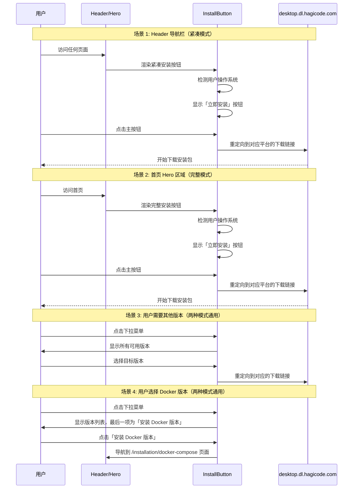

# 变更: 全局统一安装按钮组件

## 为什么

当前网站存在多处安装入口，但功能不一致，造成用户体验混乱：

1. **Header 导航栏的「立即安装」按钮**：直接跳转到 `/desktop` 下载页面
2. **首页 Hero 区域的「开始使用」按钮**：跳转到 `/installation/docker-compose` 文档页面
3. **Desktop 下载页面**：已经实现了完善的 `DownloadOption` 组件，具备平台检测、分体式按钮设计、多版本支持等功能

用户需要多次点击才能获取 Desktop 安装包，降低了转化率。

Desktop 下载页面已经实现了完善的 `DownloadOption` 组件，具备：
- **平台检测**：自动识别用户操作系统（Windows/macOS/Linux）
- **分体式按钮设计**：主下载区域 + 下拉切换按钮
- **多版本支持**：同一平台支持多个安装包（如 Windows 的 Setup 版本、macOS 的 arm64/x64 版本）
- **查询字符串支持**：通过 `?os=windows|macos|linux` 参数进行平台切换调试

网站需要一个**统一的安装按钮组件**，在 Header 和首页 Hero 区域使用，提供一键直达下载的体验，不再需要跳转到 Desktop 页面。

## 变更内容

- **新增共享组件**: 创建 `src/components/home/InstallButton.astro` 组件
  - 基于用户当前操作系统自动选择默认下载版本
  - 主按钮显示固定文案「立即安装」（与 Desktop 的平台标签不同）
  - 右侧下拉菜单列出所有可用版本
  - **下拉菜单最后一项**：特殊链接「安装 Docker 版本」，点击后跳转到 `/installation/docker-compose` 页面
  - 支持查询字符串 `?os=windows|macos|linux` 强制指定平台
  - 支持两种显示模式：
    - **完整模式**：适用于 Hero 区域，更大的尺寸和更明显的视觉效果
    - **紧凑模式**：适用于 Header 导航栏，节省空间

- **更新 Header 导航栏**: 修改 `src/components/home/Navbar.tsx` 组件
  - 将现有的「立即安装」按钮（跳转到 Desktop 页面）替换为 `InstallButton` 组件（紧凑模式）
  - 按钮点击后直接触发下载，不再跳转

- **更新首页 Hero 区域**: 修改 `HeroSection.tsx` 组件
  - 将现有「开始使用」按钮替换为 `InstallButton` 组件（完整模式）
  - 保持「了解更多」按钮不变

- **新增工具函数**: 扩展 `src/utils/desktop.ts`
  - 添加平台检测函数（支持查询字符串覆盖）
  - 复用现有的版本获取和分组逻辑

- **新增类型定义**: 扩展 `src/types/desktop.ts`
  - 定义统一安装按钮所需的接口类型

## 受影响的部分

### 受影响的规范

- **homepage-components**: 添加新的安装按钮组件

### 受影响的代码

**新增文件**:
- `src/components/home/InstallButton.astro` - 统一安装按钮组件
- `src/components/home/InstallButton.module.css` - 按钮样式（如需要）

**修改文件**:
- `src/components/home/HeroSection.tsx` - 集成新的安装按钮组件（完整模式）
- `src/components/home/Navbar.tsx` - 集成新的安装按钮组件（紧凑模式），替代原有的跳转按钮
- `src/utils/desktop.ts` - 添加平台检测函数（如需要）

**共享文件**（已存在，无需修改）:
- `src/types/desktop.ts` - 复用现有类型定义
- `src/components/desktop/DownloadOption.astro` - 参考实现，但不直接使用

## 与 Desktop DownloadOption 的差异

| 特性 | Desktop DownloadOption | 统一 InstallButton |
|------|----------------------|-------------------|
| 主按钮文案 | 平台名称（Windows/macOS/Linux） | 固定文案「立即安装」 |
| 下载范围 | 显示该平台所有版本 | 仅显示主要版本（精简列表） |
| 布局风格 | 完整的下载卡片 | 紧凑的按钮样式 |
| 显示模式 | 单一模式 | 完整模式（Hero） / 紧凑模式（Header） |
| 使用场景 | Desktop 下载页面 | 全站通用（Header、首页 Hero） |

## 用户体验流程



## 技术考虑

### 平台检测逻辑

```typescript
function detectOS(): 'windows' | 'macos' | 'linux' | 'unknown' {
  // 1. 优先检查 URL 查询参数 ?os=windows|macos|linux
  // 2. 基于 UserAgent 检测
  const userAgent = navigator.userAgent;
  if (userAgent.includes('Windows')) return 'windows';
  if (userAgent.includes('Mac OS X')) return 'macos';
  if (userAgent.includes('Linux')) return 'linux';
  return 'unknown';
}
```

### 样式设计

- 复用 `src/styles/homepage.css` 的按钮样式系统
- 使用 `--gradient-primary` 等现有 CSS 变量确保主题一致性
- 支持亮色/暗色/农历新年主题
- 两种显示模式：
  - **完整模式**：适配首页 Hero 区域布局，更大的视觉冲击力
  - **紧凑模式**：适配 Header 导航栏，节省空间，保持可点击性
- **Docker 版本菜单项**：
  - 在下拉菜单中作为最后一项显示
  - 使用不同的视觉样式（如分隔线、不同图标）以示区别
  - 悬停时显示页面跳转图标（如外部链接箭头）

## 验证标准

### 功能完整性

- [ ] 主按钮正确显示「立即安装」文案
- [ ] 根据用户操作系统自动选择默认下载版本
- [ ] 下拉菜单正确显示该平台的所有可用版本
- [ ] **下拉菜单最后一项显示「安装 Docker 版本」**
- [ ] **点击「安装 Docker 版本」正确跳转到 `/installation/docker-compose` 页面**
- [ ] 查询字符串 `?os=windows|macos|linux` 能正确覆盖自动检测
- [ ] 点击下载按钮能正确跳转到下载链接
- [ ] Header 和 Hero 区域的按钮功能一致，都是直接下载而非跳转页面

### 技术合规性

- [ ] 通过 `npm run typecheck`（TypeScript 严格模式）
- [ ] 通过 `npm run build`（Astro 构建无错误）
- [ ] 所有下载链接有效且格式正确

### 用户体验

- [ ] 按钮样式与现有首页设计保持一致
- [ ] 支持所有主题（亮色/暗色/农历新年）
- [ ] 响应式设计支持移动端和桌面端
- [ ] 下拉菜单交互流畅，支持键盘导航
- [ ] 提供清晰的 ARIA 标签和语义化 HTML
- [ ] Header 和 Hero 区域的按钮视觉一致性
- [ ] 移动端 Header 中的按钮适配良好

### 性能要求

- [ ] 组件使用 Astro 静态生成，无运行时开销
- [ ] 构建时获取版本数据，不影响页面加载性能
- [ ] 按钮交互响应迅速（< 100ms）

## 风险与缓解

### 风险 1: 外部数据源不可用

**描述**: `desktop.dl.hagicode.com/index.json` 在构建时可能不可访问。

**缓解措施**:
- 复用 Desktop 页面的错误处理逻辑
- 如果数据获取失败，显示降级版本（链接到 Desktop 下载页面）

### 风险 2: 平台检测不准确

**描述**: UserAgent 检测可能无法准确识别所有设备。

**缓解措施**:
- 提供查询字符串覆盖机制，便于测试和调试
- 提供下拉菜单，用户可手动选择其他平台版本

### 风险 3: 样式冲突

**描述**: 新组件样式可能与现有首页样式冲突。

**缓解措施**:
- 复用现有的 CSS 变量和样式类
- 使用 CSS Modules 或 Astro scoped styles 隔离样式
- 在所有主题下测试样式一致性

## 相关资源

- **现有 Desktop 下载页面**: `src/pages/desktop/index.astro`
- **现有下载组件**: `src/components/desktop/DownloadOption.astro`
- **现有 Hero 组件**: `src/components/home/HeroSection.tsx`
- **现有 Navbar 组件**: `src/components/home/Navbar.tsx`
- **项目配置**: `openspec/project.md`
- **设计指南**: `openspec/PROPOSAL_DESIGN_GUIDELINES.md`
