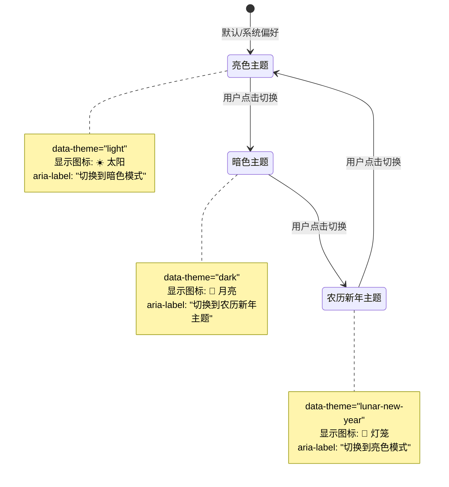
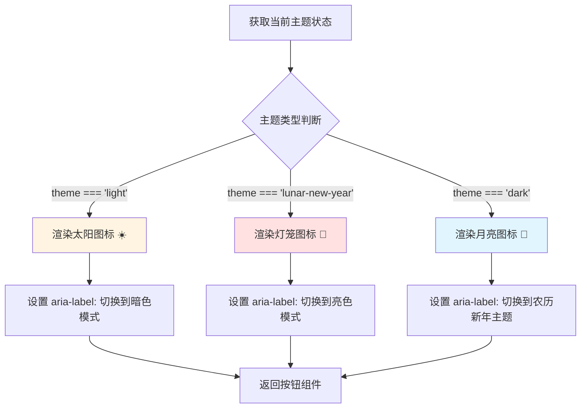

# Change: 修复 ThemeToggle 图标显示与主题状态不一致问题

## Why

当前 ThemeToggle 组件显示的图标表示"切换后"的目标主题，而非"当前"主题状态，导致用户视觉混淆：
- 处于暗色模式时显示太阳图标（暗示亮色模式）
- 处于亮色模式时显示月亮图标（暗示暗色模式）

这种设计与常规 UI 模式相悖，增加了用户的认知负担。用户反馈按钮显示应该是当前主题的图标：暗色显示月亮，亮色显示太阳。

## What Changes

- **修改图标显示逻辑**：使按钮图标表示"当前主题状态"而非"切换目标"
- **保持 aria-label 和 title 属性**：继续描述"切换到"的语义，不影响无障碍功能
- **图标映射调整**：
  - 暗色模式 (`dark`): 显示月亮图标（而非太阳）
  - 亮色模式 (`light`): 显示太阳图标（而非月亮）
  - 农历新年主题 (`lunar-new-year`): 保持显示灯笼图标

## UI 设计变更

### 当前状态 vs 目标状态

```
当前实现（图标表示切换目标）:
┌──────────────────────────────────────────────────────────────────────┐
│  主题状态: dark      │  显示图标: ☀️ (太阳)  │  用户预期: 🌙 (月亮)     │
│  主题状态: light     │  显示图标: 🌙 (月亮)  │  用户预期: ☀️ (太阳)     │
│  主题状态: lunar-new-year │ 显示图标: 🏮 (灯笼) │  用户预期: 🏮 (灯笼)  │
└──────────────────────────────────────────────────────────────────────┘

目标实现（图标表示当前状态）:
┌──────────────────────────────────────────────────────────────────────┐
│  主题状态: dark      │  显示图标: 🌙 (月亮)  │  符合用户预期 ✓         │
│  主题状态: light     │  显示图标: ☀️ (太阳)  │  符合用户预期 ✓         │
│  主题状态: lunar-new-year │ 显示图标: 🏮 (灯笼) │  符合用户预期 ✓      │
└──────────────────────────────────────────────────────────────────────┘
```

### 状态转换图



## 代码流程变更

### 图标渲染逻辑变更



### 条件渲染逻辑变更对比

```typescript
// 当前实现（图标表示切换目标）
{theme === 'dark' ? (
  <SunIcon />      // 暗色时显示太阳（切换到亮色）
) : theme === 'lunar-new-year' ? (
  <LanternIcon />  // 农历新年时显示灯笼
) : (
  <MoonIcon />     // 亮色时显示月亮（切换到暗色）
)}

// 目标实现（图标表示当前状态）
{theme === 'light' ? (
  <SunIcon />      // 亮色时显示太阳
) : theme === 'lunar-new-year' ? (
  <LanternIcon />  // 农历新年时显示灯笼
) : (
  <MoonIcon />     // 暗色时显示月亮
)}
```

## 影响的代码文件

| 文件路径 | 变更类型 | 变更说明 |
|---------|---------|---------|
| `src/components/home/ThemeToggle.tsx:103-131` | 修改 | 调整图标条件渲染逻辑 |

## 风险与权衡

| 风险 | 影响 | 缓解措施 |
|------|------|---------|
| 用户习惯改变 | 低 | 新逻辑更符合直觉，降低认知负担 |
| aria-label 语义混淆 | 无 | aria-label 继续描述"切换到"，无障碍功能不受影响 |

## 成功标准

### 功能完整性
- ✅ 亮色模式时显示太阳图标
- ✅ 暗色模式时显示月亮图标
- ✅ 农历新年主题时显示灯笼图标
- ✅ 点击按钮仍能正确切换到下一个主题

### 用户体验
- ✅ 图标准确反映当前主题状态
- ✅ 无视觉混淆，符合常规 UI 模式
- ✅ aria-label 继续提供准确的"切换到"描述

### 技术质量
- ✅ TypeScript 类型检查通过
- ✅ 无 console 错误或警告
- ✅ 主题切换功能不受影响

## Impact

### 影响的规格
- **修改规格**: `theme-system` - 主题图标显示逻辑

### 影响的代码文件
- `src/components/home/ThemeToggle.tsx:103-131` - 图标条件渲染逻辑

### 用户体验影响
- **正面**:
  - 图标准确反映当前主题状态
  - 减少认知负担
  - 符合常规 UI 模式

- **风险**:
  - 无显著风险

### 开发流程影响
- 无需修改现有工作流
- 与现有主题系统完全兼容
