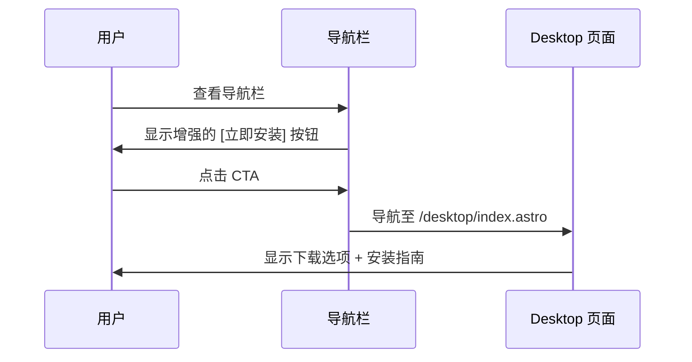

# Change: 统一安装入口为单一 CTA 按钮

## Why

当前 Hagicode 文档站点存在分散的安装入口问题。首页和 Docs 导航栏各自包含独立的"安装指南"入口，同时站点已新增 Desktop 页面用于展示桌面客户端内容。这种冗余的导航结构导致用户体验不一致，增加了用户的决策负担，且未能突出安装作为核心操作的重要性。

通过合并和增强安装入口，可以简化导航结构，提供统一的行动点，并提升用户转化率。

## What Changes

- **移除冗余导航入口**: 删除"安装指南"和"桌面客户端"导航入口（两者均指向 Desktop 页面，造成功能重复）
- **新增统一 CTA 按钮**: 创建"立即安装"按钮，指向 Desktop 页面 (`/desktop/index.astro`)
- **UI 视觉增强**: 为 CTA 按钮应用渐变、阴影和动画效果，突出其作为核心行动点
- **主题适配**: 确保按钮在亮色、暗色和农历新年主题下的可访问性和视觉一致性
- **响应式设计**: 保证按钮在移动端和桌面端均有良好表现

## UI Design Changes

### 当前导航结构 (Before)

```
┌─────────────────────────────────────────────────────────────┐
│  Logo  │  安装指南 │ 桌面客户端 │  博客  │  文档  │  ...   │
└─────────────────────────────────────────────────────────────┘
```

### 目标导航结构 (After)

```
┌─────────────────────────────────────────────────────────────┐
│  Logo  │ [立即安装] │  博客  │  文档  │  ...                  │
│         (CTA按钮)                                           │
└─────────────────────────────────────────────────────────────┘
```

### CTA 按钮视觉设计

```
┌──────────────────────────────────────────────┐
│  ✨ 立即安装 ▼                               │
│  - 渐变背景: 使用 CSS 变量 --gradient-primary │
│  - 发光阴影: 使用 CSS 变量 --shadow-glow      │
│  - 悬停效果: translateY(-2px) + 增强阴影        │
│  - 动画: Framer Motion entrance + hover      │
└──────────────────────────────────────────────┘
```

**主题适配设计原则**:
- 发光效果 MUST 使用 CSS 变量定义，确保在所有主题下均可自定义
- 支持的主题包括: 亮色主题、暗色主题、农历新年主题
- 每个主题定义其专用的发光颜色变量，确保视觉协调性

### 用户交互流程



## Impact

### Affected specs
- `astro-site`: 新增统一安装 CTA 按钮要求

### Affected code
- `src/config/navigation.ts`: 移除"安装指南"和"桌面客户端"导航入口
- `src/components/home/Navbar.tsx`: 集成增强的"立即安装"CTA 按钮
- `src/styles/homepage.css`: 新增 CTA 按钮样式类和动画
- 可能需要创建新的 `src/components/home/InstallCTAButton.tsx` 组件

**数据源说明**:
- `src/config/navigation.ts` 是首页导航栏和 Starlight Docs 顶部导航栏的共享数据源
- 修改此文件会同时影响首页和文档页面的顶部导航
- `src/components/StarlightHeader.astro` 使用相同的 `navLinks` 数据

**注意**:
- Hero Section 的修改不在本提案范围内，由另一个提案负责规划
- "桌面客户端"按钮被移除是因为它与新的"立即安装"CTA 按钮功能重复（均跳转到 `/desktop`）
- **Starlight Docs 侧边栏（sidebar）不在本提案范围内**，保持不变

### Dependencies
- **Framer Motion ^12.26.1**: 已集成，用于按钮动画效果
- **React 19.2.4**: 已集成，用于组件实现
- **CSS Variables**: 使用现有 `src/styles/homepage.css` 中的主题变量

### Migration
- 首页和 Starlight Docs 顶部导航: 现有的"安装指南"和"桌面客户端"链接将被移除
- 用户需要通过新的"立即安装"CTA 按钮访问 Desktop 页面
- Desktop 页面已成为安装相关内容的单一权威来源
- 无需数据迁移，仅 UI/导航结构变更

### Risks
- **用户习惯变更**: 现有用户可能习惯旧的"安装指南"入口位置
  - **缓解措施**: 新的 CTA 按钮将更加突出和直观
- **移动端体验**: 确保增强的按钮在小屏幕上不会占用过多空间
  - **缓解措施**: 响应式设计，移动端适当调整按钮大小
- **多主题发光效果适配**: 发光颜色在不同主题下可能产生视觉冲突
  - **缓解措施**: 使用 CSS 变量定义主题专用发光颜色，确保每个主题都有协调的视觉效果

### Non-Goals
- 不修改 Hero Section（由另一个提案负责）
- 不修改 Desktop 页面 (`/desktop/index.astro`) 的现有内容
- 不影响博客、技术支持群、GitHub 链接等其他导航项
- **不修改 Starlight Docs 侧边栏（sidebar）** - 侧边栏内容保持不变
