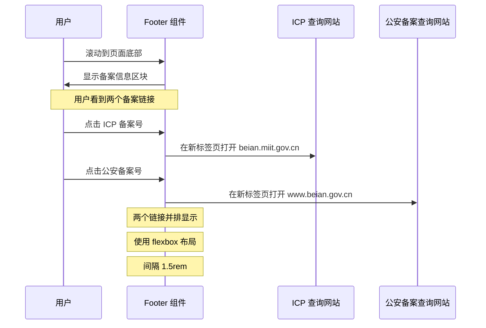

# Change: 在 Footer 组件中添加公安备案信息

**Status**: ExecutionCompleted

## Why

当前站点的 Footer 组件缺少公安备案信息展示。根据中国相关法规要求，网站需要在页面底部显示公安备案号以符合合规性要求。缺少此信息可能导致网站合规性问题和用户信任度降低。

## What Changes

- 在 `src/components/StarlightFooter.astro` 组件的备案信息区块中添加公安备案号展示
- 在 `src/components/home/Footer.tsx` 组件的备案信息区块中添加公安备案号展示
- 备案号：闽公网安备35011102351148号
- 保持与现有 ICP 备案信息样式的一致性
- 确保响应式设计在不同屏幕尺寸下正常显示

**重要说明**：站点有两个独立的 Footer 组件：
1. `StarlightFooter.astro` - 用于 Starlight 文档页面
2. `home/Footer.tsx` - 用于首页
两个组件都需要添加公安备案信息以确保全站一致性。

## UI 设计变更

### 备案信息区块当前布局

```
┌─────────────────────────────────────────────────────────────┐
│                                                             │
│              [统一 Footer 容器]                              │
│  ┌─────────────────────────────────────────────────────┐   │
│  │  Logo 和版权行                                       │   │
│  │  Hagicode  © 2026 Hagicode. All rights reserved.   │   │
│  └─────────────────────────────────────────────────────┘   │
│  ────────────────────────────────────────────────────────── │
│  ┌──────────┐  ┌──────────┐  ┌──────────┐                │
│  │ 产品     │  │ 快速链接 │  │ 社区     │                │
│  │  - Hagicode 简介 │  - 下载客户端 │  - GitHub      │                │
│  └──────────┘  └──────────┘  └──────────┘                │
├─────────────────────────────────────────────────────────────┤
│                                                             │
│            [备案信息区块 - 当前状态]                         │
│                                                             │
│           闽ICP备2026004153号-1                             │
│           (链接到 beian.miit.gov.cn)                        │
│                                                             │
└─────────────────────────────────────────────────────────────┘
```

### 备案信息区块变更后布局

```
┌─────────────────────────────────────────────────────────────┐
│                                                             │
│            [备案信息区块 - 变更后]                           │
│                                                             │
│    闽ICP备2026004153号-1    闽公网安备35011102351148号       │
│      (ICP 备案)              (公安备案)                     │
│                                                             │
└─────────────────────────────────────────────────────────────┘
```

### 备案信息区块交互流程



## Impact

- **受影响的规范**: `openspec/specs/astro-site/spec.md`
- **受影响的代码**:
  - `src/components/StarlightFooter.astro` (Starlight 文档页面 Footer)
  - `src/components/home/Footer.tsx` (首页 Footer)
  - `src/components/home/Footer.module.css` (首页 Footer 样式)
- **用户体验影响**:
  - 用户能够在站点底部查看完整的备案信息（ICP + 公安备案）
  - 提升站点的合规性和可信度
  - 首页和文档页的备案信息保持一致
- **技术影响**:
  - 需要修改两个 Footer 组件及其样式
  - 无需影响其他组件或页面
  - 构建时间无影响
  - 代码变化量 < 40 行（两个组件 + 样式）
- **后续维护**:
  - 备案号信息已硬编码在组件中
  - 建议在未来考虑将其提取为配置项
  - 当前实现符合"简单优先"原则
