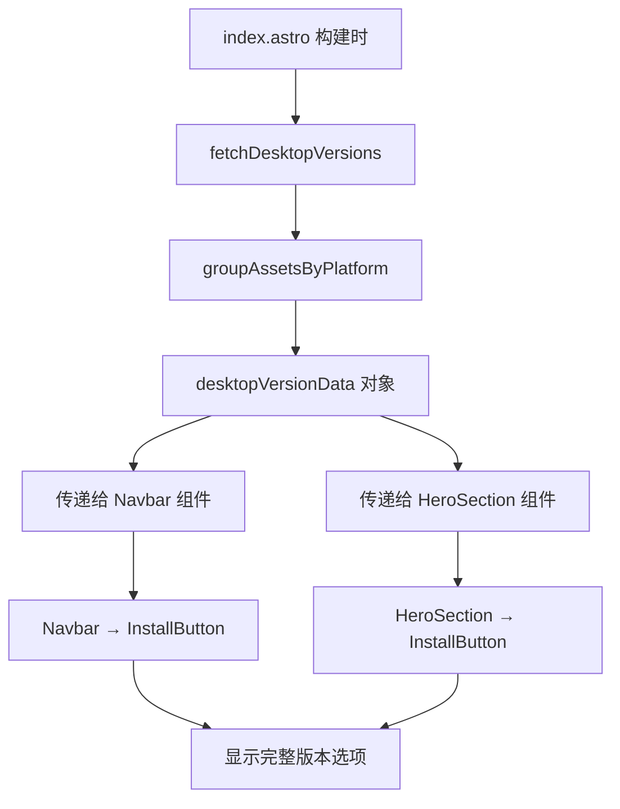

# Change: 修复首页安装按钮版本信息传递问题

## Why

首页的安装按钮组件存在版本信息传递问题，导致下拉菜单中无法正确显示可用的 Desktop 版本下载选项。虽然 z-index 层级问题已解决，但版本数据未正确从首页传递到 Navbar 和 HeroSection 组件，影响用户获取最新的安装包。

## What Changes

- **修复 Navbar 组件中的版本信息传递**
  - 确保 `index.astro` 页面正确获取 Desktop 版本数据
  - 验证 `desktopVersion`、`desktopPlatforms`、`desktopVersionError` props 正确传递给 Navbar 组件
  - 确保版本数据在构建时通过 `fetchDesktopVersions()` 和 `groupAssetsByPlatform()` 正确处理

- **修复 HeroSection 组件中的版本信息传递**
  - 确保版本数据 props 正确传递给 HeroSection 组件
  - 验证 HeroSection 内部的 InstallButton 组件能正确接收并使用版本数据

- **验证 InstallButton 组件的 props 接口**
  - 确保 InstallButton 组件正确接收 `version`、`platforms`、`versionError` props
  - 验证组件在不同变体（full/compact）下都能正确处理版本数据

## UI Design Changes

**修改前**：
```
┌─────────────────────────────────────────────┐
│ Navbar                                      │
│  [立即安装 ▼] → 点击展开下拉菜单            │
│    └─ 无版本选项显示或显示降级链接           │  ← 版本数据未传递
└─────────────────────────────────────────────┘
```

**修改后**：
```
┌─────────────────────────────────────────────┐
│ Navbar                                      │
│  [立即安装 ▼] → 点击展开下拉菜单            │
│    ├─ Windows                               │
│    │  ├─ 安装程序 (v1.x.x)  ✓               │
│    │  └─ 便携版 (v1.x.x)                    │
│    ├─ macOS                                 │
│    │  ├─ Apple Silicon (v1.x.x)             │
│    │  └─ Intel 版 (v1.x.x)                  │
│    ├─ Linux                                 │
│    │  └─ AppImage (v1.x.x)                  │
│    └─ 安装 Docker 版本                      │
└─────────────────────────────────────────────┘
```

## Code Flow Changes



## Impact

- **Affected specs**: `astro-site`
- **Affected code**:
  - `src/pages/index.astro` (验证版本数据获取和传递)
  - `src/components/home/Navbar.tsx` (验证 props 接收和传递)
  - `src/components/home/HeroSection.tsx` (验证 props 接收和传递)
  - `src/components/home/InstallButton.tsx` (验证 props 接口)
- **User impact**: 用户可正常访问所有平台的最新版本安装选项，下拉菜单显示完整版本信息
- **Technical scope**: 确保版本数据在构建时正确获取并传递到相关组件，无需修改组件逻辑，仅修复数据传递流程
