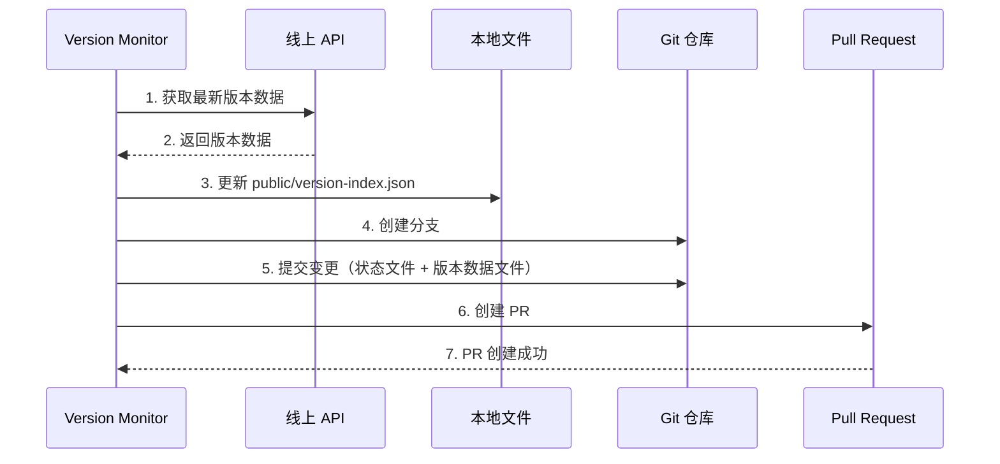
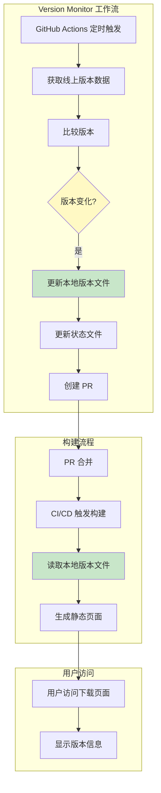

# Design: Version Data Storage Architecture

## Context

当前版本监控系统存在以下架构问题：

1. **构建时依赖外部服务**: `src/pages/desktop/index.astro` 在构建时通过 `fetchDesktopVersions()` 直接从 `https://desktop.dl.hagicode.com/index.json` 获取版本数据
2. **网络耦合**: 构建过程与外部服务可用性强耦合，网络问题可能导致构建失败
3. **数据不可预测**: 每次构建可能获取不同版本的线上数据，构建结果不可复现
4. **离线构建受限**: 无法在没有网络连接的环境中进行完整构建

## Goals / Non-Goals

### Goals
- 站点构建时使用代码库中存储的本地版本数据文件
- Version Monitor 检测到新版本时，同步更新本地版本数据文件
- 构建过程可离线进行，不依赖外部服务可用性
- 保持版本数据的完整性和准确性
- 向后兼容，不影响现有功能

### Non-Goals
- 不改变版本数据格式（保持与线上 API 一致）
- 不改变版本监控的核心逻辑（仅添加本地文件同步）
- 不改变 PR 创建和合并流程
- 不实现复杂的缓存机制（简单文件存储即可）

## Decisions

### Decision 1: 本地版本数据文件位置

**选择**: 使用 `public/version-index.json` 作为本地版本数据文件存储位置

**理由**:
- `public/` 目录在构建时会被直接复制到输出目录，易于访问
- 文件路径可预测，便于在代码中引用
- 符合静态资源管理的最佳实践

**替代方案**:
- `src/data/version-index.json`: 需要额外的导入逻辑
- `.github/version-index.json`: 不便于前端代码访问

### Decision 2: 版本数据同步时机

**选择**: 在 Version Monitor 检测到新版本并准备创建 PR 时同步本地文件

**理由**:
- 确保本地文件与版本状态文件同时更新
- PR 包含所有相关变更，便于审查
- 合并 PR 后 CI/CD 触发的构建将使用最新数据

**同步流程**:


### Decision 3: 站点构建时的数据获取策略

**选择**: 优先使用本地文件，仅在生产环境构建时使用本地数据

**理由**:
- 确保构建结果可预测和可复现
- 避免构建时的网络依赖
- 开发环境可选择降级到线上数据（便于测试）

**实现策略**:
```typescript
export async function fetchDesktopVersions(): Promise<DesktopIndexResponse> {
  // 生产构建：优先使用本地文件
  if (import.meta.env.PROD || process.env.NODE_ENV === 'production') {
    try {
      const localData = await fs.readFile('public/version-index.json', 'utf-8');
      return JSON.parse(localData);
    } catch (error) {
      throw new Error('Local version data not found. Please ensure public/version-index.json exists.');
    }
  }

  // 开发环境：降级到线上 API
  const response = await fetch('https://desktop.dl.hagicode.com/index.json');
  return await response.json();
}
```

**替代方案（已拒绝）**:
- 始终使用线上 API: 不解决构建依赖问题
- 使用复杂的缓存机制: 过度设计，简单文件存储足够

## UI/UX Design

本变更不涉及用户界面变化。用户看到的效果：
- 桌面下载页面显示的版本信息更可靠
- 页面加载速度可能略有提升（无需等待线上 API 请求）
- 用户体验保持一致

## Technical Design

### 架构变更

**原架构**:
```
┌─────────────────────────────────────────────────────────────┐
│ 构建时（每次构建）                                           │
├─────────────────────────────────────────────────────────────┤
│  Astro 构建 → fetchDesktopVersions() → 线上 API              │
│                          ↓                                  │
│                     网络请求（依赖）                          │
│                          ↓                                  │
│                     版本数据                                │
└─────────────────────────────────────────────────────────────┘
```

**新架构**:
```
┌──────────────────────────────────────────────────────────────┐
│ Version Monitor 运行时（定期，如每30分钟）                      │
├──────────────────────────────────────────────────────────────┤
│  线上 API → 比较版本 → 检测到变化?                              │
│                    ↓ 是                                       │
│          更新 public/version-index.json                       │
│                    ↓                                          │
│          更新 .github/version-state.json                      │
│                    ↓                                          │
│          创建 PR → 审查 → 合并                                  │
└──────────────────────────────────────────────────────────────┘

┌──────────────────────────────────────────────────────────────┐
│ 构建时（PR 合并后触发）                                         │
├──────────────────────────────────────────────────────────────┤
│  Astro 构建 → fetchDesktopVersions() → 本地文件               │
│                                          ↓                    │
│                            public/version-index.json           │
│                                          ↓                    │
│                                    版本数据（离线可用）         │
└──────────────────────────────────────────────────────────────┘
```

### 组件交互



### 数据格式

本地版本数据文件格式与线上 API 保持一致：

```json
{
  "versions": [
    {
      "version": "1.2.3",
      "releaseDate": "2025-01-15T10:00:00Z",
      "assets": [
        {
          "name": "Hagicode-Desktop-Setup-1.2.3.exe",
          "path": "releases/1.2.3/Hagicode-Desktop-Setup-1.2.3.exe",
          "size": 123456789
        }
      ]
    }
  ]
}
```

### 实现细节

#### 1. Version Monitor 修改

需要在 `scripts/version-monitor.js` 中添加：

```javascript
// 本地版本数据文件路径
const VERSION_INDEX_FILE = 'public/version-index.json';

/**
 * 更新本地版本数据文件
 * @param {object} versionData - 从线上获取的版本数据
 */
async function updateLocalVersionIndex(versionData) {
  try {
    // 确保 public 目录存在
    await fs.mkdir('public', { recursive: true });

    // 写入版本数据
    await fs.writeFile(
      VERSION_INDEX_FILE,
      JSON.stringify(versionData, null, 2),
      'utf-8'
    );

    logger.info(`Local version index updated: ${VERSION_INDEX_FILE}`);
  } catch (error) {
    logger.error(`Failed to update local version index: ${error.message}`);
    throw error;
  }
}

// 在版本更新检测到变化时调用
async function handleVersionUpdate(currentVersion, versionData) {
  // ... 现有逻辑 ...

  // 新增：更新本地版本数据文件
  await updateLocalVersionIndex(versionData.raw);

  // ... 创建 PR 等 ...
}
```

#### 2. 构建时读取逻辑修改

在 `src/utils/desktop.ts` 中：

```typescript
// 本地版本数据文件路径
const LOCAL_VERSION_INDEX = 'public/version-index.json';

/**
 * 获取版本数据（优先使用本地文件）
 */
export async function fetchDesktopVersions(): Promise<DesktopIndexResponse> {
  // 生产环境：使用本地文件
  if (import.meta.env.PROD) {
    try {
      // 注意：在 Astro 构建时，需要使用相对于项目根目录的路径
      // 这里的实现可能需要根据实际构建环境调整
      const localData = await import('../public/version-index.json');
      return localData.default as DesktopIndexResponse;
    } catch (error) {
      throw new Error(
        'Local version data not found. Please run Version Monitor to sync the latest version.'
      );
    }
  }

  // 开发环境：降级到线上 API（可选）
  const response = await fetch(INDEX_JSON_URL, {
    signal: controller.signal,
  });
  // ... 现有逻辑 ...
}
```

**注意**: Astro 构建时的文件访问可能需要特殊处理，具体实现可能需要使用 Astro 的数据加载机制。

## Risks / Trade-offs

### 风险

| 风险 | 影响 | 缓解措施 |
|-----|-----|---------|
| 本地文件与线上数据不一致 | 用户看到过时版本信息 | Version Monitor 定期同步，PR 机制确保数据更新 |
| 首次构建时本地文件不存在 | 构建失败 | 在初始提交中包含默认版本数据文件 |
| 文件格式变化导致不兼容 | 线上 API 升级后本地文件格式可能不同 | Version Monitor 负责格式转换和验证 |
| Astro 构建时文件访问问题 | 可能无法正确读取本地文件 | 使用 Astro 的数据加载机制或构建时脚本 |

### 权衡

**优点**:
- 构建过程独立于外部服务
- 构建结果可预测和可复现
- 支持离线构建
- 减少构建时的网络依赖

**缺点**:
- 增加了 Version Monitor 的复杂度
- 需要维护额外的文件同步逻辑
- 本地文件可能与线上数据存在短暂延迟（最多 30 分钟）

## Migration Plan

### 迁移步骤

1. **准备阶段**
   - 创建 `public/version-index.json` 文件
   - 从线上 API 获取当前最新版本数据并填入文件
   - 提交初始版本数据文件到代码库

2. **实现阶段**
   - 修改 `scripts/version-monitor.js` 添加本地文件同步逻辑
   - 修改 `src/utils/desktop.ts` 优先使用本地文件
   - 更新相关测试

3. **验证阶段**
   - 本地测试 Version Monitor 的文件同步功能
   - 测试构建过程是否正确使用本地数据
   - 验证生成的站点显示正确的版本信息

4. **部署阶段**
   - 合并 PR 到主分支
   - 触发 CI/CD 构建
   - 验证部署的站点正常工作

### 回滚计划

如果新架构出现问题：
1. 回滚 `src/utils/desktop.ts` 到原实现（使用线上 API）
2. 保留 `scripts/version-monitor.js` 的修改（不影响回滚）
3. `public/version-index.json` 可以保留但不影响功能

## Open Questions

1. **Astro 构建时的文件访问**: 在 Astro 构建时如何可靠地读取 `public/version-index.json`？
   - 可能需要使用 Astro 的数据加载机制
   - 或使用构建时脚本预加载数据

2. **初始版本数据**: 如何确保首次构建时 `public/version-index.json` 存在且包含有效数据？
   - 建议：手动创建初始文件
   - 或：添加脚本在首次运行时自动创建

3. **开发环境行为**: 开发环境是否也应该使用本地文件？
   - 建议：开发环境可以降级到线上 API，便于测试
   - 或：统一使用本地文件，确保开发与生产环境一致
