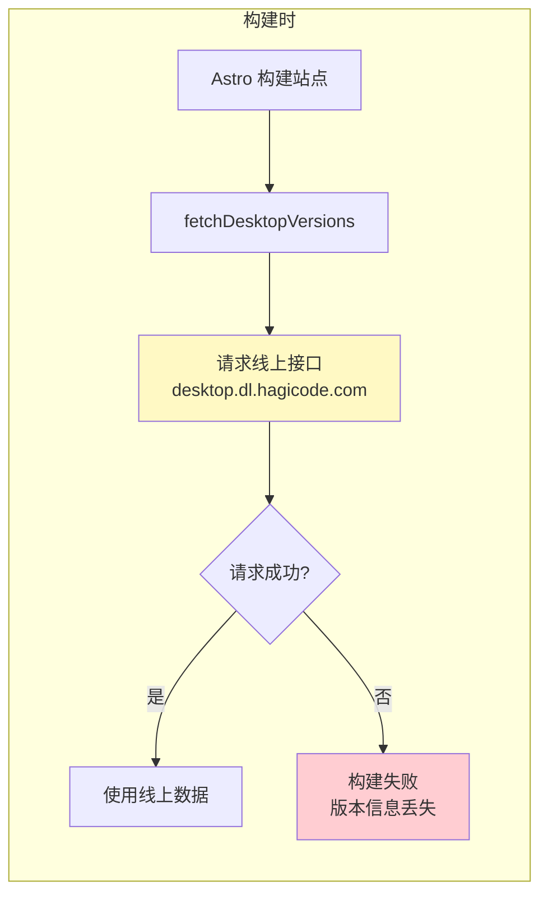
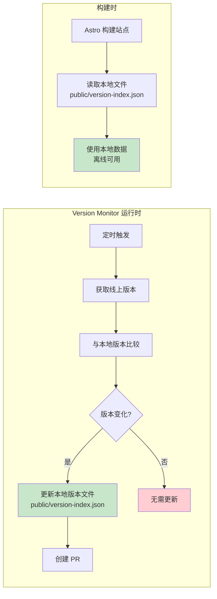
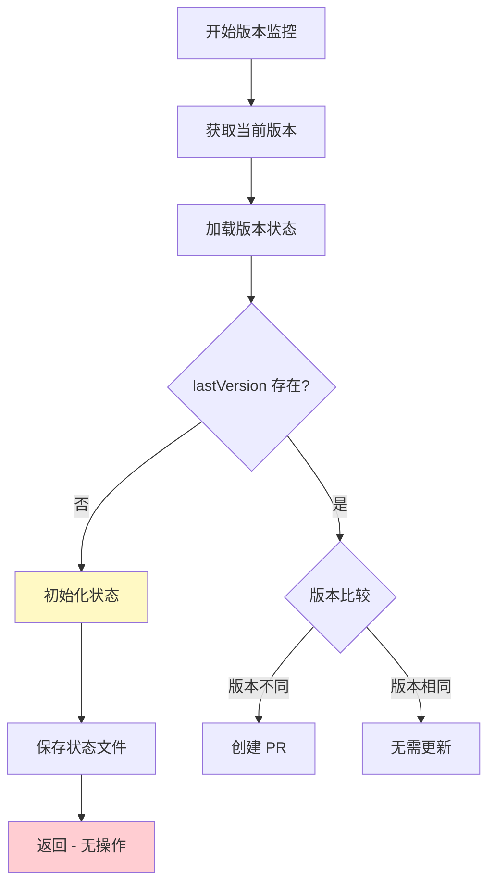
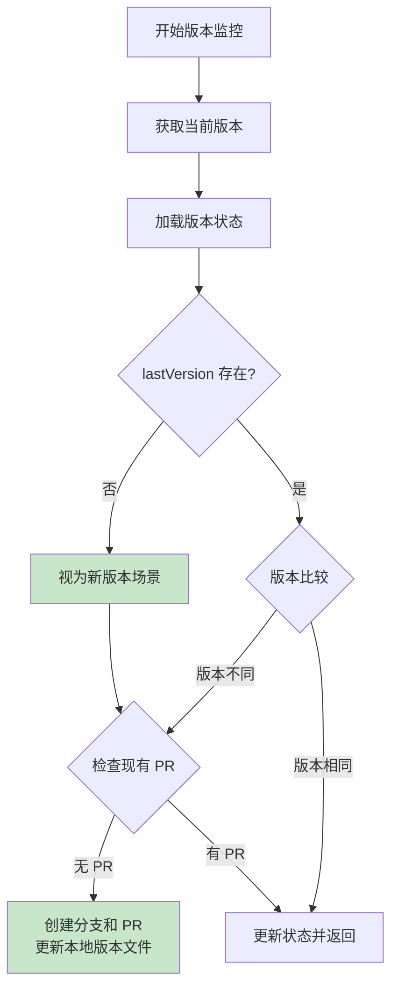

# Change: Fix Version Monitor Empty State Handling

## Why

当前 Version Monitor 在首次运行或状态丢失时（空状态场景）无法正确处理版本更新。当 `lastCheckedVersion` 和 `lastDeployedVersion` 均为空时，系统仅初始化状态文件并返回，而不触发版本更新处理流程。这导致：

1. **首次运行静默失败**: 首次运行时，即使检测到当前版本，也不会创建 PR 来同步版本信息到文档站点
2. **状态恢复后遗漏更新**: 当状态文件丢失或损坏恢复后，可能遗漏版本更新
3. **用户体验不一致**: 用户首次安装或状态恢复后无法看到正确的版本信息

## What Changes

- **修改空状态处理逻辑**: 将"无上一次版本"识别为新版本场景，触发完整的版本更新处理流程
- **统一状态比较逻辑**: 确保空状态与当前版本的比较被正确识别为版本变化
- **保持向后兼容**: 不改变现有版本比较和 PR 创建逻辑
- **明确版本数据存储策略**: 确保站点构建时使用本地版本数据文件，而非每次都请求线上接口

### 版本数据存储架构说明

**当前实现**:
- 站点在构建时直接从 `https://desktop.dl.hagicode.com/index.json` 获取版本数据
- `src/utils/desktop.ts` 中的 `fetchDesktopVersions()` 函数直接请求线上接口
- 依赖外部服务可用性，构建过程与网络状态强耦合

**期望架构**:
1. 站点构建时使用代码库中存储的本地版本数据文件
2. Version Monitor 检测到新版本时，同时更新本地版本数据文件和状态文件
3. 本地版本数据文件作为单一数据源，确保构建过程可预测且可离线进行

### 变更范围

| 文件路径 | 变更类型 | 变更原因 |
|---------|---------|---------|
| `scripts/version-monitor.js` | 修改 | 修改空状态处理逻辑，将空状态识别为新版本场景 |
| `scripts/version-monitor.js` | 修改 | 在检测到新版本时，同时更新本地版本数据文件 |
| `src/utils/desktop.ts` | 修改 | 修改版本数据获取逻辑，优先使用本地文件 |
| `public/version-index.json` 或 `src/data/version-index.json` | 新增 | 本地版本数据存储文件 |

## Code Flow Changes

### 版本数据存储架构变更

**当前架构（存在问题）**:



**新架构（期望状态）**:



### 空状态处理逻辑变更



### 修改后的流程

### 空状态处理流程

**修改前的流程**:


**修改后的流程**:



### 关键逻辑变更

**1. 空状态处理逻辑 (scripts/version-monitor.js:504-510)**

**修改前**:
```javascript
if (!lastVersion) {
  logger.info('No previous version found, initializing state');
  state.lastCheckedVersion = currentVersion;
  await saveVersionState(state);
  logger.info('Initial version state saved');
  return;  // 静默返回，不触发版本更新
}
```

**修改后**:
```javascript
// 将空状态视为新版本场景，继续执行后续的版本更新处理逻辑
// 空状态与任何有效版本的比较都将被视为版本变化
```

**2. 版本数据同步逻辑 (新增)**

**新增功能**: 在检测到新版本时，同时更新本地版本数据文件

```javascript
// 伪代码示例
async function updateLocalVersionData(versionData) {
  const versionIndexFile = 'public/version-index.json';
  await fs.writeFile(versionIndexFile, JSON.stringify(versionData, null, 2));
}
```

**3. 站点构建逻辑 (src/utils/desktop.ts)**

**修改前**:
```typescript
export async function fetchDesktopVersions(): Promise<DesktopIndexResponse> {
  const response = await fetch('https://desktop.dl.hagicode.com/index.json', ...);
  // 直接从线上获取
}
```

**修改后**:
```typescript
export async function fetchDesktopVersions(): Promise<DesktopIndexResponse> {
  // 优先读取本地文件
  try {
    const localData = await fs.readFile('public/version-index.json', 'utf-8');
    return JSON.parse(localData);
  } catch (error) {
    // 降级到线上获取（仅用于开发环境）
    const response = await fetch('https://desktop.dl.hagicode.com/index.json', ...);
    return await response.json();
  }
}
```

## Impact

### 预期收益

1. **确保首次运行正确处理**: 首次运行时能够正确检测并同步当前版本到文档站点
2. **提高容错能力**: 状态文件丢失或损坏时，系统能够自动恢复并触发版本同步
3. **改善用户体验**: 用户在首次安装或状态恢复后能够看到正确的版本信息
4. **构建独立性**: 站点构建时使用本地版本数据，不依赖外部服务可用性
5. **可预测的构建结果**: 构建过程完全基于代码库中的数据，结果可复现

### 架构变更影响

**数据流变更**:
- **原架构**: 线上 API → Version Monitor → 状态文件 + PR → 构建
- **新架构**: 线上 API → Version Monitor → 状态文件 + 本地版本数据文件 + PR → 构建（使用本地数据）

**依赖关系变更**:
- **原依赖**: 构建时依赖 `desktop.dl.hagicode.com` 可用性
- **新依赖**: 构建时依赖代码库中的 `public/version-index.json` 文件

### 风险与缓解

| 风险 | 缓解措施 |
|-----|---------|
| 首次运行可能创建不必要的 PR | 这是预期行为，确保版本同步完整 |
| 状态文件格式不兼容 | 代码已处理 ENOENT 错误，会创建新的状态文件 |
| 本地版本数据文件与线上不同步 | Version Monitor 确保每次版本更新都会同步本地文件 |
| 构建时本地文件不存在 | 初始提交中包含默认版本数据文件 |
| 需要额外维护本地版本数据文件 | 自动化脚本确保文件与线上数据保持同步 |

### 受影响的规范

- `version-monitor` - 修改版本状态处理需求，新增本地版本数据文件同步
- `desktop-page` - 修改版本数据获取逻辑，优先使用本地文件

### 测试场景

- 首次运行应用（无历史状态）
- 状态数据被清除或丢失
- 应用升级后状态格式不兼容
- **本地版本数据文件同步验证**
- **构建时本地文件读取验证**
- **线上 API 不可用时构建仍可正常工作**
