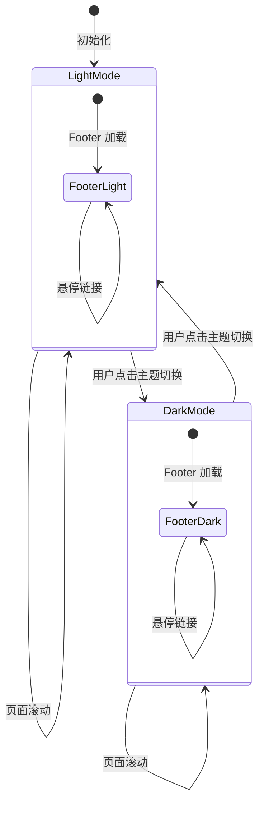
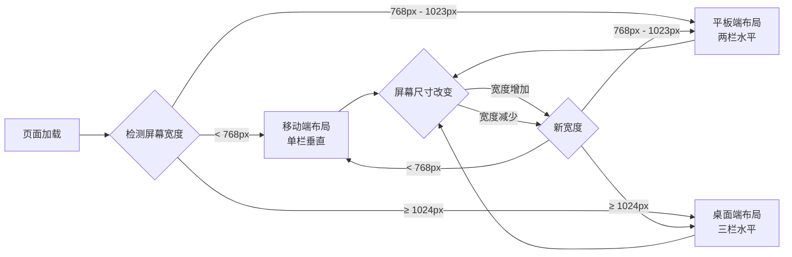
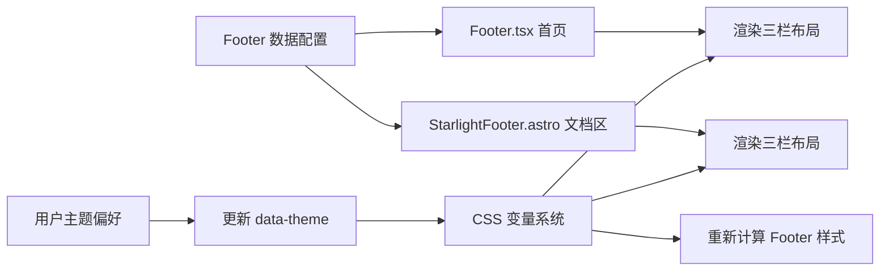
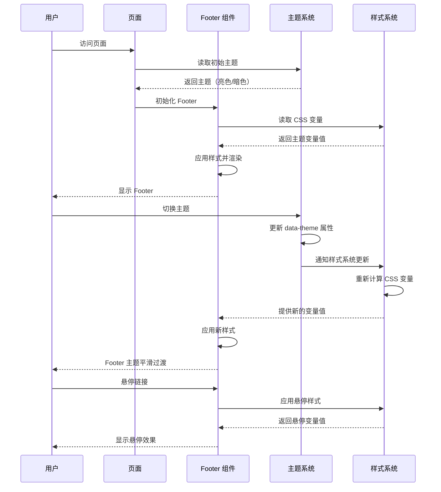

# Design: 统一首页与文档区 Footer 设计

## Context

Hagicode 文档站点当前使用两种不同的 Footer 组件，导致视觉不一致和用户体验割裂。首页使用 React 组件 `src/components/home/Footer.tsx`，文档区使用 Starlight 默认 Footer。本项目需要统一这两种 Footer 的设计，采用现代三栏高栏布局，提升信息密度和导航效率。

**约束条件：**
- 首页使用 React 组件，文档区使用 Astro/Starlight 组件
- 需要保持与现有主题系统（暗色/亮色模式）的兼容性
- 需要支持响应式设计（移动端、平板、桌面）
- 必须通过 TypeScript 类型检查
- 必须保持与现有部署配置的兼容性

**利益相关者：**
- 站点用户：需要一致的用户体验和高效的导航
- 开发团队：需要易于维护的代码结构和清晰的样式系统
- 设计团队：需要符合品牌规范的设计实现

## Goals / Non-Goals

### Goals
- 统一首页和文档区的 Footer 视觉设计
- 实现三栏高栏布局（产品信息、快速链接、社区与支持）
- 保持与现有主题系统的完全兼容
- 实现响应式设计，支持所有屏幕尺寸
- 提供清晰的 TypeScript 类型定义

### Non-Goals
- 不改变 Footer 的核心功能（导航、版权信息、备案信息）
- 不添加新的交互功能（如 Newsletter 订阅）
- 不改变现有的 CSS 变量命名约定
- 不引入新的外部依赖

## Decisions

### 决策 1：布局方案 - 使用 CSS Grid 实现三栏布局

**选择：** 使用 CSS Grid 而非 Flexbox 实现三栏布局

**原因：**
- Grid 更适合二维布局控制，可以精确定义列宽和间距
- Grid 的 `grid-template-columns` 配合 `minmax()` 可以更好地实现响应式
- Grid 布局代码更简洁，易于维护

**替代方案：** Flexbox 需要嵌套多个容器才能实现相同效果，代码复杂度更高

### 决策 2：样式系统 - 扩展现有 CSS 变量系统

**选择：** 在 `src/styles/homepage.css` 中添加 Footer 专用变量

**原因：**
- 与现有样式系统保持一致
- 便于主题切换时统一样式
- 减少样式代码重复

**替代方案：** 创建独立的 `footer.css` 文案会导致样式分散，增加维护成本

### 决策 3：组件复用 - 保持两个独立组件但统一样式

**选择：** 保持 `src/components/home/Footer.tsx` 和 `src/components/StarlightFooter.astro` 独立，但统一样式和布局

**原因：**
- React 和 Astro 组件无法直接共享
- Starlight Footer 需要保留特有功能（EditLink、LastUpdated、Pagination）
- 通过共享 CSS 变量和布局模式实现视觉统一

**替代方案：** 将 Footer 转换为纯 Astro 组件会导致首页需要重构，增加风险

### 决策 4：响应式断点 - 使用项目现有断点约定

**选择：** 遵循项目现有的响应式断点
- 移动端：<768px
- 平板端：768px-1023px
- 桌面端：≥1024px

**原因：**
- 与现有组件（如 Navbar）保持一致
- 符合常见设备的屏幕尺寸

**替代方案：** 自定义断点会增加样式复杂度

## UI/UX Design

### 桌面端布局设计（≥1024px）

```text
┌─────────────────────────────────────────────────────────────────────────────┐
│                                                                              │
│    [Hagicode Logo]                    © 2026 Hagicode. All rights reserved. │
│                                                                              │
├─────────────────────────────────────────────────────────────────────────────┤
│                                                                              │
│    产品                              快速链接                           社区   │
│    ┌─────────────────────┐           ┌─────────────────────┐   ┌───────────┐  │
│    │ Hagicode 简介       │           │ 产品文档            │   │ GitHub    │  │
│    │ 版本信息 v1.0.0     │           │ 博客文章            │   │ 许可证    │  │
│    │ 更新日志            │           │ API 参考            │   │ 问题反馈  │  │
│    │                     │           │ 快速开始            │   │ 联系邮箱  │  │
│    └─────────────────────┘           └─────────────────────┘   └───────────┘  │
│                                                                              │
└─────────────────────────────────────────────────────────────────────────────┘
│                                                                              │
│                              闽ICP备2026004153号-1                           │
│                                                                              │
└─────────────────────────────────────────────────────────────────────────────┘
```

### 平板端布局设计（768px-1023px）

```text
┌─────────────────────────────────────────────────────────┐
│                                                          │
│         [Hagicode Logo]      © 2026 Hagicode            │
│                                                          │
├─────────────────────────────────────────────────────────┤
│                                                          │
│    产品                              快速链接            │
│    ┌─────────────────────┐           ┌─────────────────┐ │
│    │ Hagicode 简介       │           │ 产品文档        │ │
│    │ 版本信息 v1.0.0     │           │ 博客文章        │ │
│    │ 更新日志            │           │ API 参考        │ │
│    │                     │           │ 快速开始        │ │
│    └─────────────────────┘           └─────────────────┘ │
│                                                          │
│    社区与支持                                            │
│    ┌─────────────────────────────────────────────────┐   │
│    │ GitHub | 许可证 | 问题反馈 | 联系邮箱            │   │
│    └─────────────────────────────────────────────────┘   │
│                                                          │
└─────────────────────────────────────────────────────────┘
│                    闽ICP备2026004153号-1                 │
└─────────────────────────────────────────────────────────┘
```

### 移动端布局设计（<768px）

```text
┌─────────────────────────┐
│                         │
│  [Hagicode Logo]        │
│  © 2026 Hagicode        │
│                         │
├─────────────────────────┤
│                         │
│  产品                   │
│  · Hagicode 简介        │
│  · 版本信息 v1.0.0      │
│  · 更新日志             │
│                         │
│  快速链接               │
│  · 产品文档             │
│  · 博客文章             │
│  · API 参考             │
│  · 快速开始             │
│                         │
│  社区与支持             │
│  · GitHub               │
│  · 许可证               │
│  · 问题反馈             │
│  · 联系邮箱             │
│                         │
└─────────────────────────┘
│   闽ICP备2026004153号-1  │
└─────────────────────────┘
```

### 主题切换流程



### 响应式布局转换流程



### 错误处理 UX

**链接失效场景：**
- 外部链接无法访问：保持默认浏览器行为
- 内部链接 404：显示 Astro 默认 404 页面

**主题切换失败场景：**
- localStorage 不可用：回退到系统主题偏好
- CSS 变量未加载：使用 fallback 颜色值

## Technical Design

### 组件架构图

```mermaid
graph TD
    subgraph "首页 (React)"
        HP[index.astro] --> HF[Footer.tsx]
        HF --> HFMS[Footer.module.css]
    end

    subgraph "文档区 (Starlight/Astro)"
        DP[docs/[...slug].astro] --> SF[StarlightFooter.astro]
        SF --> SFS[inline styles]
    end

    subgraph "共享样式系统"
        GVS[homepage.css] --> CSSVars[CSS Variables]
        CSSVars --> HFMS
        CSSVars --> SFS
    end

    subgraph "主题系统"
        TS[Theme Toggle] --> GVS
        TS --> SF
    end
```

### 数据流图



### 组件交互时序图



### TypeScript 类型定义

```typescript
/**
 * Footer 链接接口
 */
interface FooterLink {
  /** 链接显示文字 */
  label: string;
  /** 链接目标 URL */
  href: string;
  /** 是否外部链接 */
  external?: boolean;
  /** ARIA 标签 */
  ariaLabel?: string;
}

/**
 * Footer 区块接口
 */
interface FooterSection {
  /** 区块标题 */
  title: string;
  /** 区块链接列表 */
  links: FooterLink[];
}

/**
 * Footer 数据接口
 */
interface FooterData {
  /** 产品信息区块 */
  productInfo: FooterSection;
  /** 快速链接区块 */
  quickLinks: FooterSection;
  /** 社区与支持区块 */
  community: FooterSection;
}
```

### 详细代码变更

#### 首页 Footer 变更

| 组件/方法 | 变更类型 | 具体变更 | 变更原因 |
|----------|---------|---------|---------|
| Footer.tsx - 组件结构 | 修改 | 从单栏布局改为三栏布局，添加 FooterSection 数据结构 | 实现三栏高栏 Footer |
| Footer.tsx - links 属性 | 重命名 | 重构为 productInfo、quickLinks、community 三个区块 | 支持三栏内容组织 |
| Footer.tsx - TypeScript 类型 | 新增 | 添加 FooterSection、FooterLink 接口定义 | 类型安全 |
| Footer.module.css - .content | 修改 | 从 flex 布局改为 grid 布局，添加 grid-template-columns | 实现三栏布局 |
| Footer.module.css - 响应式 | 新增 | 添加移动端、平板端、桌面端媒体查询 | 响应式设计 |

#### Starlight Footer 变更

| 组件/方法 | 变更类型 | 具体变更 | 变更原因 |
|----------|---------|---------|---------|
| StarlightFooter.astro - 布局 | 修改 | 添加三栏布局结构，复用首页 Footer 设计 | 统一视觉设计 |
| StarlightFooter.astro - 样式 | 新增 | 添加与首页 Footer 一致的样式 | 保持视觉一致性 |
| StarlightFooter.astro - 保留功能 | 无变更 | 保留 EditLink、LastUpdated、Pagination | 维持文档区功能 |

#### 样式系统变更

| 文件 | 变更类型 | 具体变更 | 变更原因 |
|------|---------|---------|---------|
| homepage.css - CSS 变量 | 新增 | 添加 Footer 专用变量（--footer-bg、--footer-border 等） | 支持 Footer 主题化 |
| homepage.css - 响应式 | 无变更 | 使用现有响应式断点约定 | 保持一致性 |

## Risks / Trade-offs

### 风险 1：样式冲突

**风险：** Starlight 的默认样式可能覆盖自定义 Footer 样式

**缓解措施：**
- 使用 `@layer starlight.core` 确保样式优先级
- 使用 CSS 作用域（`.module.css` 和 `<style>` 块）
- 充分测试主题切换场景

### 风险 2：响应式布局问题

**风险：** 在某些屏幕尺寸下布局可能错乱

**缓解措施：**
- 使用浏览器 DevTools 测试各种屏幕尺寸
- 使用 CSS Grid 的 `minmax()` 和 `auto-fit` 确保布局稳定性
- 在真机上测试（iOS、Android）

### 风险 3：性能影响

**风险：** 复杂的 Grid 布局可能影响页面渲染性能

**缓解措施：**
- 使用 CSS 而非 JavaScript 实现布局
- 避免过度使用 box-shadow 和 backdrop-filter
- 测试低端设备的渲染性能

### 权衡 1：组件复用 vs 技术限制

**权衡：** 无法在 React 和 Astro 之间共享组件代码

**选择：** 保持两个独立组件但统一样式和布局

**影响：** 需要同步维护两个组件的布局变更

### 权衡 2：三栏布局 vs 信息密度

**权衡：** 三栏布局增加信息密度，但可能在移动端显示拥挤

**选择：** 在移动端使用单栏布局，桌面端使用三栏布局

**影响：** 不同屏幕尺寸下的用户体验不一致，但符合响应式设计最佳实践

## Migration Plan

### 迁移步骤

1. **准备阶段**
   - 创建功能分支 `feature/footer-design-unification`
   - 备份现有 Footer 组件

2. **样式系统扩展**
   - 在 `src/styles/homepage.css` 中添加 Footer CSS 变量
   - 验证变量在主题切换时正确更新

3. **首页 Footer 重构**
   - 重构 `src/components/home/Footer.tsx`
   - 更新 `src/components/home/Footer.module.css`
   - 测试首页 Footer 在各种主题和屏幕尺寸下的显示

4. **Starlight Footer 统一**
   - 重构 `src/components/StarlightFooter.astro`
   - 测试文档区 Footer 在各种主题和屏幕尺寸下的显示

5. **验证和测试**
   - 运行 `npm run typecheck` 确保类型检查通过
   - 运行 `npm run build` 确保构建成功
   - 手动测试各种场景（主题切换、响应式、浏览器兼容性）

6. **部署**
   - 合并到主分支
   - 监控部署后的表现

### 回滚计划

如果迁移出现问题，可以按以下步骤回滚：

1. 恢复备份的 Footer 组件文件
2. 移除新增的 CSS 变量
3. 回滚功能分支或创建 revert commit
4. 重新部署之前的版本

## Open Questions

1. **Footer 内容优先级：** 三栏内容的优先级是否符合用户需求？是否需要调整内容组织方式？

2. **品牌标识：** 是否需要在 Footer 中添加 Hagicode Logo？

3. **社交媒体链接：** 是否需要添加更多社交媒体链接（如 Twitter、LinkedIn）？

4. **国际化考虑：** 未来是否需要支持多语言 Footer？当前设计是否易于扩展？

5. **性能监控：** 是否需要添加性能监控以跟踪 Footer 渲染性能？
