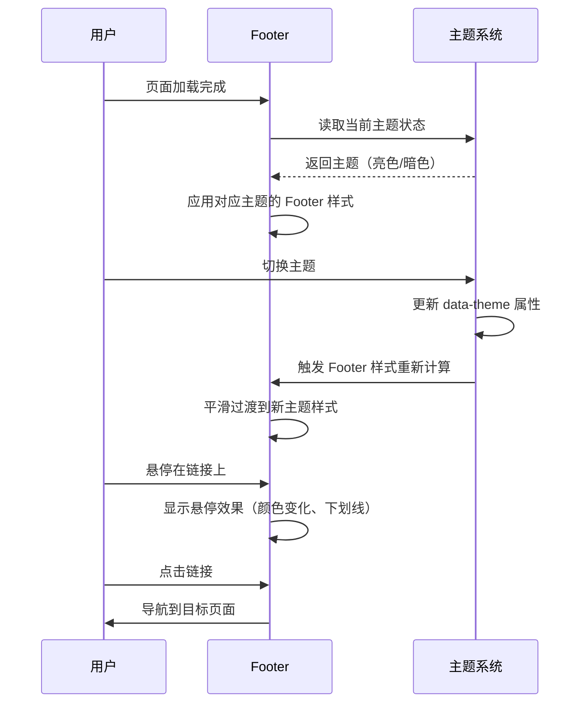

# Change: 统一首页与文档区 Footer 设计

## Why

当前 Hagicode 文档站点使用两种不同的 Footer 组件：首页使用 React 组件 `src/components/home/Footer.tsx`，文档区使用 Starlight 默认 Footer 组件。这两种 Footer 在视觉风格、布局结构和信息密度上存在明显差异，影响整站的设计一致性和用户体验。现代网站通常采用三栏高栏 Footer 布局以提供更清晰的信息架构和导航效率。

## What Changes

### 首页 Footer 改造

**目标布局：三栏高栏 Footer**

```
┌─────────────────────────────────────────────────────────────────────────────┐
│                          [Hagicode Logo] © 2026 Hagicode                    │
├─────────────────────────────────────────────────────────────────────────────┤
│                                                                             │
│  产品信息                          快速链接                      社区与支持    │
│  ┌─────────────────┐              ┌─────────────────┐          ┌─────────────────┐ │
│  │ Hagicode 简介   │              │ 产品文档        │          │ GitHub 仓库     │ │
│  │ 版本信息        │              │ 博客文章        │          │ 问题反馈        │ │
│  │ 更新日志        │              │ API 参考        │          │ 许可证 MIT      │ │
│  │                 │              │ 快速开始        │          │ 联系邮箱        │ │
│  └─────────────────┘              └─────────────────┘          └─────────────────┘ │
│                                                                             │
└─────────────────────────────────────────────────────────────────────────────┘
│                          闽ICP备2026004153号-1                              │
└─────────────────────────────────────────────────────────────────────────────┘
```

### Starlight 文档区 Footer 统一

**替换方案：** 通过 Starlight 组件覆盖机制，使用自定义 Footer 组件替换默认样式，确保与首页 Footer 保持视觉一致性。

### 样式系统整合

**共享 CSS 变量：** 扩展现有 `src/styles/homepage.css` 中的 CSS 变量系统，新增 Footer 专用变量：

- `--footer-bg`: Footer 背景色（支持亮色/暗色主题）
- `--footer-border`: Footer 边框颜色
- `--footer-link-color`: Footer 链接颜色
- `--footer-link-hover`: Footer 链接悬停颜色
- `--footer-section-gap`: Footer 区块间距

### 响应式设计

**断点策略：**
- **移动端**（<768px）：单栏垂直布局
- **平板端**（768px-1023px）：两栏水平布局
- **桌面端**（≥1024px）：三栏水平布局

## UI 设计变更

### 新首页 Footer 界面

```text
┌─────────────────────────────────────────────────────────────────────────────┐
│                                                                              │
│    [Hagicode Logo]                    © 2026 Hagicode. All rights reserved. │
│                                                                              │
├─────────────────────────────────────────────────────────────────────────────┤
│                                                                              │
│    产品                              快速链接                           社区   │
│    ┌─────────────────────┐           ┌─────────────────────┐   ┌───────────┐  │
│    │ Hagicode 简介       │           │ 产品文档            │   │ GitHub    │  │
│    │ 版本信息 v1.0.0     │           │ 博客文章            │   │ 许可证    │  │
│    │ 更新日志            │           │ API 参考            │   │ 问题反馈  │  │
│    │                     │           │ 快速开始            │   │ 联系邮箱  │  │
│    └─────────────────────┘           └─────────────────────┘   └───────────┘  │
│                                                                              │
└─────────────────────────────────────────────────────────────────────────────┘
│                                                                              │
│                              闽ICP备2026004153号-1                           │
│                                                                              │
└─────────────────────────────────────────────────────────────────────────────┘
```

### Footer 交互流程



## Impact

### 受影响的规范

- **specs/astro-site** - 新增三栏 Footer 组件要求

### 受影响的代码

| 文件路径 | 变更类型 | 变更原因 | 影响范围 |
|---------|---------|---------|---------|
| `src/components/home/Footer.tsx` | 修改 | 重构为三栏布局，使用新的 CSS 变量系统 | 首页 Footer |
| `src/components/home/Footer.module.css` | 修改 | 添加三栏布局样式、响应式断点、主题变量 | Footer 样式 |
| `src/components/StarlightFooter.astro` | 修改 | 统一为三栏布局，复用首页 Footer 样式 | 文档区 Footer |
| `src/styles/homepage.css` | 新增 | 添加 Footer 专用 CSS 变量 | 全局样式系统 |
| `src/pages/index.astro` | 无变更 | Footer 组件接口保持兼容 | 首页 |

### 用户体验影响

**正面影响：**
1. **视觉一致性** - 首页和文档区使用统一 Footer 设计，提升品牌识别度
2. **信息架构优化** - 三栏布局提供更清晰的信息层次和导航效率
3. **响应式体验** - 在各种屏幕尺寸下保持良好的阅读和交互体验

**潜在风险：**
1. **布局适应期** - 用户需要适应新的 Footer 信息组织方式
2. **内容优先级** - 需要确保三栏内容优先级合理，避免信息过载

### 技术影响

**依赖变更：** 无新增外部依赖

**构建影响：**
- 首页构建：无影响（React 组件重构）
- 文档区构建：无影响（Starlight 组件覆盖机制）
- 类型检查：需要通过 `npm run typecheck`

**兼容性：**
- 现有主题系统（暗色模式）：完全兼容
- 路由配置：无影响
- 部署配置（GitHub Pages、Azure Static Web Apps）：无影响

### 维护成本

**新增维护职责：**
1. 维护 Footer 内容更新（产品信息、快速链接、社区链接）
2. 确保响应式布局在各种设备上正常工作
3. 保持主题切换时的样式一致性

**简化点：**
1. 统一设计后减少样式代码重复
2. 共享 CSS 变量系统降低维护复杂度

---

**Status:** ExecutionCompleted
