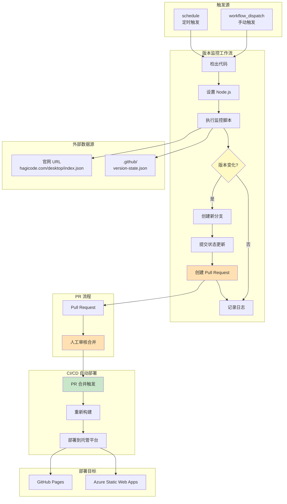
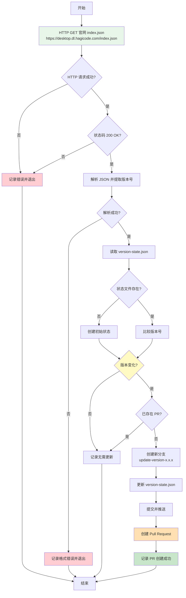
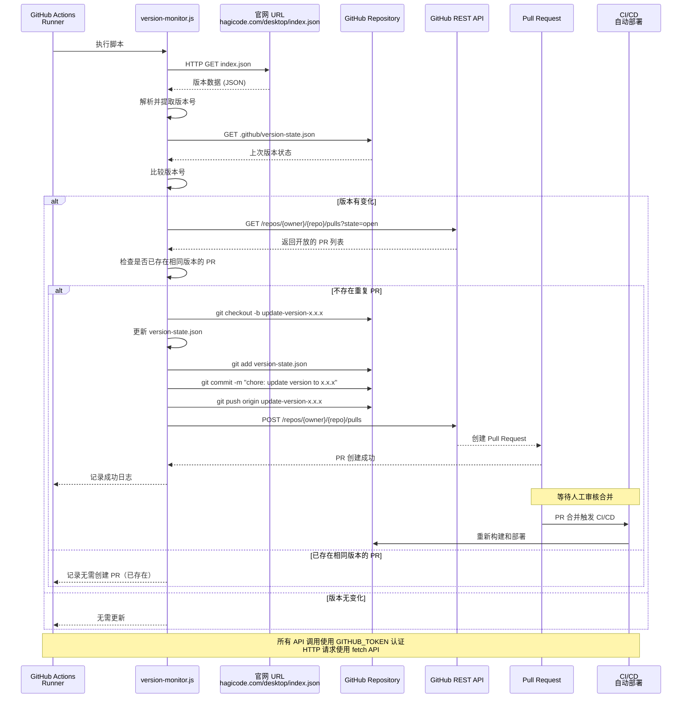

# Design: 版本监控与自动部署系统

## Context

Hagicode 文档站点使用 Astro 5.x 框架构建，部署到 GitHub Pages 和 Azure Static Web Apps。桌面客户端的版本数据托管在官网的特定 URL（如 `https://desktop.dl.hagicode.com/index.json`）。当桌面客户端发布新版本时，官网的 `index.json` 会被更新，但文档站点需要手动触发重新部署才能反映最新版本。

### 当前痛点

1. **版本同步延迟**：用户在桌面客户端看到新版本通知，但文档站点仍显示旧版本
2. **手动维护成本**：需要人工监控并手动触发部署，容易遗忘或延误
3. **用户体验不一致**：不同渠道的版本信息不同步，造成用户困惑

### 约束条件

- 项目使用 GitHub Actions 进行 CI/CD
- 部署目标：GitHub Pages 和 Azure Static Web Apps
- 版本数据源：官网 URL（`https://desktop.dl.hagicode.com/index.json`）
- 需要避免过度频繁的 HTTP 请求
- 需要处理 HTTP 请求失败的情况
- 不能影响现有的手动部署流程

### 利益相关者

- **用户**：期望官方网站始终显示最新版本信息
- **开发团队**：希望减少手动维护工作
- **运维团队**：需要可靠的自动化监控和部署机制

## Goals / Non-Goals

### Goals

- 自动从官网 URL 获取版本数据并检测版本变化
- 检测到新版本时自动创建 Pull Request
- 提供详细的日志记录和错误处理
- 支持手动触发和定时执行两种模式
- 复用现有 CI/CD 流程，PR 合并后自动部署
- 官网 URL 可配置化，便于维护

### Non-Goals

- 实时监控（轮询间隔 30 分钟已足够）
- 复杂的版本管理功能（如多版本并存）
- 修改现有的手动部署流程
- 创建独立的服务或长期运行的进程

## Decisions

### 决策 1：使用 GitHub Actions 而非独立服务

**选择**：使用 GitHub Actions 定时工作流进行版本监控

**理由**：
- 无需额外基础设施
- 利用现有的 GitHub Actions 环境
- 易于维护和调试
- 成本低（GitHub Actions 免费额度内）
- 与现有 CI/CD 流程集成度高

**替代方案考虑**：
- **独立监控服务**：需要额外的服务器资源和维护成本
- **Webhook 方案**：需要桌面客户端仓库配合，增加复杂度
- **长期运行的进程**：不符合静态站点架构，增加运维负担

### 决策 2：轮询间隔设置为 30 分钟

**选择**：每 30 分钟检查一次版本变化

**理由**：
- 平衡了实时性和 HTTP 请求频率
- GitHub Actions 每月有充足的运行次数额度
- 30 分钟延迟对于版本发布是可以接受的
- 避免对官网服务器造成过大压力

**权衡**：
- 更短的间隔（如 5 分钟）：实时性更好，但 HTTP 请求次数增加
- 更长的间隔（如 2 小时）：HTTP 请求更少，但版本同步延迟更大

### 决策 3：使用 version-state.json 跟踪版本状态

**选择**：在 `.github/version-state.json` 中存储上次检查的版本信息

**理由**：
- 作为 Git 仓库的一部分，有版本控制
- 简单可靠，无需外部存储
- 便于调试和历史追踪
- 支持多环境（如需要）

**数据结构**：
```json
{
  "lastCheckedVersion": "1.0.0",
  "lastCheckedTime": "2026-02-08T10:00:00Z",
  "lastDeployedVersion": "1.0.0",
  "lastDeployedTime": "2026-02-08T10:00:00Z",
  "sourceUrl": "https://desktop.dl.hagicode.com/index.json",
  "checkCount": 0
}
```

### 决策 4：使用 semver 进行版本比较

**选择**：使用语义化版本（Semantic Versioning）比较逻辑

**理由**：
- 版本号遵循 semver 规范（MAJOR.MINOR.PATCH）
- 支持预发布版本和构建元数据
- JavaScript 生态有成熟的 semver 库
- 准确的版本号比较逻辑

### 决策 5：通过创建 Pull Request 触发部署

**选择**：检测到版本变化时创建 Pull Request，合并后通过现有 CI/CD 流程自动部署

**理由**：
- 复用现有的 CI/CD 流程，无需修改部署配置
- 通过 PR 机制实现人工审核，确保版本更新的可控性
- 避免直接触发部署可能带来的风险
- 简化实现，只需调用 GitHub API 创建 PR
- PR 合并自动触发部署，与正常开发流程一致

**替代方案考虑**：
- **直接触发部署工作流**：需要修改现有部署配置，增加复杂度
- **Webhook 方案**：需要桌面客户端仓库配合，增加复杂度
- **直接推送到 main 分支**：跳过审核，风险较高

## Technical Design

### 系统架构



### 数据流设计



### API 交互设计



### 监控脚本设计

**文件位置**：`scripts/version-monitor.js`

**核心函数**：

1. `fetchCurrentVersion()`
   - 从官网 URL 获取 `index.json` 的最新版本号
   - 使用 HTTP GET 请求获取数据
   - 参数：`url?: string` - 可选的自定义 URL，默认使用配置的官网 URL
   - 返回：`Promise<VersionData>` - 包含版本号等信息的对象
   - 错误处理：网络错误、超时、非 200 状态码、JSON 解析错误

2. `loadVersionState()`
   - 读取 `.github/version-state.json` 状态文件
   - 参数：无
   - 返回：`Promise<VersionState>` - 版本状态对象
   - 错误处理：文件不存在时返回默认状态

3. `compareVersions(v1, v2)`
   - 使用 semver 比较两个版本号
   - 参数：`v1: string`, `v2: string`
   - 返回：`number` - -1 (v1 < v2), 0 (v1 = v2), 1 (v1 > v2)

4. `hasExistingPullRequest(version)`
   - 检查是否已存在相同版本的 Pull Request
   - 参数：`version: string`
   - 返回：`Promise<boolean>` - 是否已存在
   - 错误处理：API 调用失败

5. `createVersionBranch(version)`
   - 创建新的 Git 分支用于版本更新
   - 参数：`version: string`
   - 返回：`Promise<string>` - 分支名称
   - 错误处理：Git 操作失败

6. `updateVersionStateAndCommit(state, branch)`
   - 在指定分支上更新并提交版本状态文件
   - 参数：`state: VersionState`, `branch: string`
   - 返回：`Promise<void>`
   - 错误处理：Git 操作失败

7. `createPullRequest(version, branch)`
   - 创建 Pull Request
   - 参数：`version: string`, `branch: string`
   - 返回：`Promise<number>` - PR 编号
   - 错误处理：API 调用失败

8. `fetchWithRetry(url, options)`
   - 带重试机制的 HTTP 请求
   - 参数：`url: string`, `options: RequestInit`, `maxRetries?: number`
   - 返回：`Promise<Response>`
   - 错误处理：网络错误、超时，使用指数退避重试策略

**类型定义**：

```typescript
interface VersionState {
  lastCheckedVersion: string;
  lastCheckedTime: string; // ISO 8601 格式
  lastDeployedVersion: string;
  lastDeployedTime: string; // ISO 8601 格式
  sourceUrl: string; // 官网 URL
  checkCount: number;
}

interface VersionData {
  version: string;
  releaseDate: string;
  downloadUrl: string;
  // 其他版本相关字段
}

interface MonitorConfig {
  sourceUrl: string; // 官网 URL
  timeout: number; // HTTP 请求超时时间（毫秒）
  maxRetries: number; // 最大重试次数
  retryDelay: number; // 重试延迟（毫秒）
}
```

### GitHub Actions 工作流设计

**文件位置**：`.github/workflows/version-monitor.yml`

**关键配置**：

```yaml
name: Version Monitor

on:
  schedule:
    - cron: '*/30 * * * *'  # 每 30 分钟
  workflow_dispatch:        # 支持手动触发

permissions:
  contents: write
  pull-requests: write

jobs:
  monitor:
    runs-on: ubuntu-latest
    steps:
      - name: Checkout code
        uses: actions/checkout@v4

      - name: Setup Node.js
        uses: actions/setup-node@v4
        with:
          node-version: '20'

      - name: Run version monitor
        run: node scripts/version-monitor.js
        env:
          GITHUB_TOKEN: ${{ secrets.GITHUB_TOKEN }}
          REPO_OWNER: ${{ github.repository_owner }}
          REPO_NAME: ${{ github.repository }}
          VERSION_SOURCE_URL: ${{ vars.VERSION_SOURCE_URL || 'https://desktop.dl.hagicode.com/index.json' }}
          REQUEST_TIMEOUT: '30000'  # 30 秒超时
          MAX_RETRIES: '3'
```

**触发器配置**：

- `schedule`: 使用 cron 表达式，`*/30 * * * *` 表示每 30 分钟执行一次
- `workflow_dispatch`: 允许在 GitHub Actions UI 手动触发

**权限配置**：

- `contents: write`: 需要创建分支和提交文件
- `pull-requests: write`: 需要创建 Pull Request

### 错误处理设计

**错误类型和处理策略**：

| 错误类型 | 处理策略 | 日志级别 | 恢复机制 |
|---------|---------|---------|---------|
| HTTP 请求失败（网络错误、DNS 解析失败） | 指数退避重试（最多 3 次） | ERROR | 下次定时任务自动重试 |
| HTTP 请求超时 | 重试（最多 3 次），增加超时时间 | WARN | 指数退避重试 |
| HTTP 非 200 状态码（4xx/5xx） | 记录错误并退出 | ERROR | 下次定时任务自动重试 |
| JSON 解析失败 | 记录错误并退出 | ERROR | 人工介入检查数据源 |
| 版本数据格式错误 | 记录错误并退出 | ERROR | 人工介入修复数据源 |
| Git 操作失败（创建分支、提交） | 记录错误并退出 | ERROR | 人工介入检查权限 |
| PR 创建失败 | 记录错误，保留分支和提交 | ERROR | 人工手动创建 PR |
| 已存在相同版本的 PR | 跳过创建，记录日志 | INFO | 无需操作 |
| PR 列表查询失败 | 记录警告，继续尝试创建 PR | WARN | 可能创建重复 PR |

**重试策略**：

```javascript
async function fetchWithRetry(url, options = {}, maxRetries = 3) {
  const { timeout = 30000, ...fetchOptions } = options;

  for (let i = 0; i < maxRetries; i++) {
    try {
      const controller = new AbortController();
      const timeoutId = setTimeout(() => controller.abort(), timeout);

      const response = await fetch(url, {
        ...fetchOptions,
        signal: controller.signal
      });

      clearTimeout(timeoutId);

      if (!response.ok) {
        throw new Error(`HTTP ${response.status}: ${response.statusText}`);
      }

      return response;
    } catch (error) {
      if (error.name === 'AbortError') {
        logger.warn(`Request timeout (${timeout}ms), attempt ${i + 1}/${maxRetries}`);
      } else {
        logger.warn(`Request failed: ${error.message}, attempt ${i + 1}/${maxRetries}`);
      }

      if (i === maxRetries - 1) {
        throw error; // 最后一次重试失败，抛出错误
      }

      // 指数退避：等待 2^i * 1000 毫秒
      const waitTime = Math.pow(2, i) * 1000;
      await sleep(waitTime);
    }
  }
}
```

### 日志设计

**日志级别**：

- `DEBUG`: 详细的执行信息（版本号、时间戳等）
- `INFO`: 正常操作记录（开始检查、版本无变化等）
- `WARN`: 警告信息（重试、非致命错误）
- `ERROR`: 错误信息（失败的操作）

**日志格式**：

```javascript
const logger = {
  debug: (msg) => console.log(`[DEBUG] ${msg}`),
  info: (msg) => console.log(`[INFO] ${msg}`),
  warn: (msg) => console.log(`[WARN] ${msg}`),
  error: (msg) => console.log(`[ERROR] ${msg}`)
};

// 使用示例
logger.info(`Fetching version from: ${config.sourceUrl}`);
logger.info(`Current version: ${currentVersion}`);
logger.warn(`Retrying fetch attempt ${attempt}/${maxRetries}`);
logger.error(`Failed to fetch version data: ${error.message}`);
```

**GitHub Actions 输出**：

使用 GitHub Actions 的日志格式，支持步骤级别的输出：

```yaml
- name: Run version monitor
  id: monitor
  run: node scripts/version-monitor.js

- name: Display result
  run: |
    echo "Version changed: ${{ steps.monitor.outputs.version_changed }}"
    echo "New version: ${{ steps.monitor.outputs.new_version }}"
    echo "PR created: ${{ steps.monitor.outputs.pr_created }}"
    echo "PR number: ${{ steps.monitor.outputs.pr_number }}"
```

## Risks / Trade-offs

### 风险分析

| 风险 | 影响 | 概率 | 缓解措施 |
|-----|-----|-----|---------|
| 官网 URL 不可用或响应超时 | 高 | 中 | 实现请求超时和重试机制（指数退避） |
| HTTP 请求失败 | 高 | 中 | 实现重试策略，添加详细错误日志 |
| 官网 URL 配置错误 | 高 | 低 | 添加 URL 验证和健康检查 |
| PR 创建失败 | 中 | 低 | 添加详细的错误日志；保留分支和提交，便于人工手动创建 PR |
| 重复创建 PR | 中 | 低 | 实现检查现有 PR 的逻辑，避免重复创建 |
| 版本数据格式变化 | 中 | 低 | 在脚本中添加数据验证；使用 TypeScript 接口 |
| JSON 解析失败 | 中 | 低 | 添加 try-catch 和详细的错误日志 |
| 分支冲突 | 低 | 低 | 使用带时间戳的分支名，或使用版本号作为分支名 |
| 官网服务器负载过高 | 低 | 低 | 设置合理的轮询间隔（30分钟） |
| 轮询间隔过长 | 低 | 低 | 可配置的轮询间隔；支持手动触发 |
| 状态文件冲突 | 低 | 低 | 使用 Git 原子操作；处理并发修改 |
| PR 未及时合并 | 低 | 中 | 添加通知机制提醒审核者 |

### 权衡考虑

**实时性 vs 资源使用**：
- 30 分钟轮询间隔在实时性和 HTTP 请求频率之间取得平衡
- 如需更实时的更新，可以考虑使用 Webhook 方案

**简单性 vs 功能完整性**：
- 当前设计专注于核心功能：从官网 URL 检测版本并创建 PR
- 避免过度设计，保持方案简单可靠

**自动化 vs 可控性**：
- 通过 PR 机制实现自动化，同时保留人工审核环节
- 保留手动触发选项，便于测试和紧急情况
- 官网 URL 可配置化，便于维护和切换

## Migration Plan

### 实施步骤

**阶段 1：准备工作**（预计 1-2 天）
1. 创建 `scripts/` 目录（如不存在）
2. 创建 `.github/` 目录下的文件结构
3. 准备初始 `version-state.json` 文件
4. 配置官网 URL（通过环境变量或配置文件）
5. 测试环境验证

**阶段 2：核心功能开发**（预计 2-3 天）
1. 实现 `version-monitor.js` 脚本
2. 实现从官网 URL 获取版本数据的 HTTP 请求逻辑
3. 实现 JSON 解析和版本提取逻辑
4. 创建 GitHub Actions 工作流文件
5. 本地测试脚本功能（模拟官网响应）
6. 测试版本比较逻辑

**阶段 3：集成测试**（预计 1-2 天）
1. 提交代码到 GitHub
2. 测试 GitHub Actions 工作流执行
3. 测试从真实官网 URL 获取数据
4. 测试手动触发功能
5. 测试 PR 创建功能
6. 测试定时执行功能

**阶段 4：部署验证**（预计 1 天）
1. 合并到 main 分支
2. 验证工作流正常运行
3. 模拟官网版本更新场景
4. 验证 PR 自动创建
5. 验证 PR 合并后自动触发 CI/CD 部署

**阶段 5：监控和优化**（持续）
1. 监控工作流执行情况
2. 检查日志输出
3. 监控官网 URL 可用性
4. 根据实际情况调整参数
5. 处理异常情况

### 回滚计划

**如果需要回滚**：
1. 删除 `.github/workflows/version-monitor.yml` 文件
2. 恢复原有的手动部署流程
3. 清理 `version-state.json` 文件（可选）

**回滚步骤**：
```bash
git checkout main -- .github/workflows/version-monitor.yml
git checkout main -- scripts/version-monitor.js
git checkout main -- .github/version-state.json
git commit -m "Revert: Disable version monitor"
git push origin main
```

### 测试策略

**单元测试**：
- 测试版本比较逻辑（semver）
- 测试状态文件读写
- 测试错误处理逻辑
- 测试 HTTP 请求重试机制
- 测试 JSON 解析和验证
- 测试分支名称生成逻辑

**集成测试**：
- 测试完整的监控流程
- 测试 GitHub Actions 工作流
- 测试从官网 URL 获取版本数据
- 测试 PR 创建功能
- 测试重复 PR 检测逻辑

**端到端测试**：
- 模拟官网版本更新场景
- 验证 PR 自动创建流程
- 验证 PR 合并后 CI/CD 自动部署
- 检查部署后的版本信息
- 测试官网 URL 不可达的场景

## Open Questions

1. **官网 URL 确认**
   - 问题：官网 `index.json` 的确切 URL 是什么？
   - 影响：需要正确的 URL 才能获取版本数据
   - 决策：在实施前需要确认官网 URL（可能是 `https://desktop.dl.hagicode.com/index.json` 或其他）

2. **版本数据格式确认**
   - 问题：官网 `index.json` 的确切数据结构是什么？
   - 影响：需要了解数据结构才能正确解析版本号
   - 决策：在实施前需要确认数据格式

3. **轮询间隔调整**
   - 问题：30 分钟的轮询间隔是否合适？
   - 影响：影响版本同步的实时性和官网服务器负载
   - 决策：初始设置为 30 分钟，根据实际使用情况调整

4. **PR 审核流程**
   - 问题：PR 创建后由谁负责审核合并？
   - 影响：需要明确责任人和流程
   - 决策：需要团队明确 PR 审核责任人

5. **多环境支持**
   - 问题：是否需要支持多环境（开发、测试、生产）的版本监控？
   - 影响：可能需要更复杂的状态管理
   - 决策：当前仅支持单一环境，根据需求扩展

6. **通知机制**
   - 问题：是否需要在 PR 创建时发送通知（邮件/Slack）？
   - 影响：需要额外的配置和集成
   - 决策：作为可选功能，后续添加

7. **备用数据源**
   - 问题：是否需要配置备用数据源以防官网 URL 不可用？
   - 影响：增加系统复杂度但提高可靠性
   - 决策：初始实现不支持，后续可作为增强功能添加
