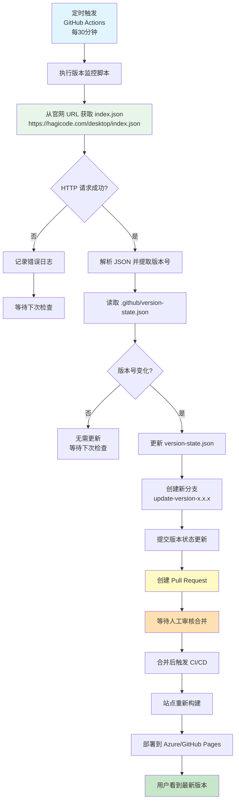
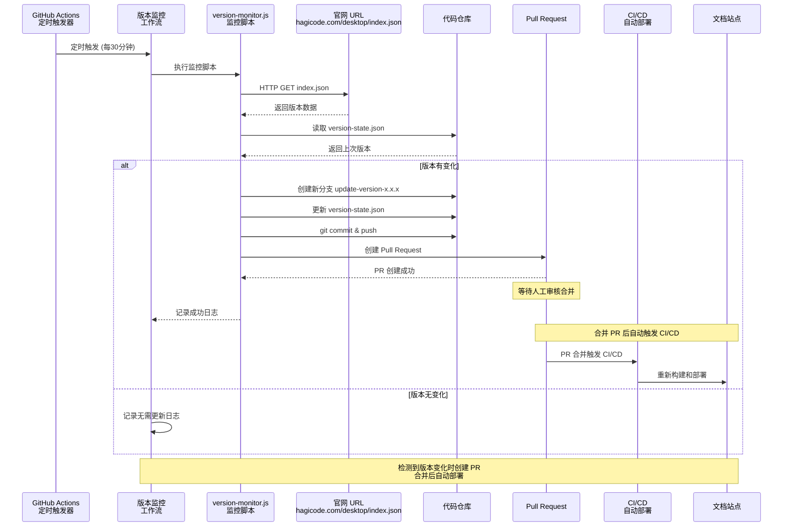
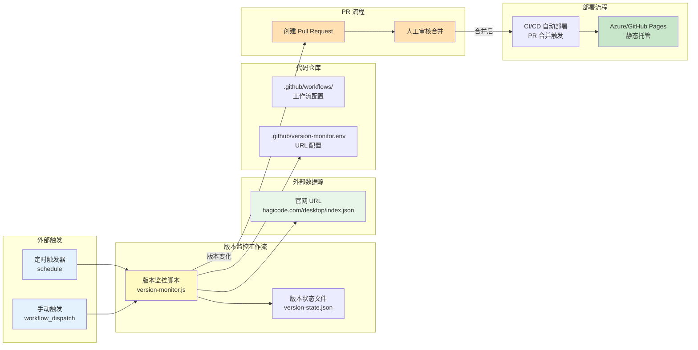

# Change: 版本监控与自动部署系统

## Why

当前 Hagicode 文档站点的桌面客户端下载页面需要显示最新的版本信息。版本数据托管在官网的特定 URL（如 `https://hagicode.com/desktop/index.json`）。当桌面客户端发布新版本时，官网的 `index.json` 会被更新，但文档站点不会自动检测到这一变化并触发重新部署。这导致：

1. **版本同步延迟**：文档站点显示过时的版本信息，直到手动触发新的构建和部署
2. **手动维护成本**：需要人工监控官网 `index.json` 的变化并手动触发部署流程
3. **用户体验不一致**：用户在桌面客户端中看到新版本通知，但文档站点仍显示旧版本

## What Changes

- 添加版本监控 GitHub Actions 工作流，定期从官网 URL 获取 `index.json` 并检查版本变化
- 创建版本状态跟踪机制，记录上次检查时的版本信息
- 检测到新版本时自动创建 Pull Request，合并后通过现有 CI/CD 流程自动部署
- 添加详细的日志记录和错误处理机制

### 新增组件

1. **GitHub Actions 工作流** (`.github/workflows/version-monitor.yml`)
   - 定时从官网获取版本数据并检查变化（建议每 30 分钟）
   - 支持手动触发（workflow_dispatch）
   - 检测到版本变化时创建 Pull Request

2. **版本监控脚本** (`scripts/version-monitor.js`)
   - 从官网 URL（如 `https://hagicode.com/desktop/index.json`）获取最新版本号
   - 与存储的基准版本进行比较
   - 检测到变化时创建 Pull Request

3. **版本状态存储** (`.github/version-state.json`)
   - 记录上次检查时的版本信息
   - 作为 Git 仓库的一部分进行版本控制

4. **环境变量配置** (`.github/version-monitor.env`)
   - 存储官网 `index.json` 的 URL 配置
   - 可配置的轮询间隔和其他参数

## Code Flow Changes

### 版本监控与部署流程

### 组件交互时序图

### 系统架构图

### 代码变更清单

| 文件路径 | 变更类型 | 变更原因 | 影响范围 |
|---------|---------|---------|---------|
| `.github/workflows/version-monitor.yml` | 新增 | 定时从官网获取版本数据并创建 PR | CI/CD 自动化 |
| `scripts/version-monitor.js` | 新增 | 版本比较和 Pull Request 创建逻辑，支持 HTTP 请求获取远程数据 | 监控功能核心 |
| `.github/version-state.json` | 新增 | 存储上次检查的版本状态 | 版本跟踪 |
| `.github/version-monitor.env` | 新增 | 存储官网 URL 配置和环境变量 | 配置管理 |

**变更类型说明**：
- **新增**：全新的文件或功能
- **修改**：在现有基础上添加或调整功能
- **删除**：移除不再需要的功能
- **重构**：重新组织代码结构但不改变功能

## Impact

### 预期收益

1. **自动化同步**：从版本发布到 Pull Request 创建完全自动化，减少人工监控
2. **提升用户体验**：确保官方网站下载页面始终显示最新的版本信息
3. **降低维护成本**：减少人工干预，降低人为错误风险
4. **缩短同步延迟**：从数小时甚至数天的手动延迟缩短到 30 分钟内的自动响应
5. **安全可控**：通过 Pull Request 机制，所有版本更新都需要人工审核合并

### 技术考量

1. **CI/CD 集成**：复用现有 CI/CD 流程，PR 合并后自动触发部署
2. **性能影响**：定时轮询会对官网服务器产生 HTTP 请求，需合理设置轮询间隔
3. **错误处理**：需要实现健壮的错误处理机制，包括网络故障、API 限流等场景
4. **日志和监控**：添加详细的日志记录，便于监控脚本运行状态和排查问题
5. **PR 管理**：需要处理已存在 PR 的情况，避免重复创建

### 兼容性

- 与现有的 Astro 构建系统完全兼容
- 不影响现有的手动部署流程
- 可以独立启用/禁用版本监控功能
- 支持 GitHub Pages 和 Azure Static Web Apps 两种部署目标
- 复用现有 CI/CD 流程，无需修改部署配置

### 风险与缓解

| 风险 | 缓解措施 |
|-----|---------|
| 官网 URL 不可用或响应超时 | 添加请求超时设置和重试机制，记录错误日志下次重试 |
| HTTP 请求失败 | 实现指数退避重试策略（最多 3 次） |
| GitHub API 速率限制 | 设置合理的轮询间隔（30分钟），添加错误重试机制 |
| PR 创建失败 | 添加详细的错误日志和通知机制 |
| 重复创建 PR | 检查是否已存在相同版本的 PR，避免重复创建 |
| 版本数据格式变化 | 在脚本中添加数据验证和格式兼容性检查 |
| 误创建 PR | 实现严格的版本比较逻辑，确保只在真正有变化时创建 |
| 官网 URL 配置错误 | 添加 URL 验证和健康检查机制 |
| PR 未及时合并 | 添加通知机制提醒审核者合并 PR |

### 受影响的规范

- `github-actions` - 新增 GitHub Actions 工作流规范
- `deployment-automation` - 部署自动化流程规范（新增）
