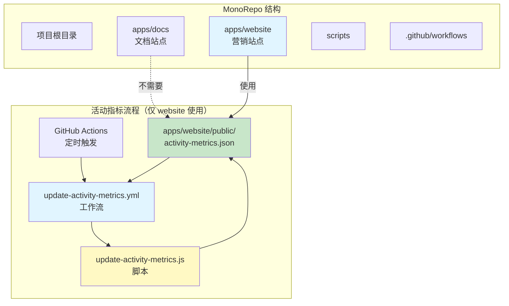
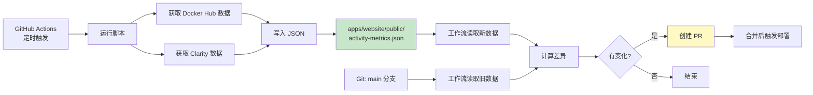

# Design: 活动指标 MonoRepo 路径适配

## Context

项目已完成从单体应用到 MonoRepo 架构的重构。活动指标数据文件 `activity-metrics.json` 原位于根目录的 `public/`，现在需要迁移至 `apps/website/public/`。

**重要说明**：活动指标是官网营销站点（`apps/website`）首页展示的功能，用于显示 Docker Hub 拉取次数和 Microsoft Clarity 用户活跃数据。文档站点（`apps/docs`）不需要此功能。相关的自动化脚本和 GitHub Action 工作流仍指向旧路径，需要适配新的 MonoRepo 结构。

**约束条件**：
- 必须保持与现有 CI/CD 流程的兼容性
- 不影响 `apps/docs` 应用的正常运行
- 确保每日定时任务能正常工作
- 需要处理可能误放在 `apps/docs/public/` 的文件

## Goals / Non-Goals

**Goals**:
- 更新所有指向旧路径的配置和脚本，指向 `apps/website/public/`
- 创建 `apps/website/public/activity-metrics.json` 作为新的数据源
- 清理 MonoRepo 迁移后的残留文件（包括根目录和误放在 `apps/docs/public/` 的文件）
- 确保自动化流程的可靠性

**Non-Goals**:
- 修改活动指标的数据格式或结构
- 创建新的共享数据包或符号链接
- 为 `apps/docs` 添加活动指标功能（文档站点不需要）

## Decisions

### 决策 1: 直接路径更新而非使用符号链接

**选择**: 直接更新所有脚本和工作流中的路径引用

**原因**:
- 更简单直接，无需维护额外的文件系统抽象
- 避免符号链接在不同操作系统上的兼容性问题
- 符合 MonoRepo 的标准实践

**备选方案**:
- 在根目录创建符号链接指向 `apps/website/public/activity-metrics.json`
  - 缺点: 符号链接在 Windows 上可能有问题，增加维护复杂度

### 决策 2: 活动指标仅在 apps/website 中使用

**选择**: 将活动指标数据文件放置在 `apps/website/public/`，不为 `apps/docs` 添加此功能

**原因**:
- `apps/website` 是官方营销站点，首页需要展示活动指标（Docker 拉取量、用户活跃度）
- `apps/docs` 是 Starlight 文档站点，专注于技术文档，不需要展示营销类指标
- 简化实现，避免不必要的数据复制

**决策依据**（来自代码审查）：
- 活动指标组件仅在官网首页使用
- 文档站点无相关引用或需求

### 决策 3: 数据迁移策略

**选择**: 从现有位置（根目录或 `apps/docs/public/`）复制数据到 `apps/website/public/`，然后清理旧位置

**原因**:
- 保留历史数据，避免丢失已记录的指标
- 确保迁移过程中数据可用性
- 清理所有误放的文件，避免混淆

## Technical Design

### 路径映射表

| 组件 | 文件 | 行号 | 旧路径 | 新路径 |
|------|------|------|--------|--------|
| 脚本配置 | `scripts/update-activity-metrics.js` | 55 | `../public/activity-metrics.json` | `../apps/website/public/activity-metrics.json` |
| 新数据读取 | `.github/workflows/update-activity-metrics.yml` | 54 | `public/activity-metrics.json` | `apps/website/public/activity-metrics.json` |
| 旧数据对比 | `.github/workflows/update-activity-metrics.yml` | 58 | `main:public/activity-metrics.json` | `main:apps/website/public/activity-metrics.json` |
| Git add | `.github/workflows/update-activity-metrics.yml` | 194 | `public/activity-metrics.json` | `apps/website/public/activity-metrics.json` |
| PR 数据读取 | `.github/workflows/update-activity-metrics.yml` | 240-243 | `public/activity-metrics.json` | `apps/website/public/activity-metrics.json` |
| Summary 数据读取 | `.github/workflows/update-activity-metrics.yml` | 281-286 | `public/activity-metrics.json` | `apps/website/public/activity-metrics.json` |

### 架构图

### 数据流图

### 应用职责划分

| 应用 | 职责 | 是否需要活动指标 |
|------|------|------------------|
| `apps/docs` | Starlight 文档站点 | 否 |
| `apps/website` | 官方营销站点，首页展示活动指标 | 是 |

## Risks / Trade-offs

| 风险 | 影响 | 缓解措施 |
|------|------|----------|
| 路径更新遗漏导致失败 | 高 | 使用全局搜索确保所有引用都已更新 |
| 工作流测试不充分 | 中 | 在合并前通过 workflow_dispatch 测试 |
| 误删除仍在使用的文件 | 低 | 确认 `apps/website/public/` 有文件副本再删除 |
| `apps/docs` 中误放的文件导致混淆 | 低 | 在清理步骤中明确标记为需要删除 |

## Migration Plan

### 步骤

1. **准备阶段**
   - 创建 `apps/website/public/` 目录（如果不存在）
   - 从现有位置复制 `activity-metrics.json` 到 `apps/website/public/`
   - 验证文件格式正确

2. **实施阶段**
   - 更新脚本配置
   - 更新工作流配置
   - 提交更改到新分支

3. **验证阶段**
   - 本地测试脚本
   - 手动触发工作流测试
   - 验证创建的 PR 内容正确

4. **清理阶段**
   - 删除根目录的残留文件
   - 删除 `apps/docs/public/activity-metrics.json`（误放位置）
   - 提交清理更改

### 回滚计划

如果出现问题，可以：
1. 恢复 `scripts/update-activity-metrics.js` 中的路径
2. 恢复 `.github/workflows/update-activity-metrics.yml` 中的路径
3. 从 `apps/website/public/activity-metrics.json` 恢复数据到原位置
