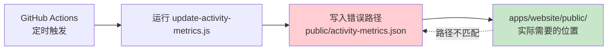
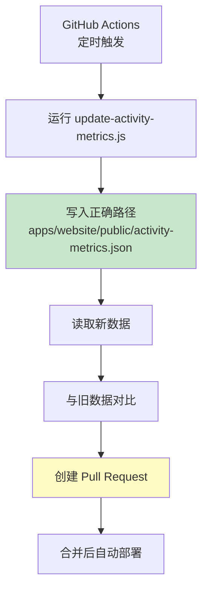

# Change: 适配 MonoRepo 架构的活动指标路径

Status: ExecutionCompleted

## Why

项目已完成从单体 Astro 应用到 **MonoRepo 架构**的重构，原始的单体应用已拆分为两个独立应用：

- **`apps/docs`** - Starlight 文档站点
- **`apps/website`** - 官方营销站点

活动指标数据文件 `activity-metrics.json` 原位于根目录的 `public/`，现在需要迁移至 `apps/website/public/`（因为活动指标是官网营销站点首页展示的功能，文档站点不需要）。但相关的更新脚本和 GitHub Action 工作流仍指向旧路径。这导致自动化更新流程无法正常工作，每日定时任务会失败。

## What Changes

- 更新 `scripts/update-activity-metrics.js` 中的输出文件路径配置
- 修复 `.github/workflows/update-activity-metrics.yml` 中的所有路径引用
- 创建 `apps/website/public/activity-metrics.json` 作为新的数据源
- 清理根目录的过时指标文件（以及 `apps/docs/public/` 中误放的文件）
- 确保活动指标仅在 `apps/website` 应用中使用

## Code Flow Changes

### 当前路径问题

### 修复后的流程

### 路径变更对照

| 组件 | 旧路径 | 新路径 |
|------|--------|--------|
| 脚本输出 | `public/activity-metrics.json` | `apps/website/public/activity-metrics.json` |
| git add | `public/activity-metrics.json` | `apps/website/public/activity-metrics.json` |
| git show | `main:public/activity-metrics.json` | `main:apps/website/public/activity-metrics.json` |
| cat 读取 | `public/activity-metrics.json` | `apps/website/public/activity-metrics.json` |

## Impact

### 受影响组件

- **`scripts/update-activity-metrics.js`**: 输出文件路径配置
- **`.github/workflows/update-activity-metrics.yml`**: 所有文件路径引用
- **`apps/website/public/activity-metrics.json`**: 成为唯一的活动指标数据源
- **根目录 `public/` 和 `data/`**: 需要清理过时的指标文件
- **`apps/docs/public/activity-metrics.json`**: 如果存在，需要清理（误放位置）

### 预期收益

- **路径一致性**: 脚本、工作流和实际文件位置完全对齐
- **自动化可靠**: GitHub Action 每日定时任务能正确更新指标数据
- **清理技术债务**: 移除 monorepo 迁移后的残留文件

### 风险与缓解

| 风险 | 缓解措施 |
|-----|---------|
| 更新后脚本输出路径错误 | 本地测试脚本确保输出到正确位置 |
| 工作流 PR 创建失败 | 在合并前通过 workflow_dispatch 测试工作流 |
| 根目录残留文件被删除后需要恢复 | 文件将存在于 `apps/website/public/`，无需恢复 |
| `apps/docs/public/` 误放的文件 | 清理前确认 `apps/website/public/` 有文件副本 |

### 受影响的规范

- `activity-metrics` - 活动指标自动化更新规范（MODIFIED）
