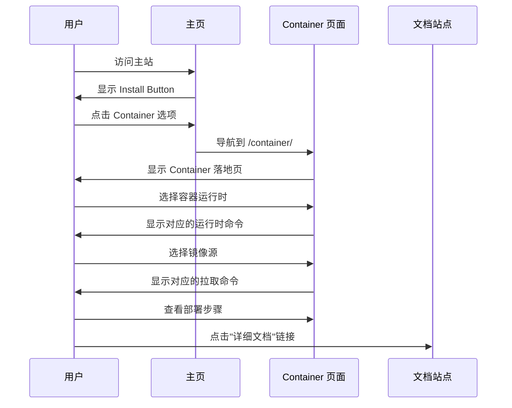

# Change: 添加容器部署落地页面

## Why

当前主站点缺少容器部署方式的专门落地页面。虽然文档站点已有 Docker Compose 部署文档，但缺少一个类似 Desktop 页面的营销落地页面来展示容器部署的优势和特性。容器技术不仅限于 Docker，还包括 Podman 等其他容器运行时。用户无法在主站点获取通过容器部署 Hagicode 的完整视觉化介绍和快速部署指引。

## What Changes

- 创建新的容器部署落地页面 (`/container/index.astro`)
- 参照 Desktop 页面的设计风格和布局结构
- 在 `packages/shared/src/links.ts` 中添加 `container` 链接配置
- 更新 Install Button 组件中的容器链接，指向新的落地页面
- 创建 Container 页面专属样式文件（如需要）

## UI Design Changes

### 页面结构

参照 Desktop 页面的设计，Container 落地页面应包含以下区域：

```
+------------------------------------------------------------------+
|                         Hero Section                             |
|  +------------------------------------------------------------+  |
|  |           Hagicode Container                                |  |
|  |    容器化部署，开箱即用，快速上手                           |  |
|  |                                                            |  |
|  |  [Docker Hub 镜像] [Azure ACR 镜像] [阿里云 ACR 镜像]      |  |
|  |  最新版本: x.x.x • 支持 amd64/arm64                        |  |
|  |                                                            |  |
|  |  [环境隔离] [一键部署] [快速启动]                          |  |
|  +------------------------------------------------------------+  |
+------------------------------------------------------------------+
|                        功能特性                                 |
|  +--------------+  +--------------+  +--------------+            |
|  |  环境隔离    |  |  快速部署    |  |  跨平台支持  |            |
|  |  图标        |  |  图标        |  |  图标        |            |
|  |  描述文本    |  |  描述文本    |  |  描述文本    |            |
|  +--------------+  +--------------+  +--------------+            |
|  +--------------+  +--------------+  +--------------+            |
|  |  数据持久化  |  |  自动更新    |  |  多镜像源    |            |
|  |  图标        |  |  图标        |  |  图标        |            |
|  |  描述文本    |  |  描述文本    |  |  描述文本    |            |
|  +--------------+  +--------------+  +--------------+            |
+------------------------------------------------------------------+
|                        容器运行时选择                           |
|  [Docker] | [Podman] | [其他兼容运行时]                         |
|  ----------------------------------------------------------------  |
|  | 镜像拉取命令和配置说明                                        |  |
|  ----------------------------------------------------------------  |
+------------------------------------------------------------------+
|                        镜像源选择                               |
|  [Docker Hub] | [Azure ACR] | [阿里云 ACR]                        |
|  ----------------------------------------------------------------  |
|  | 镜像拉取命令和配置说明                                        |  |
|  ----------------------------------------------------------------  |
+------------------------------------------------------------------+
|                        快速启动                                 |
|  [单容器部署] | [Docker Compose 部署] | [Podman 部署]            |
|  ----------------------------------------------------------------  |
|  | 分步骤的部署命令和说明                                        |  |
|  ----------------------------------------------------------------  |
+------------------------------------------------------------------+
|                        常见问题                                 |
|  +------------------------------------------------------------+  |
|  | Q: 容器版本和 Desktop 版本有什么区别？                      |  |
|  | A: ...                                                      |  |
|  +------------------------------------------------------------+  |
|  +------------------------------------------------------------+  |
|  | Q: 支持哪些容器运行时？                                     |  |
|  | A: ...                                                      |  |
|  +------------------------------------------------------------+  |
|  +------------------------------------------------------------+  |
|  | Q: 如何更新容器？                                           |  |
|  | A: ...                                                      |  |
|  +------------------------------------------------------------+  |
+------------------------------------------------------------------+
```

### 用户交互流程



## Impact

**Affected specs:**
- `website-landing-pages` - 主站落地页面结构

**Affected code:**
- `apps/website/src/pages/container/index.astro` (新建)
- `apps/website/src/styles/container.css` (新建，可选复用 desktop.css)
- `apps/website/src/components/container/` (新建组件，如需要)
- `packages/shared/src/links.ts` (修改 - 添加 container 链接)
- `apps/website/src/components/home/InstallButton.tsx` (修改 - 更新容器链接)
- `apps/docs/src/components/InstallButton.tsx` (修改 - 同步更新容器链接)

**User impact:**
- 用户可通过主站 Container 页面快速了解容器部署方式
- Install Button 的 Container 选项指向专门的营销落地页面
- 支持多种容器运行时（Docker、Podman 等）
- 提供更友好的容器部署入门体验

**Technical impact:**
- 增加一个新的营销落地页面路由
- 可能需要创建容器相关的图标组件（可复用 Desktop 组件）
- 无需修改核心架构或依赖项
- 需要确保 `npm run build` 和 `npm run typecheck` 通过

## Status

**ExecutionCompleted** - All tasks have been implemented successfully.

- ✅ Created Container landing page with all required sections (Hero, Features, Runtime Selection, Mirror Sources, Quick Start, FAQ)
- ✅ Created container.css styling file
- ✅ Added `container` link configuration in `packages/shared/src/links.ts`
- ✅ Updated InstallButton components in both website and docs apps to point to new container page
- ✅ Build completed successfully
