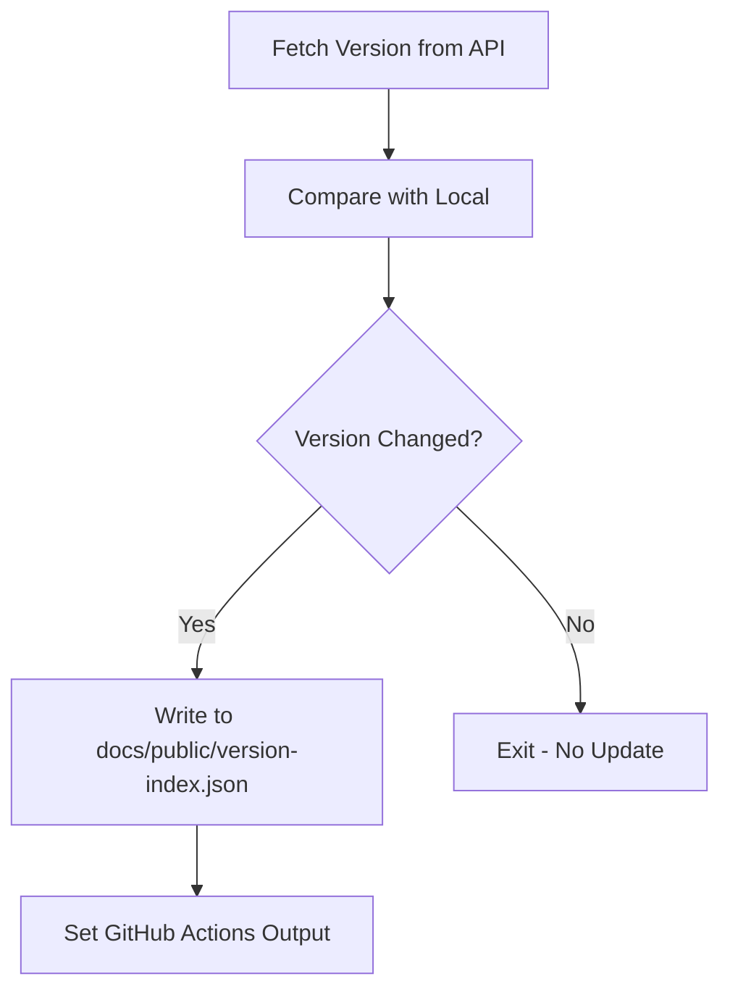
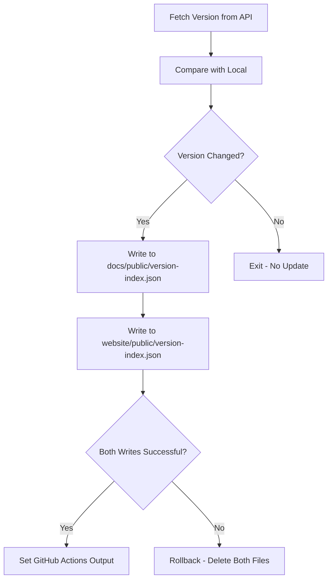

# Change: Fix Version Monitor Workflow to Sync Both Sites

## Why

The version monitor workflow currently only updates `apps/docs/public/version-index.json`, leaving `apps/website/public/version-index.json` unchanged. This causes the marketing site (hagicode.com) to display outdated version information inconsistent with the documentation site (docs.hagicode.com).

The root cause is in `scripts/version-monitor.js:34` which hardcodes a single file path for version updates, ignoring the second site's version file.

## What Changes

- Modify `scripts/version-monitor.js` to write version data to **both** `apps/docs/public/version-index.json` and `apps/website/public/version-index.json`
- Update the `updateLocalVersionIndex()` function to handle multiple file paths
- Ensure both files are atomically updated together (fail-fast if either write fails)

## Code Flow Changes

### Current Flow

### Fixed Flow

## Impact

- Affected specs: `version-monitor`
- Affected code:
  - `scripts/version-monitor.js:34` - VERSION_INDEX_FILE constant
  - `scripts/version-monitor.js:175-192` - updateLocalVersionIndex() function
  - `scripts/version-monitor.js:148-169` - loadLocalVersion() function (may need to check primary file)

## Status

**ExecutionCompleted** - All tasks have been successfully implemented.
