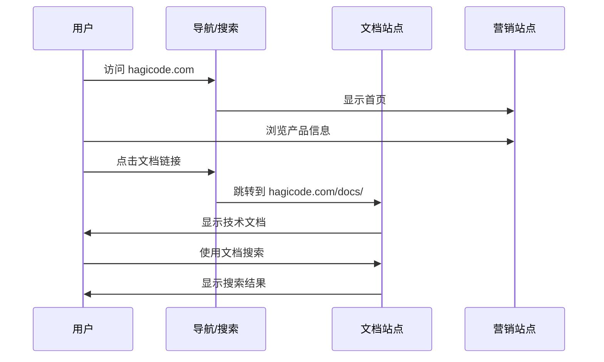
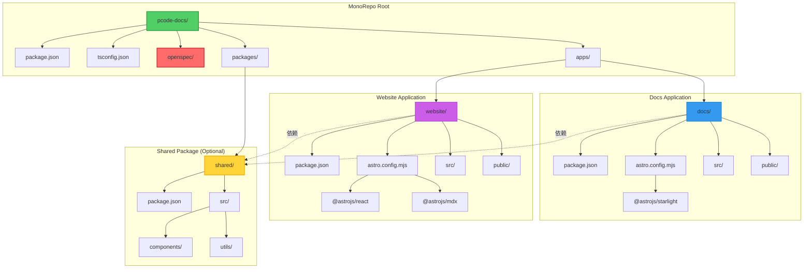
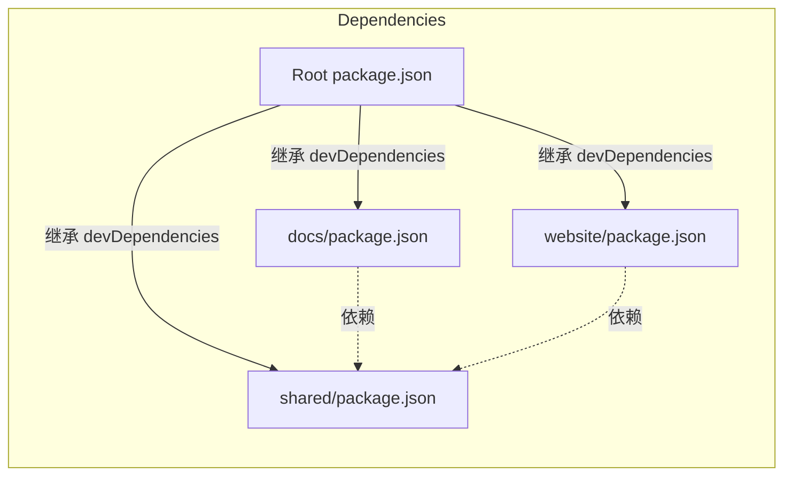
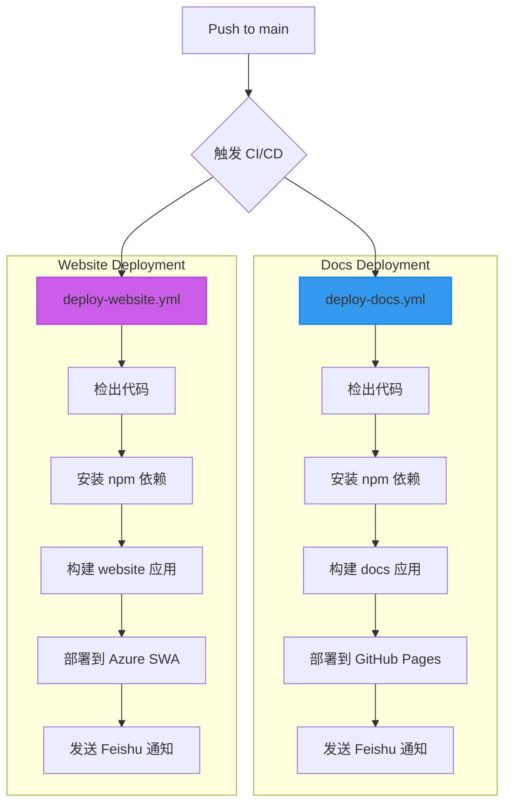
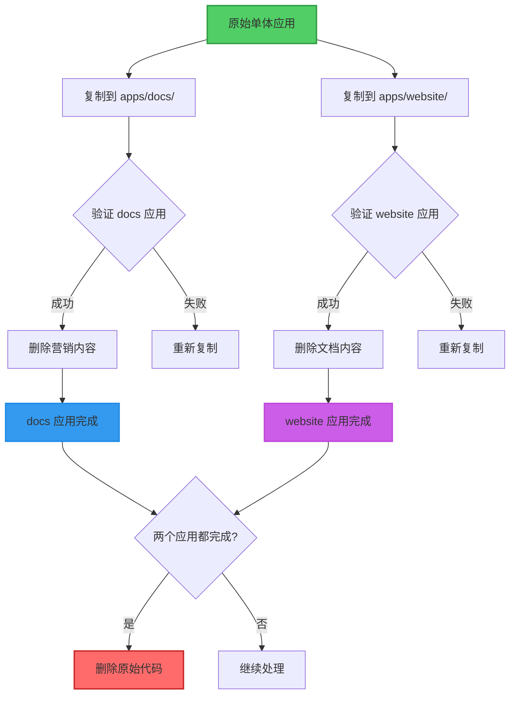

# Design: Refactor Astro site to MonoRepo architecture

## Context

当前 Hagicode 文档站点（pcode-docs）是一个基于 Astro 5.16 + Starlight 的单体应用。项目将技术文档和营销内容（首页、Desktop 应用展示）混合在同一个应用中，这导致：

1. **样式冲突**: Starlight 主题样式影响营销站点的设计自由度
2. **配置耦合**: 单一 `astro.config.mjs` 必须同时满足文档和营销的需求
3. **部署限制**: 两个部分必须打包部署在一起，无法独立扩展
4. **维护复杂**: 修改一个部分可能意外影响另一个部分

### 约束条件

- 必须保持 `openspec/` 在根级别，两个应用共享 OpenSpec 工作流
- 必须保持与现有 CI/CD（GitHub Pages 和 Azure Static Web Apps）的兼容性
- 必须保持现有的 URL 结构和 SEO 优化
- 迁移过程中不能丢失任何内容或功能

### 利益相关者

- 开发团队: 需要清晰的代码结构和高效的开发体验
- 用户: 需要稳定的文档和营销站点访问
- CI/CD 系统: 需要支持多应用的独立部署

## Goals / Non-Goals

### Goals
- **隔离性**: 文档站点和营销站点完全隔离，互不影响
- **独立性**: 两个应用可以独立开发、构建和部署
- **可扩展性**: 架构支持未来添加更多应用（博客、API 文档等）
- **开发体验**: 保持或改进本地开发体验
- **兼容性**: 与现有工具和工作流兼容

### Non-Goals
- 不改变文档内容或结构
- 不改变营销站点的设计或功能
- 不引入额外的复杂工具（如 Nx），除非必要
- 不改变 OpenSpec 工作流

## Decisions

### Decision 1: 包管理器选择

**选择**: npm workspaces

**原因**:
- npm 是 Node.js 默认包管理器，无需额外安装
- 良好的兼容性和稳定性
- 原生支持 monorepo 的 workspace 功能
- 团队熟悉度高，降低学习成本

**替代方案**:
- pnpm workspaces: 功能更强大，但需要额外安装
- Yarn workspaces: 功能丰富，但配置复杂

**实现**:
```json
// package.json
{
  "workspaces": [
    "apps/*",
    "packages/*"
  ]
}
```

### Decision 2: 目录结构

**选择**: apps + packages 结构

**原因**:
- 清晰分离应用和共享代码
- 符合 monorepo 最佳实践
- 易于理解和导航

**结构**:
```
pcode-docs/
├── apps/
│   ├── docs/          # Starlight 文档站点
│   └── website/       # 官方营销站点
├── packages/
│   └── shared/        # 共享代码（可选）
├── openspec/          # OpenSpec 规范（保持根级）
└── package.json       # 根级配置（含 workspaces）
```

### Decision 3: 共享代码策略

**选择**: 仅在必要时创建 `packages/shared`

**原因**:
- 避免过度工程化
- 先评估实际共享需求
- 可以后续添加

**共享代码评估**:
- **共享组件**: 如果两个应用需要相同的 UI 组件
- **共享工具**: 如日期格式化、验证函数等
- **共享类型**: TypeScript 类型定义
- **共享配置**: 如 ESLint、Prettier 配置

### Decision 4: 构建工具选择

**初始选择**: 使用 npm workspaces，考虑后续添加 Turborepo

**初始方案**:
- 项目规模较小，两个应用的构建可以接受
- 减少初始工具链复杂度
- npm 的并行安装已经足够高效
- 可以在根级 package.json 中使用 `npm-run-all` 实现并行构建

**Turborepo 评估标准**:
当出现以下情况时，应考虑引入 Turborepo：
- 构建时间超过 5 分钟
- 需要更细粒度的缓存控制
- 需要远程缓存支持（团队协作）
- 需要构建管道和任务依赖管理
- CI/CD 成本成为关注点

**Turborepo 优势**:
- 智能增量构建：仅重建变更的应用
- 远程缓存：团队共享构建产物
- 并行任务执行：优化构建管道
- 可视化构建依赖图

**实施计划**:
1. **阶段 1**: 使用 npm workspaces 完成基础迁移
2. **阶段 2**: 监控构建时间和性能指标
3. **阶段 3**: 如需要，添加 Turborepo（预计 1-2 天配置时间）

### Decision 5: 部署策略

**选择**: 两个应用独立部署

**文档站点**: GitHub Pages
- 部署路径: `https://hagicode.com/docs/`
- CI/CD: `.github/workflows/deploy-docs.yml`

**营销站点**: Azure Static Web Apps
- 部署路径: `https://hagicode.com/`
- CI/CD: `.github/workflows/deploy-website.yml`

**原因**:
- 利用现有的部署基础设施
- 两个应用可以独立更新
- 降低部署风险

## UI/UX Design

### 用户访问流程不变



### 站点间导航

**营销站点 → 文档站点**:
- 顶部导航栏的"文档"链接
- 产品介绍页面的"查看文档"按钮

**文档站点 → 营销站点**:
- Starlight 顶部的 logo 链接
- 可能的"返回首页"链接

## Technical Design

### 架构设计



### 依赖关系图



### CI/CD 流程设计



### 构建产物结构

```
pcode-docs/
├── apps/
│   ├── docs/
│   │   └── dist/              # 文档站点构建产物
│   │       ├── docs/
│   │       └── index.html
│   └── website/
│       └── dist/              # 营销站点构建产物
│           ├── index.html
│           └── assets/
```

## 详细技术规格

### 根级 package.json

```json
{
  "name": "pcode-docs-monorepo",
  "version": "1.0.0",
  "private": true,
  "workspaces": [
    "apps/*",
    "packages/*"
  ],
  "scripts": {
    "dev": "npm run dev --workspaces --if-present",
    "dev:docs": "npm run dev --workspace=docs",
    "dev:website": "npm run dev --workspace=website",
    "build": "npm run build --workspaces --if-present",
    "build:docs": "npm run build --workspace=docs",
    "build:website": "npm run build --workspace=website",
    "preview": "npm run preview --workspaces --if-present",
    "typecheck": "npm run typecheck --workspaces --if-present"
  },
  "devDependencies": {
    "@astrojs/react": "^4.4.2",
    "@astrojs/mdx": "^4.3.13",
    "@astrojs/starlight": "^0.31.0",
    "@astrojs/mermaid": "^11.12.2",
    "astro": "^5.16.16",
    "prettier": "^3.0.0",
    "typescript": "~5.3.0",
    "vite": "^6.0.0",
    "npm-run-all": "^4.1.5"
  },
  "engines": {
    "node": ">=18.0",
    "npm": ">=9.0"
  }
}
```

### apps/docs/package.json

```json
{
  "name": "docs",
  "version": "1.0.0",
  "private": true,
  "type": "module",
  "scripts": {
    "dev": "astro dev",
    "build": "astro build",
    "preview": "astro preview",
    "astro": "astro",
    "typecheck": "tsc --noEmit"
  },
  "dependencies": {
    "@astrojs/mdx": "^4.3.13",
    "@astrojs/starlight": "^0.31.0",
    "@astrojs/mermaid": "^11.12.2",
    "astro": "^5.16.16"
  }
}
```

### apps/website/package.json

```json
{
  "name": "website",
  "version": "1.0.0",
  "private": true,
  "type": "module",
  "scripts": {
    "dev": "astro dev --port 4322",
    "build": "astro build",
    "preview": "astro preview",
    "astro": "astro",
    "typecheck": "tsc --noEmit"
  },
  "dependencies": {
    "@astrojs/react": "^4.4.2",
    "@astrojs/mdx": "^4.3.13",
    "astro": "^5.16.16",
    "react": "^18.2.0",
    "react-dom": "^18.2.0",
    "framer-motion": "^12.26.1"
  }
}
```

### TypeScript 配置

根级 tsconfig.json:
```json
{
  "compilerOptions": {
    "composite": true,
    "declarationMap": true,
    "baseUrl": ".",
    "paths": {
      "@docs/*": ["apps/docs/src/*"],
      "@website/*": ["apps/website/src/*"],
      "@shared/*": ["packages/shared/src/*"]
    }
  },
  "references": [
    { "path": "./apps/docs" },
    { "path": "./apps/website" },
    { "path": "./packages/shared" }
  ]
}
```

## 代码变更清单

### 新增文件

| 文件路径 | 用途 | 说明 |
|---------|------|------|
| `package.json` | npm workspaces 配置 | 定义 apps 和 packages |
| `apps/docs/package.json` | docs 应用配置 | 继承根级依赖 |
| `apps/docs/astro.config.mjs` | docs Astro 配置 | Starlight 配置 |
| `apps/website/package.json` | website 应用配置 | 继承根级依赖 |
| `apps/website/astro.config.mjs` | website Astro 配置 | 纯 Astro，无 Starlight |
| `packages/shared/package.json` | 共享包配置（可选） | 共享组件和工具 |
| `.github/workflows/deploy-docs.yml` | 文档站点部署 | GitHub Actions |
| `.github/workflows/deploy-website.yml` | 营销站点部署 | GitHub Actions |

### 修改文件

| 文件路径 | 变更类型 | 变更说明 |
|---------|---------|---------|
| `package.json` | 修改 | 添加 workspaces 配置和统一脚本 |
| `tsconfig.json` | 修改 | 配置 monorepo references |
| `openspec/project.md` | 修改 | 更新架构说明 |

### 移动文件

| 原路径 | 新路径 | 说明 |
|-------|-------|------|
| `src/content/docs/*` | `apps/docs/src/content/docs/*` | 文档内容 |
| `src/pages/docs/[...slug].astro` | `apps/docs/src/pages/docs/[...slug].astro` | 文档路由 |
| `src/pages/index.astro` | `apps/website/src/pages/index.astro` | 首页 |
| `src/components/home/*` | `apps/website/src/components/home/*` | 首页组件 |

### 删除文件

| 文件路径 | 删除原因 |
|---------|---------|
| `astro.config.mjs` | 替换为应用级配置 |
| `src/` 目录 | 内容已迁移到 apps/ |

## 风险和缓解措施

### 风险 1: 迁移过程中内容丢失

**缓解措施**:
- **采用"复制然后删除"策略**，而非直接移动
- 原始代码在整个迁移过程中始终保持完整
- 两个应用分别独立复制和验证
- 每个应用删除非必要内容前先验证功能完整性
- 创建迁移检查清单，逐步验证

### 风险 2: 构建时间增加

**缓解措施**:
- 使用 npm 的并行安装
- 配置合理的缓存策略
- 如果后续需要，可以添加 Turborepo
- 监控构建时间并优化

### 风险 3: CI/CD 复杂度增加

**缓解措施**:
- 保持工作流简单和独立
- 使用模板和共享配置
- 充分测试部署流程
- 文档化所有配置

### 风险 4: 开发体验下降

**缓解措施**:
- 提供便捷的启动脚本
- 配置合适的端口
- 更新 IDE 配置
- 编写清晰的开发文档

### 风险 5: 部署失败

**缓解措施**:
- 在测试环境充分验证
- 准备详细的回滚计划
- 监控部署过程
- 设置适当的告警

## 迁移计划

### 阶段 1: 准备（1 天）
- [ ] 创建 monorepo 目录结构
- [ ] 配置 npm workspaces
- [ ] 创建分支保护规则

### 阶段 2: 应用迁移（2-3 天）

**迁移策略: 复制然后删除**

采用更安全的迁移策略：
1. **复制完整站点**到每个新应用目录
2. **独立删除**每个应用中不需要的内容
3. **分别验证**每个应用的功能

- [ ] **步骤 1**: 复制完整站点到 `apps/docs/`
  - [ ] 复制根级 `package.json`
  - [ ] 复制根级 `astro.config.mjs`
  - [ ] 复制 `src/` 目录
  - [ ] 复制 `public/` 目录
- [ ] **步骤 2**: 从 `apps/docs/` 删除营销内容
  - [ ] 删除首页相关文件
  - [ ] 删除首页组件
  - [ ] 保留文档内容和路由
- [ ] **步骤 3**: 验证 `apps/docs/` 独立工作
  - [ ] 本地启动验证
  - [ ] 构建验证
- [ ] **步骤 4**: 复制完整站点到 `apps/website/`
  - [ ] 复制所有文件
- [ ] **步骤 5**: 从 `apps/website/` 删除文档内容
  - [ ] 删除文档内容
  - [ ] 删除文档路由
  - [ ] 移除 Starlight 配置
  - [ ] 保留首页和组件
- [ ] **步骤 6**: 验证 `apps/website/` 独立工作
  - [ ] 本地启动验证
  - [ ] 构建验证
- [ ] 处理共享代码
- [ ] 本地验证两个应用同时运行

### 阶段 3: CI/CD 更新（1-2 天）
- [ ] 创建部署工作流
- [ ] 测试部署流程
- [ ] 配置通知

### 阶段 4: 测试和发布（1-2 天）
- [ ] 完整测试
- [ ] 文档更新
- [ ] 发布
- [ ] 监控

**总计**: 5-8 天

## 迁移策略详细说明

### 复制然后删除方法

本迁移采用"复制然后删除"策略，而非直接"移动"文件。这种方法更安全，原因如下：

#### 优势

1. **原始代码始终完整**: 在整个迁移过程中，原始代码不会被修改或删除
2. **独立验证**: 每个应用可以独立验证功能完整性
3. **快速恢复**: 如果删除错误，可以快速从原始复制中恢复
4. **降低风险**: 逐步减少内容，比逐步增加内容更容易验证

#### 迁移流程图



#### docs 应用删除清单

从 `apps/docs/` 中删除：
- `src/pages/index.astro` - 首页
- `src/components/home/` - 首页组件
- 营销相关的样式文件

保留：
- `src/content/docs/` - 文档内容
- `src/pages/docs/` - 文档路由
- `src/content/config.ts` - 内容配置

#### website 应用删除清单

从 `apps/website/` 中删除：
- `src/content/docs/` - 文档内容
- `src/pages/docs/` - 文档路由
- `src/content/config.ts` - Starlight 内容配置
- Starlight 相关配置

保留：
- `src/pages/index.astro` - 首页
- `src/components/home/` - 首页组件
- 营销相关的样式和配置

## 回滚计划

如果迁移出现问题：

1. **立即回滚**:
   ```bash
   git checkout <backup-branch>
   git push origin main --force
   ```

2. **验证回滚**:
   - 检查应用正常运行
   - 验证所有链接工作
   - 确认 CI/CD 正常

3. **分析问题**:
   - 记录失败原因
   - 制定修复计划
   - 决定是否重试

4. **重新规划**:
   - 根据问题调整方案
   - 设置更多检查点
   - 准备更充分的测试

## 开放问题

### 问题 1: 是否需要共享包？

**状态**: 待决定

**讨论**: 需要先审核当前代码库，识别实际共享需求后再决定。

### 问题 2: 如何处理跨应用链接？

**状态**: 需要设计

**讨论**: 需要明确两个应用间的链接策略（相对路径、绝对路径、环境变量）。

### 问题 3: 是否需要 Turborepo？

**状态**: 阶段性评估

**讨论**:
- **阶段 1**: 使用 npm workspaces 完成迁移和验证
- **评估点**: 当构建时间超过 5 分钟时考虑引入
- **决策标准**:
  - 本地开发构建时间
  - CI/CD 构建时间和成本
  - 团队规模和协作需求
  - 是否需要远程缓存

**Turborepo 实施准备**:
如需添加 Turborepo，预期工作量：
- 配置 `turbo.json`（30 分钟）
- 更新构建脚本（1 小时）
- 配置远程缓存（可选，1 小时）
- 更新 CI/CD 工作流（1 小时）
- 测试和验证（1 小时）

**总计**: 约 1 天工作

### 问题 4: 如何处理共享的静态资源？

**状态**: 需要设计

**讨论**: 可能需要创建共享的 public 目录或使用符号链接。

## 成功标准

迁移成功的标准：

1. **功能完整性**:
   - [ ] 所有文档内容可访问
   - [ ] 所有营销页面正常工作
   - [ ] 所有链接有效

2. **构建成功**:
   - [ ] `npm run build` 成功
   - [ ] 两个应用都能独立构建
   - [ ] 无 TypeScript 错误

3. **部署成功**:
   - [ ] 文档站点部署成功
   - [ ] 营销站点部署成功
   - [ ] CI/CD 流程正常

4. **开发体验**:
   - [ ] `npm run dev` 可以同时启动两个应用
   - [ ] IDE 正确识别 monorepo 结构
   - [ ] 热更新正常工作

5. **性能**:
   - [ ] 构建时间可接受（< 5 分钟）
   - [ ] 页面加载速度无明显下降

## 附录: Turborepo 实施方案

如需引入 Turborepo 优化构建性能，可参考以下实施方案：

### turbo.json 配置示例

```json
{
  "$schema": "https://turbo.build/schema.json",
  "pipeline": {
    "build": {
      "dependsOn": ["^build"],
      "outputs": ["dist/**", ".astro/**"]
    },
    "dev": {
      "cache": false,
      "persistent": true
    },
    "lint": {
      "outputs": []
    },
    "typecheck": {
      "dependsOn": ["^build"],
      "outputs": []
    }
  }
}
```

### 构建脚本更新

```json
{
  "scripts": {
    "dev": "turbo run dev",
    "build": "turbo run build",
    "lint": "turbo run lint",
    "clean": "turbo run clean"
  },
  "devDependencies": {
    "turbo": "^2.0.0"
  }
}
```

### CI/CD 集成

GitHub Actions 中使用 Turborepo 远程缓存：

```yaml
- name: Build with Turborepo
  run: turbo run build
  env:
    TURBO_TOKEN: ${{ secrets.TURBO_TOKEN }}
    TURBO_TEAM: your-team-slug
```

### 性能对比

| 指标 | npm workspaces | Turborepo |
|------|---------------|-----------|
| 初始构建时间 | 基准 | 基准 + 10%（配置开销）|
| 增量构建时间 | 100% | 10-30%（缓存命中）|
| 远程缓存 | 不支持 | 支持 |
| 可视化 | 无 | 构建图 |
| 学习曲线 | 低 | 中等 |

### 迁移检查清单

- [ ] 评估当前构建性能是否需要优化
- [ ] 创建 `turbo.json` 配置文件
- [ ] 更新根级 `package.json` 添加 turbo 依赖
- [ ] 更新应用级 `package.json` 添加 `turbo.json` 引用
- [ ] 配置 CI/CD 远程缓存（可选）
- [ ] 运行 `turbo prune` 优化 CI 构建
- [ ] 验证构建输出正确
- [ ] 测试增量构建效果
- [ ] 团队培训和文档更新
