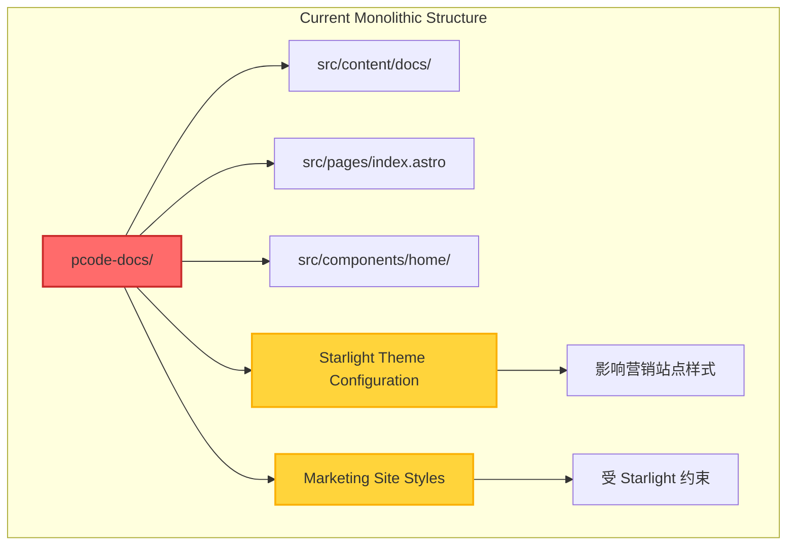
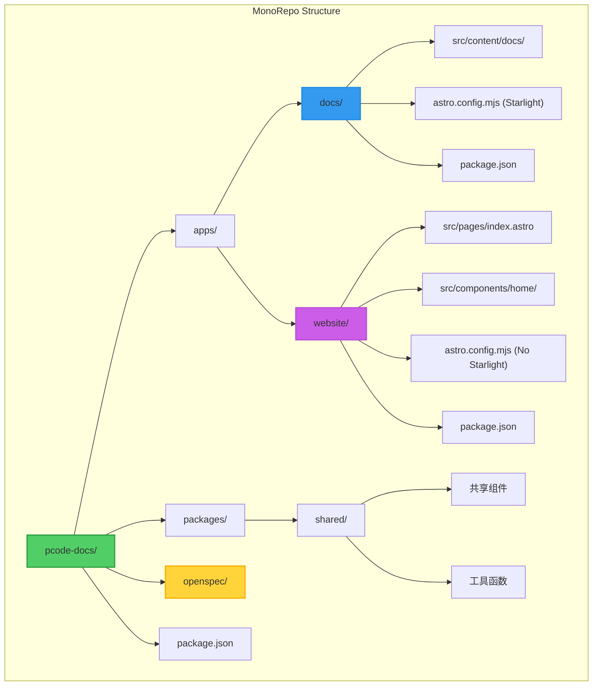
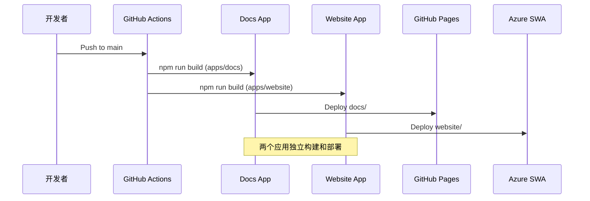

# Change: Refactor Astro site to MonoRepo architecture

## Why

当前项目将 Starlight 文档站点和官方营销站点（首页 + Desktop 展示）混合在同一个 Astro 应用中，导致样式、配置和内容相互影响。Starlight 主题的约束限制了营销站点的设计自由度，两部分内容必须打包部署在同一域名下，无法独立部署和扩展。将站点重构为 MonoRepo 架构可以实现关注点分离，提供更好的隔离性、独立性和可维护性。

## What Changes

- **BREAKING**: 将当前单体 Astro 应用拆分为两个独立的应用
- 创建 `apps/docs` - Starlight 文档站点（纯文档，不含营销内容）
- 创建 `apps/website` - 官方营销站点（首页和 Desktop 展示，不含 Starlight）
- 配置 npm workspaces 实现 MonoRepo 结构
- 设置根级 package.json 统一管理依赖和脚本
- 保持 `openspec/` 目录在根级别，两个应用共享 OpenSpec 工作流
- 更新 CI/CD 配置以支持独立部署两个应用
- 创建共享包 `packages/shared`（如需要）用于共享组件和工具函数

## Code Flow Changes

### 当前架构



### 目标架构



### 部署流程变更



## 目录结构对比

### 变更前

```
pcode-docs/
├── src/
│   ├── content/docs/        # Starlight 文档
│   ├── pages/
│   │   ├── index.astro      # 首页（与文档混合）
│   │   └── docs/[...slug].astro
│   └── components/
│       ├── home/            # 首页组件（与文档混合）
│       └── ...
├── public/
├── astro.config.mjs         # 单一配置（Starlight + 营销）
├── package.json
└── openspec/
```

### 变更后

```
pcode-docs/
├── apps/
│   ├── docs/                # Starlight 文档站点
│   │   ├── src/
│   │   │   └── content/docs/
│   │   ├── public/
│   │   ├── astro.config.mjs  # Starlight 配置
│   │   └── package.json
│   └── website/             # 官方营销站点
│       ├── src/
│       │   ├── pages/
│       │   │   └── index.astro
│       │   └── components/
│       │       └── home/
│       ├── public/
│       ├── astro.config.mjs  # 纯 Astro 配置
│       └── package.json
├── packages/
│   └── shared/              # 共享代码（可选）
│       ├── components/
│       ├── utils/
│       └── package.json
├── openspec/                # 保持根级别
├── package.json             # 根级 workspaces 配置
└── tsconfig.json            # 根级 TypeScript 配置
```

## Impact

### 受影响的规范
- `monorepo-structure` - 新增 MonoRepo 架构规范
- `astro-site` - 修改为支持多应用结构
- `github-integration` - 更新 CI/CD 配置以支持多应用部署

### 受影响的代码
- **根目录**:
  - `package.json` - 添加 workspaces 配置
  - 更新 `tsconfig.json` 为 monorepo 配置
- **apps/docs/**:
  - 从 `src/content/docs/` 迁移文档内容
  - 从 `src/pages/docs/[...slug].astro` 迁移路由
  - 独立的 `astro.config.mjs`（Starlight）
  - 独立的 `package.json`
- **apps/website/**:
  - 从 `src/pages/index.astro` 迁移首页
  - 从 `src/components/home/` 迁移首页组件
  - 独立的 `astro.config.mjs`（不含 Starlight）
  - 独立的 `package.json`
- **.github/workflows/**:
  - `deploy.yml` - 分离为 `deploy-docs.yml` 和 `deploy-website.yml`
  - `azure-static-web-apps-*.yml` - 更新以支持多应用

### 预期收益
- **隔离性**: 文档站点和营销站点在样式、配置、内容方面完全隔离
- **独立性**: 可以独立部署、独立版本管理、独立 CI/CD 流程
- **可维护性**: 修改其中一个站点不会影响另一个站点
- **扩展性**: 未来可以轻松添加更多应用（如博客站、API 文档站等）
- **设计自由**: 营销站点不再受 Starlight 主题约束

### 潜在风险
- **迁移成本**: 需要重构现有目录结构和构建配置
- **共享代码**: 需要处理两个应用间的共享组件和工具函数
- **开发体验**: 需要更新开发脚本，确保可以同时启动两个应用
- **部署复杂度**: CI/CD 配置需要同时支持两个应用的部署
- **构建性能**: 可能需要引入 Turborepo 等工具优化构建时间

### 兼容性考虑
- **OpenSpec 集成**: `openspec/` 目录保持在根级别，两个应用共享同一 OpenSpec 工作流
- **URL 结构**: 文档站点和营销站点可以部署到同一域名的不同路径或独立域名
- **环境变量**: 需要为两个应用分别配置 `VITE_SITE_BASE` 等环境变量
- **构建工具**: 初始使用 npm workspaces，根据性能需求可考虑引入 Turborepo

## 迁移策略

### 阶段 1: 基础设施搭建
1. 创建 MonoRepo 目录结构
2. 配置 npm workspaces
3. 设置根级 package.json 和构建脚本

### 阶段 2: 应用拆分
1. 创建 `apps/docs` 并迁移文档内容
2. 创建 `apps/website` 并迁移营销内容
3. 处理共享代码和依赖关系

### 阶段 3: CI/CD 更新
1. 更新 GitHub Actions 工作流
2. 配置独立部署流程
3. 验证两个应用的部署

### 阶段 4: 验证和清理
1. 本地开发体验验证
2. 生产部署验证
3. 清理旧的代码和配置

### 阶段 5: 性能优化（可选）
1. 评估构建性能和瓶颈
2. 如需要，引入 Turborepo 优化构建时间
3. 配置远程缓存（如团队需要）

## 回滚计划

如果迁移出现问题：
1. 保留原始单体应用代码在独立分支
2. 可以快速切换回原始结构
3. 两个应用可以独立回滚，不影响另一个
4. 数据和内容不会丢失（只是移动位置）

## 状态

**状态**: ExecutionCompleted

**完成日期**: 2026-02-10

**阻塞因素**: 无
